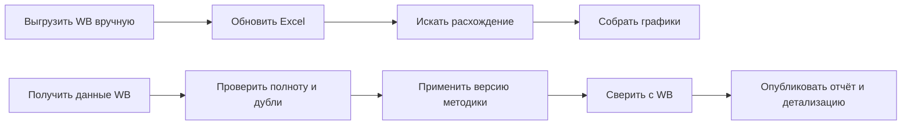
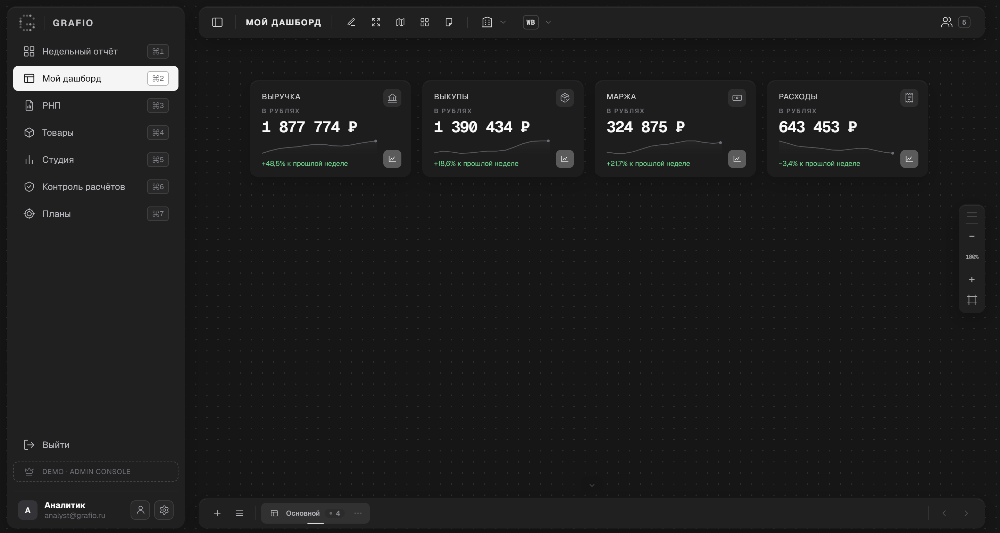
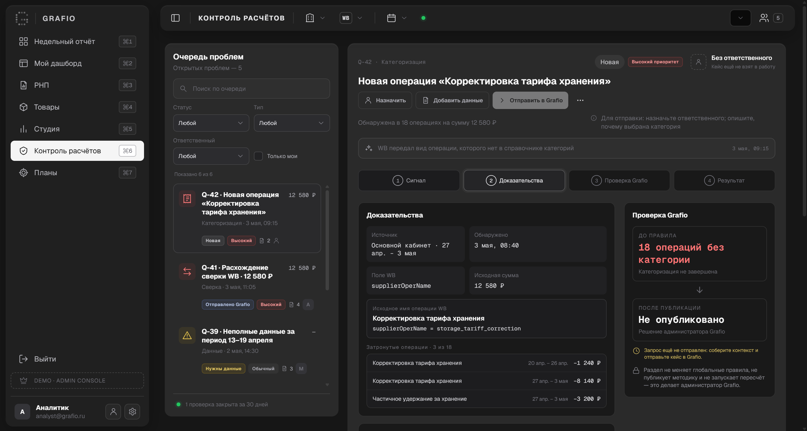
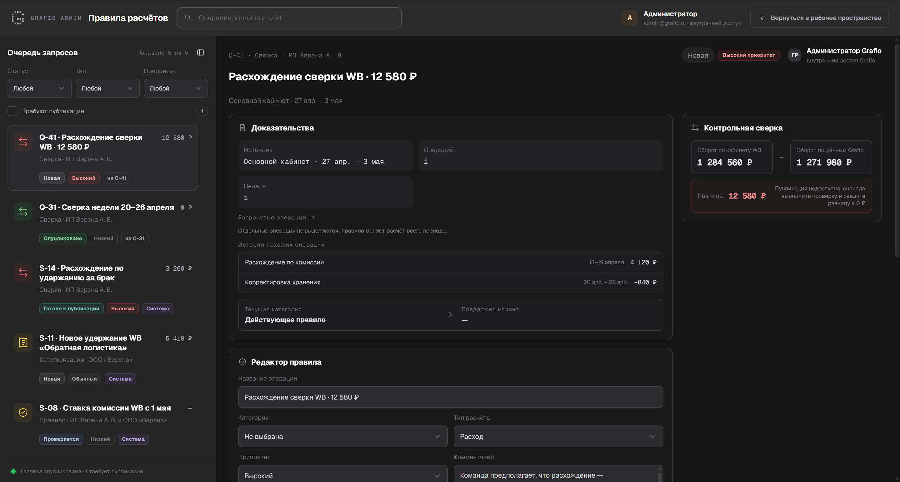
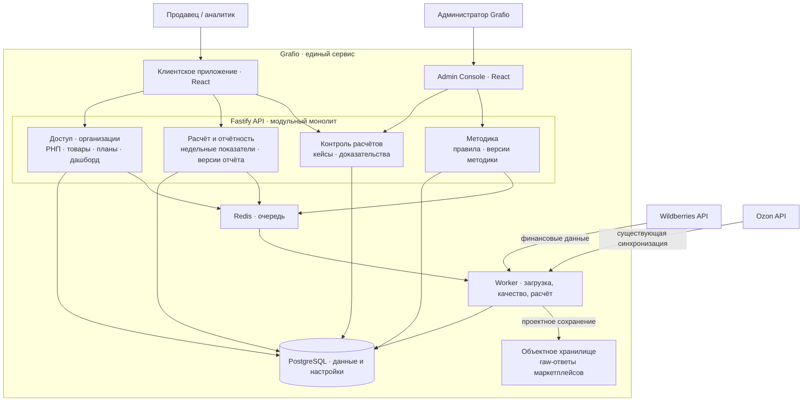

# Grafio: от ручного отчёта Wildberries к проекту финансового сервиса

**Кейс бизнес- и системного анализа · апрель 2026**

В консалтинге я еженедельно собирал финансовую аналитику продавцов маркетплейсов в Excel и Google Sheets. Выгрузки Wildberries приходилось переносить в шаблон, обновлять себестоимость, проверять формулы и вручную искать расхождения. При изменении операции или состава полей привычный расчёт мог перестать сходиться именно перед клиентским созвоном.

Я участвовал в работе над действующим Grafio: API-синхронизацией, РНП, товарами, месячными планами и редактируемым дашбордом. Опираясь на этот продукт и опыт ручной подготовки отчётов, я спроектировал следующий этап — финансовый контур с контролем качества данных WB, воспроизводимым недельным отчётом, детализацией расходов и управляемым исправлением методики. Результат аналитической работы — набор требований, моделей процессов и данных, API-контракт, архитектурные решения и кликабельный прототип.

| | |
|---|---|
| **Моя роль** | Участие в развитии действующего сервиса; бизнес- и системный анализ финансового контура, расчётные правила, сценарии, модели, приёмка и прототипирование |
| **Основной пользователь** | Финансист или аналитик продавца WB; отдельная роль — администратор Grafio |
| **Статус результата** | Целевое решение документировано; интерфейс показан в демонстрационном прототипе. Новый финансовый backend и заявленные эффекты не подтверждены внедрением |
| **Открытая проверка** | Поля и знаки нового финансового API WB требуют сверки на обезличенной фактической неделе |

**Посмотреть результат:** [прототип](prototype/index.html) · [галерея экранов](screenshots/README.md) · [обзорная архитектура](docs/architecture/README.md) · [SRS](docs/requirements/srs.md) · [SwaggerHub 3.0.0-target](https://app.swaggerhub.com/apis/grafio/api-grafio/3.0.0-target) · [маршрут чтения](docs/README.md).

## Проблема и исходный процесс

Аналитик скачивал отчёт WB, переносил операции в Excel, обновлял справочники и формулы, сверял итог с WB и переносил графики в презентацию. Неизвестную операцию приходилось разбирать вручную; неполный источник мог выглядеть как нулевой показатель. По моей оценке из прежней работы, один кабинет занимал 0,5–1,5 часа в неделю, крупный — до 3 часов и иногда больше. Это ориентир для описания проблемы, а не измеренный результат Grafio.

Бизнесу нужен был ответ не только «сколько составили расходы», но и «почему изменилась маржа» — с возможностью пройти от недельной суммы до товара и операции, а затем понять, можно ли доверять расчёту.

Подробные процессы представлены в [AS-IS/TO-BE BPMN](docs/processes/bpmn-index.md).

## Что вошло в решение

Я начал с одного законченного сценария: пользователь выбирает доступный кабинет и завершённую неделю ПН–ВС, видит выручку, выкупы, себестоимость, расходы, маржу и маржинальность, сравнивает недели и открывает детализацию статьи. Отчёт показывает качество источников, результат сверки и версию методики. Если данные неполны, интерфейс сообщает об ограничении, а не маскирует его нулём.

После проработки ядра я связал новые сценарии с существующими модулями Grafio. РНП и аналитика стали основой недельного финансового отчёта, товары — детализации себестоимости, месячные планы — версий целей и прогнозов, редактируемый дашборд — листов и Студии. Отдельно описаны клиентский «Контроль расчётов», внутренняя Admin Console, подключение кабинета WB, команда и безопасность. [Архитектура Grafio](docs/architecture/README.md) показывает единый сервис и статус модулей; [функциональные требования](docs/requirements/functional-requirements.md) описывают проектное поведение, а [техническое приложение](docs/architecture/implementation-baseline.md) фиксирует уже реализованную основу.

Чтобы пройти сценарии в актуальном интерфейсе, скачайте репозиторий и откройте [index.html](prototype/index.html) локально в браузере: установка зависимостей не требуется. Прототип показывает переходы на демонстрационных данных и не подтверждает работу расчётного API.

## Прототип в текущем состоянии

| Недельная аналитика | Личный дашборд |
|---|---|
|  |  |
| **Клиентский контроль расчётов** | **Внутренняя Admin Console** |
|  |  |

Все девять разных экранов, включая РНП, товары, студию, планы и аккаунт, собраны в [галерее прототипа](screenshots/README.md). Изображения можно открыть в полном размере.

## Ключевой сценарий: от расхождения к новой версии

1. Финансист видит расхождение сверки или неизвестную операцию и создаёт кейс с периодом, кабинетом, суммой и доказательствами.
2. Администратор Grafio исследует исходные операции, готовит проект правила и выполняет контрольный расчёт. Клиент не публикует системную методику самостоятельно.
3. Публикация допускается при нулевой сверке, указанной дате действия и зафиксированной причине. Администратор выбирает пересчёт истории или применение правила вперёд.
4. Исторический пересчёт создаёт новые версии затронутых недель; прежние отчёты остаются доступными. Клиент видит, что изменилось и почему.

Этот путь раскрыт в [операционных сценариях](docs/processes/operational-workflows.md), [BPMN](docs/processes/bpmn/03-methodology-publication.bpmn), [статусных моделях](docs/processes/status-models.md) и [sequence-диаграмме](docs/architecture/sequence/03-case-to-methodology.puml).

## Решения, которые сделали расчёт проверяемым

| Решение | Зачем оно нужно | Подробности |
|---|---|---|
| Единая база структуры — выкупы | Маржа, себестоимость и расходы образуют 100% выкупов; при нулевой или отрицательной базе доли не рассчитываются | [Паспорта показателей](docs/data/metric-passports.md) |
| Точная сверка `Δ = 0` | Пользовательское округление не скрывает пропущенную операцию | [Бизнес-правила](docs/requirements/business-rules.md) |
| Независимые состояния качества | Ошибка источника, неполнота, расхождение и отсутствие расчёта имеют разные причины и последствия | [Статусные модели](docs/processes/status-models.md) |
| Неизменяемые raw-ответы и версии | Можно восстановить источник числа, перепроверить правило и сравнить старый отчёт с новым | [ADR о raw](docs/architecture/adr/ADR-003-immutable-raw-source-storage.md), [ADR о версиях](docs/architecture/adr/ADR-002-immutable-report-versions.md) |
| Отдельные полномочия администратора | Клиент передаёт проблему и получает объяснение; изменение общей методики проходит внутреннюю проверку | [ADR об Admin Console](docs/architecture/adr/ADR-005-separate-admin-console-boundary.md) |

## Архитектура Grafio на одной схеме

Схема показывает один сервис: существующую платформу и спроектированное развитие финансового контура WB. Отчётность, клиентские кейсы и методика разделены по ответственности. Это логические связи, а не подтверждение внедрения всех изображённых механизмов. Подробности доступны в [карте архитектуры](docs/architecture/README.md), [C4-модели](docs/architecture/c4-model.md), [sequence-диаграммах](docs/architecture/sequence-diagrams.md) и [ADR](docs/architecture/adr/README.md).

## Что подготовлено для команды

| Вопрос команды | Артефакт |
|---|---|
| Зачем менять процесс? | [Бизнес-требования](docs/requirements/business-requirements.md), [AS-IS](docs/context/as-is-weekly-report.md) |
| Что должна делать система? | [SRS](docs/requirements/srs.md), [BPMN](docs/processes/bpmn-index.md) |
| Как считаются и проверяются показатели? | [Паспорта метрик](docs/data/metric-passports.md), [критерии приёмки](docs/requirements/acceptance-criteria.md) |
| Как устроены данные и сервис? | [ERD](docs/data/target-erd.md), [архитектура Grafio](docs/architecture/README.md) |
| Как задан обмен данными? | [API-контракт](docs/api/contracts.md), [OpenAPI 3.1](docs/api/openapi.json) |

## Как читать кейс дальше

После кейса откройте [путеводитель по 12 ключевым материалам](docs/README.md) или сразу пройдите [прототип](prototype/README.md). Матрица прослеживаемости и подробные приложения доступны из путеводителя, когда понадобится проверить конкретное решение.
