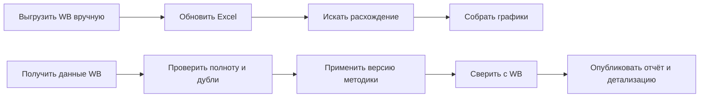

# Grafio: от ручного отчёта Wildberries к проекту финансового сервиса

**Кейс бизнес- и системного анализа · апрель 2026**

В консалтинге я еженедельно собирал финансовую аналитику продавцов маркетплейсов в Excel и Google Sheets. Выгрузки Wildberries приходилось переносить в шаблон, обновлять себестоимость, проверять формулы и вручную искать расхождения. При изменении операции или состава полей привычный расчёт мог перестать сходиться именно перед клиентским созвоном.

Я участвовал в работе над действующим Grafio: API-синхронизацией, РНП, товарами, месячными планами и редактируемым дашбордом. Опираясь на этот продукт и опыт ручной подготовки отчётов, я спроектировал следующий этап — финансовый контур с контролем качества данных WB, воспроизводимым недельным отчётом, детализацией расходов и управляемым исправлением методики. Результат аналитической работы — набор требований, моделей процессов и данных, API-контракт, архитектурные решения и кликабельный прототип.

| | |
|---|---|
| **Моя роль** | Участие в развитии действующего сервиса; бизнес- и системный анализ финансового контура, расчётные правила, сценарии, модели, приёмка и прототипирование |
| **Основной пользователь** | Финансист или аналитик продавца WB; отдельная роль — администратор Grafio |
| **Статус результата** | Целевое решение документировано; интерфейс показан в демонстрационном прототипе. Новый финансовый backend и заявленные эффекты не подтверждены внедрением |
| **Открытая проверка** | Поля и знаки нового финансового API WB требуют сверки на обезличенной фактической неделе |

**Посмотреть результат:** [прототип](prototype/index.html) · [галерея экранов](screenshots/README.md) · [SRS](docs/requirements/srs.md) · [SwaggerHub 3.0.0-target](https://app.swaggerhub.com/apis/grafio/api-grafio/3.0.0-target) · [карта всех документов](docs/README.md).

## Проблема и исходный процесс

Аналитик скачивал отчёт WB, переносил операции в Excel, обновлял справочники и формулы, сверял итог с WB и переносил графики в презентацию. Неизвестную операцию приходилось разбирать вручную; неполный источник мог выглядеть как нулевой показатель. По моей оценке из прежней работы, один кабинет занимал 0,5–1,5 часа в неделю, крупный — до 3 часов и иногда больше. Это ориентир для описания проблемы, а не измеренный результат Grafio.

Бизнесу нужен был ответ не только «сколько составили расходы», но и «почему изменилась маржа» — с возможностью пройти от недельной суммы до товара и операции, а затем понять, можно ли доверять расчёту.

Подробные процессы представлены в [AS-IS/TO-BE BPMN](docs/processes/bpmn-index.md).

## Что вошло в решение

Я начал с одного законченного сценария: пользователь выбирает доступный кабинет и завершённую неделю ПН–ВС, видит выручку, выкупы, себестоимость, расходы, маржу и маржинальность, сравнивает недели и открывает детализацию статьи. Отчёт показывает качество источников, результат сверки и версию методики. Если данные неполны, интерфейс сообщает об ограничении, а не маскирует его нулём.

После проработки ядра я связал новые сценарии с существующими модулями Grafio. РНП и аналитика стали основой недельного финансового отчёта, товары — детализации себестоимости, месячные планы — версий целей и прогнозов, редактируемый дашборд — листов и Студии. Отдельно описаны клиентский «Контроль расчётов», внутренняя Admin Console, подключение кабинета WB, команда и безопасность. [Функциональные требования](docs/requirements/functional-requirements.md) описывают целевое поведение; [обзор действующего сервиса](docs/architecture/current-service-overview.md) помогает отделить его от уже реализованного.

Чтобы пройти сценарии в актуальном интерфейсе, скачайте репозиторий и откройте [index.html](prototype/index.html) локально в браузере: установка зависимостей не требуется. Прототип показывает переходы на демонстрационных данных и не подтверждает работу расчётного API.

## Прототип в текущем состоянии

| Недельная аналитика | Личный дашборд |
|---|---|
|  |  |
| **Клиентский контроль расчётов** | **Внутренняя Admin Console** |
|  |  |

Все девять разных экранов, включая РНП, товары, студию, планы и аккаунт, собраны в [галерее прототипа](screenshots/README.md). Изображения можно открыть в полном размере.

## Ключевой сценарий: от расхождения к новой версии

1. Финансист видит расхождение сверки или неизвестную операцию и создаёт кейс с периодом, кабинетом, суммой и доказательствами.
2. Администратор Grafio исследует исходные операции, готовит проект правила и выполняет контрольный расчёт. Клиент не публикует системную методику самостоятельно.
3. Публикация допускается при нулевой сверке, указанной дате действия и зафиксированной причине. Администратор выбирает пересчёт истории или применение правила вперёд.
4. Исторический пересчёт создаёт новые версии затронутых недель; прежние отчёты остаются доступными. Клиент видит, что изменилось и почему.

Этот путь раскрыт в [операционных сценариях](docs/processes/operational-workflows.md), [BPMN](docs/processes/bpmn/03-methodology-publication.bpmn), [статусных моделях](docs/processes/status-models.md) и [sequence-диаграмме](docs/architecture/sequence/03-case-to-methodology.puml).

## Решения, которые сделали расчёт проверяемым

| Решение | Зачем оно нужно | Подробности |
|---|---|---|
| Единая база структуры — выкупы | Маржа, себестоимость и расходы образуют 100% выкупов; при нулевой или отрицательной базе доли не рассчитываются | [Паспорта показателей](docs/data/metric-passports.md) |
| Точная сверка `Δ = 0` | Пользовательское округление не скрывает пропущенную операцию | [Бизнес-правила](docs/requirements/business-rules.md) |
| Независимые состояния качества | Ошибка источника, неполнота, расхождение и отсутствие расчёта имеют разные причины и последствия | [Статусные модели](docs/processes/status-models.md) |
| Неизменяемые raw-ответы и версии | Можно восстановить источник числа, перепроверить правило и сравнить старый отчёт с новым | [ADR о raw](docs/architecture/adr/ADR-003-immutable-raw-source-storage.md), [ADR о версиях](docs/architecture/adr/ADR-002-immutable-report-versions.md) |
| Отдельные полномочия администратора | Клиент передаёт проблему и получает объяснение; изменение общей методики проходит внутреннюю проверку | [ADR об Admin Console](docs/architecture/adr/ADR-005-separate-admin-console-boundary.md) |

Целевая техническая форма — [модульный монолит с отдельным worker](docs/architecture/adr/ADR-001-modular-monolith-and-worker.md). [C4-модель](docs/architecture/c4-model.md) показывает границы системы и модулей, а [sequence-диаграммы](docs/architecture/sequence-diagrams.md) — порядок взаимодействий. Исходный код существующего Grafio описан отдельно в [обзоре текущей архитектуры](docs/architecture/current-service-overview.md); целевые диаграммы не следует читать как отчёт о реализованных модулях.

## Что подготовлено для команды

| Вопрос команды | Артефакт |
|---|---|
| Зачем менять процесс и кому это нужно? | [Бизнес-требования](docs/requirements/business-requirements.md), [пользовательские требования](docs/requirements/user-requirements.md), [User Stories](docs/requirements/user-stories.md) |
| Как работают сценарии и исключения? | [Use Cases и диаграммы](docs/requirements/use-case-catalog.md), [BPMN](docs/processes/bpmn-index.md), [операционные процессы](docs/processes/operational-workflows.md) |
| Что должна делать система и как это принять? | [SRS](docs/requirements/srs.md), [функциональные требования](docs/requirements/functional-requirements.md), [критерии приёмки](docs/requirements/acceptance-criteria.md) |
| Откуда берутся данные и как считаются показатели? | [Контракт WB](docs/data/wb-data-contract.md), [маппинг полей](docs/data/wb-field-mapping-validation.md), [паспорта метрик](docs/data/metric-passports.md) |
| Как хранятся данные и версии? | [Единая целевая ERD](docs/data/target-erd.md), [статусные модели](docs/processes/status-models.md) |
| Как взаимодействуют части системы? | [OpenAPI 3.1](docs/api/openapi.json), [SwaggerHub](https://app.swaggerhub.com/apis/grafio/api-grafio/3.0.0-target), [C4](docs/architecture/c4-model.md), [sequence](docs/architecture/sequence-diagrams.md), [ADR](docs/architecture/adr/README.md) |
| Какие качества и ограничения важны? | [NFR](docs/requirements/non-functional-requirements.md), [ограничения](docs/requirements/constraints-and-assumptions.md), [матрица прослеживаемости](docs/requirements/traceability-matrix.md) |

## Проверка результата и границы доказательств

Кликабельный прототип позволил проверить информационную архитектуру, видимые состояния отчёта, переключение представлений и основные переходы. Проверки и их дату фиксирует [журнал приёмки](docs/validation/prototype-uat.md). После зафиксированного прогона прототип продолжал изменяться, поэтому журнал подтверждает конкретный срез, а не каждую последующую правку.

Документы образуют прослеживаемую цепочку от потребности до приёмки. [Целевой OpenAPI](docs/api/contracts.md) описывает проектный контракт и опубликован для обсуждения; его наличие не доказывает, что все 77 операций доступны на сервере. Для основных финансовых показателей поля нового API WB найдены и сопоставлены с прежней книгой, но контрольная сверка на обезличенном фактическом ответе ещё не выполнена. До неё денежные формулы и классификатор новых операций остаются проектными гипотезами.

Я не заявляю измеренную экономию времени, снижение ошибок или подтверждённые эксплуатационные показатели: для этого нужны работающая реализация, реальные данные и отдельные испытания.

## Как читать кейс дальше

Для быстрого просмотра достаточно [прототипа](prototype/README.md) и [путеводителя](docs/README.md) после чтения этого кейса. Для оценки полноты системного анализа откройте [SRS](docs/requirements/srs.md), [матрицу прослеживаемости](docs/requirements/traceability-matrix.md) и [API-контракт](docs/api/contracts.md). Источники и детальные таблицы собраны в [карте материалов](docs/README.md).
