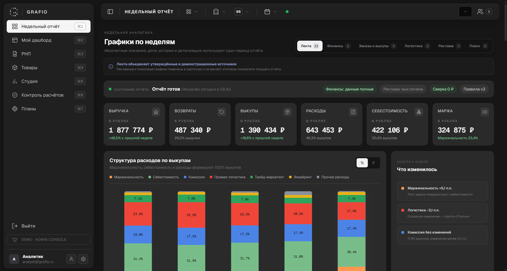

# Grafio — BI-платформа для продавцов маркетплейсов

**Кейс бизнес и системного анализа · проектирование сервиса с нуля**

Я проектировал Grafio от подключения маркетплейсов и расчёта показателей до товаров, планов, рабочего пространства, контроля расчётов и административных процессов. Здесь собраны решения, требования и модели, которые связывают пользовательские сценарии с данными, API и архитектурой. Финансовая методика раскрыта подробнее: её результаты должны быть проверяемыми до исходной операции.

| [Кликабельный прототип](https://onlyuncia.github.io/grafio-product-docs/) | [Экраны сервиса](screenshots/README.md) | [Материалы проекта](docs/README.md) |
|:---|:---|:---|
| Пройти сценарии на демонстрационных данных | Быстро увидеть основные разделы | Перейти к требованиям, процессам и архитектуре |

*Недельная аналитика в демонстрационном прототипе.*

## Исходная задача

До Grafio аналитику продавцов собирали в Excel и Google Sheets: переносили выгрузки маркетплейсов, обновляли себестоимость, проверяли формулы и искали расхождения. При изменении структуры выгрузки или названия операции часть начислений могла перестать учитываться. Итоговую сумму было трудно объяснить до конкретной записи.

Подготовка недели занимала, по ретроспективной оценке, от 0,5–1,5 часа для небольшого продавца до 3 часов для крупного; это ориентиры исходного процесса, а не измеренный эффект Grafio. Бизнесу был нужен ответ не только «сколько составили расходы», но и «почему изменилась маржа» — с возможностью проверить сумму по товарам и операциям.

Ручной путь и его границы описаны в [AS-IS](docs/context/as-is-weekly-report.md); целевой процесс показан в [BPMN](docs/processes/bpmn-index.md).

## Пример сквозного решения

Если WB передаёт операцию, которой нет в опубликованной методике, Grafio сохраняет её исходное значение без выдуманной категории и автоматически создаёт сигнал для администратора. Новая версия отчёта с непроверенным расчётом не публикуется; клиент видит состояние проверки и прежнюю опубликованную версию. Администратор устанавливает смысл операции и область действия правила, проверяет влияние на показатели и проводит контрольный расчёт до точной сверки с источником (`Δ = 0`). Если правило применяется к затронутой неделе, после публикации и повторной сверки появляется новая версия отчёта, а прежняя остаётся доступной для сравнения.

Решение прослеживается от [контракта данных](docs/data/wb-data-contract.md) и [бизнес-правил](docs/requirements/business-rules.md) до [процесса публикации методики](docs/processes/bpmn-index.md#публикация-методики) и [критериев приёмки](docs/requirements/acceptance-criteria.md). В прототипе показаны экранные состояния; описанный расчётный процесс относится к целевому решению.

## Мой вклад и ключевые решения

| Область | Что я спроектировал | Результат в кейсе |
|---|---|---|
| Подключение WB и Ozon | Подключение кабинетов, синхронизация и ошибки; готовность источника отделена от готовности показателя | [Архитектура](docs/architecture/README.md), [интеграция WB](docs/architecture/integration-specification.md) |
| РНП и недельная аналитика | Определения метрик, недельный срез, качество и сверка; отсутствие данных не подменяется нулём | [Паспорта показателей](docs/data/metric-passports.md), [экран отчёта](screenshots/01-weekly-report.png) |
| Товары и себестоимость | Связь операции с товаром и исторической стоимостью, детализация суммы до записей | [Модель данных](docs/data/logical-data-model.md), [сценарий детализации](docs/requirements/weekly-expense-use-case.md) |
| Планы | Область плана, сопоставление факта с целью, версии и прогноз | [Правила планов](docs/product/plans-and-forecasts.md), [экран планов](screenshots/07-plans.png) |
| Дашборд и Студия | Листы, каталог KPI и графиков, настройка виджетов и редактирование | [Прототип](https://onlyuncia.github.io/grafio-product-docs/), [экран Студии](screenshots/05-studio.png) |
| Контроль расчётов, команда и доступ | Клиентский кейс, роли сотрудников и отдельный процесс администратора | [Операционные процессы](docs/processes/operational-workflows.md), [BPMN](docs/processes/bpmn-index.md) |
| История расчётов | Новая версия сохраняет прежний результат и объясняет изменение | [Решение о версиях](docs/architecture/adr/ADR-002-immutable-report-versions.md) |

> **Реализовано в сервисе:** клиентское приложение, API, фоновые задания, синхронизация с маркетплейсами, РНП, товары, планы и дашборд.
>
> **Спроектировано и показано в прототипе:** воспроизводимый недельный финансовый расчёт, управление системной методикой и Студия. Подробный статус частей — в [архитектуре Grafio](docs/architecture/README.md).

## Где смотреть подробнее

Начните с [SRS](docs/requirements/srs.md), затем откройте [BPMN-процессы](docs/processes/bpmn-index.md) и [архитектуру](docs/architecture/README.md). Смысл расчётов раскрывают [паспорта показателей](docs/data/metric-passports.md), а полный список материалов собран в [путеводителе](docs/README.md).

Требования разделены на [бизнес-](docs/requirements/business-requirements.md), [пользовательские](docs/requirements/user-requirements.md), [функциональные](docs/requirements/functional-requirements.md) и [нефункциональные](docs/requirements/non-functional-requirements.md); отдельно описаны [бизнес-правила](docs/requirements/business-rules.md), [ограничения](docs/requirements/constraints-and-assumptions.md) и [интерфейсы](docs/requirements/interface-requirements.md). Связь требований с приёмкой показывает [матрица прослеживаемости](docs/requirements/traceability-matrix.md).

## Форматы и инструменты

**Модели и контракты**

   

**API и прототип**

  
