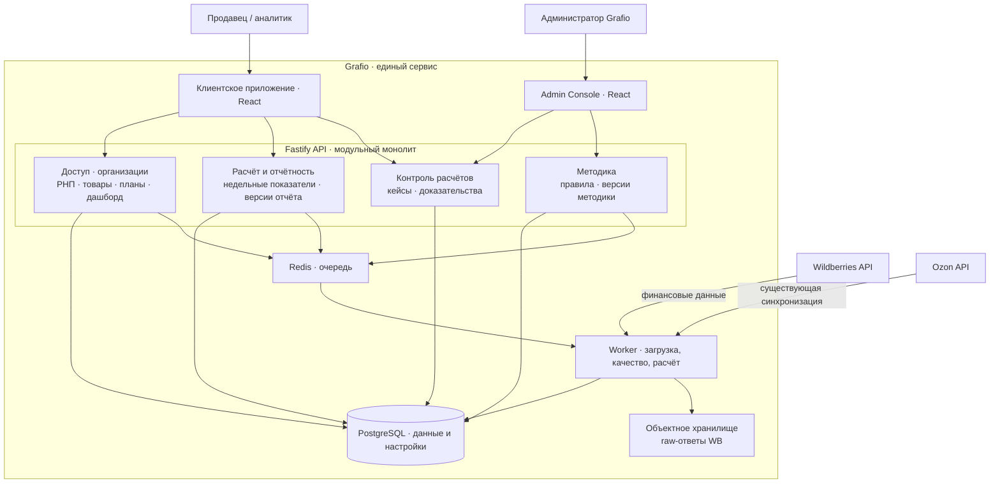

# Архитектура Grafio

Grafio представлен как **один развивающийся сервис**. Его реализованная основа включает клиентское приложение, API, PostgreSQL, очередь и worker, синхронизацию с маркетплейсами, РНП, товары, месячные планы и редактируемый дашборд. Проект финансового контура расширяет эту основу: вводит воспроизводимый недельный расчёт, контроль качества и расхождений, версии отчётов и методики, разграничение действий клиента и администратора.

Эта страница — основная точка входа в архитектуру. Статусы ниже различают описанную реализацию и проектные решения: экран прототипа или диаграмма не считаются подтверждением работающего backend.

## Обзорная схема

Схема показывает логические связи, а не физическую топологию развёртывания. Финансовый контур подробно спроектирован для WB; Ozon показан как существующая интеграция платформы. В схеме совместно отображены уже существовавшие компоненты и проектируемые дополнения, поэтому статус каждого участка указан отдельно.

## Модули и статус

| Участок Grafio | Основа в реализации | Проектное развитие |
|---|---|---|
| Платформа и доступ | React SPA, Fastify API, PostgreSQL, Redis/worker, организации и базовый доступ | Области доступа, жизненный цикл сотрудника, отдельная граница полномочий Admin Console |
| Данные маркетплейсов | API-синхронизация WB и Ozon | Для финансовых данных WB — сохранение raw-ответа, контроль схемы, полноты и повторной обработки |
| Аналитика и товары | РНП, каталог, история себестоимости | Недельные показатели, детализация до операции и товара, источники себестоимости в расчёте |
| Планы и дашборд | Месячные планы и редактируемый canvas | Версии целей, сопоставление факта с планом, листы и библиотека виджетов |
| Расчёт и отчётность | Аналитические данные и отчёты существующего сервиса | Версия недельного отчёта, сверка, признаки качества и воспроизводимая детализация |
| Контроль расчётов | — | Клиентский кейс с доказательствами, передача в Grafio и административное решение |
| Методика | — | Правила и версии методики, контрольная проверка, публикация и пересчёт |

Технические свидетельства существующей основы собраны в [приложении об исходной реализации](implementation-baseline.md). Детальные границы и интерфейсы проектного развития — в [приложении о финансовом контуре](financial-contour-design.md). Прочерк означает, что соответствующий процесс не подтверждён обзором реализации, а не отсутствие любых смежных функций в продукте.

## Основной путь данных

1. Клиент подключает разрешённый кабинет; планировщик или пользователь инициирует загрузку. API ставит задание в очередь, worker обращается к WB. Существующая синхронизация Ozon остаётся частью платформы, но финансовые правила этого кейса для неё не определены.
2. Для проектируемого финансового потока worker сохраняет неизменяемый raw-ответ WB в объектном хранилище. PostgreSQL хранит ссылку на документ, хеш, метаданные загрузки и результат обработки. Затем выполняются нормализация, проверки качества и классификация по опубликованной версии методики.
3. Расчёт создаёт новую версию недельного отчёта с показателями, детализацией и результатом сверки. Клиентское приложение читает опубликованную версию через API; неполнота или расхождение отражаются как состояние данных, а не как нулевой показатель.
4. Клиент оформляет проблему в «Контроле расчётов». Администратор проверяет доказательства и, если нужно, публикует версию правила; пересчёт создаёт новые версии затронутых отчётов, сохраняя историю. Долгие операции выполняет worker.

## Архитектурные границы

- Fastify API остаётся модульным монолитом с явными границами предметных модулей; очередь и worker отделяют загрузку и пересчёт от синхронных запросов.
- PostgreSQL — транзакционное хранилище нормализованных данных, настроек, версий и аудита. Raw-ответы WB в проектном решении находятся в объектном хранилище, а не в отдельной СУБД.
- Клиентские операции и публикация системных правил разделены полномочиями. Admin Console — отдельный интерфейс той же системы, а не второй сервис.
- [C4-модель](c4-model.md), [sequence-диаграммы](sequence-diagrams.md) и [ADR](adr/README.md) раскрывают финансовый контур; [прототип](../../prototype/README.md) демонстрирует сценарии на синтетических данных и не подтверждает внедрение нового backend.
