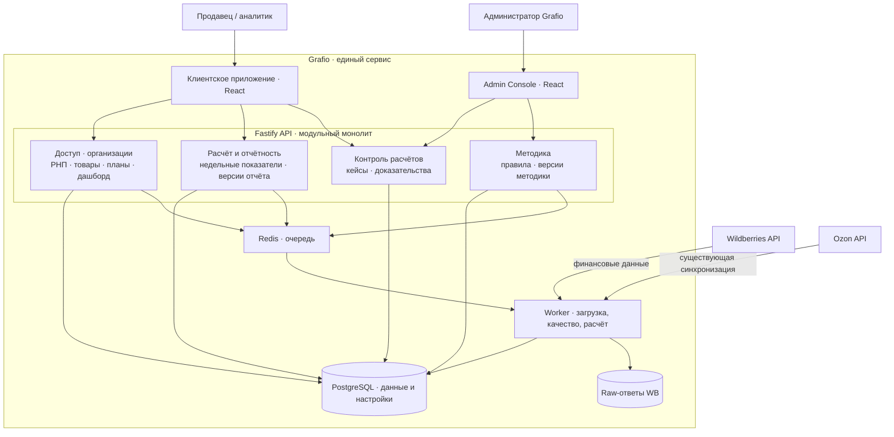

# Архитектура Grafio в кейсе

Кейс описывает развитие **одного сервиса Grafio**, а не две независимые архитектуры. Исходная платформа уже имела клиентское приложение, API, базу данных, очередь и фоновые задачи, интеграции с маркетплейсами, аналитику, товары, планы и редактируемый дашборд. Финансовый контур уточняет ответственность модулей и добавляет проверяемые расчёты, версии отчётов и методики, контроль расхождений и административный процесс.

## Обзорная схема

Схема показывает логические связи, а не физическую топологию развёртывания. Отчётность создаёт и читает версии показателей, контроль расчётов ведёт кейсы, методика управляет правилами. Финансовый контур раскрыт для WB; существующая интеграция Ozon показана как часть платформы. Статус отдельных механизмов указан в материалах ниже.

| Направление | Связь в архитектуре кейса | Где раскрыто |
|---|---|---|
| Платформа и интеграции | React SPA, Fastify API, PostgreSQL, Redis и worker составляют основу; получение финансовых данных WB дополняется правилами качества и воспроизводимости | [Обзор реализации](current-service-overview.md), [архитектурное решение](target-financial-architecture.md) |
| Аналитика и товары | РНП, финансовые данные и каталог с себестоимостью предоставляют входы для расчёта | [Обзор реализации](current-service-overview.md), [C4](c4-model.md) |
| Планы и дашборд | Месячные планы и редактируемый canvas развиваются в версионные планы, листы и каталог виджетов | [Обзор реализации](current-service-overview.md), [архитектурное решение](target-financial-architecture.md) |
| Недельная отчётность | Расчёт показателей, сверка, детализация и версии отчёта | [Архитектурное решение](target-financial-architecture.md), [C4](c4-model.md) |
| Контроль расчётов | Клиентский кейс, доказательства, статусы и передача администратору | [Операционные процессы](../processes/operational-workflows.md), [sequence-диаграммы](sequence-diagrams.md) |
| Методика | Правила, контрольная проверка, публикация версии и пересчёт | [Архитектурное решение](target-financial-architecture.md), [ADR](adr/README.md) |

Для чтения архитектуры начните с [C4-модели финансового контура](c4-model.md), затем перейдите к [границам модулей и потокам данных](target-financial-architecture.md). [Обзор исходной реализации](current-service-overview.md) нужен для технической трассировки: какие компоненты уже существовали до описанного развития. Это справочный срез кода, а не архитектура отдельного продукта.

Статус артефактов различается: обзор реализации описывает существовавший код; C4, sequence-диаграммы и ADR фиксируют проектные решения; [прототип](../../prototype/README.md) демонстрирует интерфейс на синтетических данных. Проектные схемы сами по себе не подтверждают внедрение нового финансового backend.
