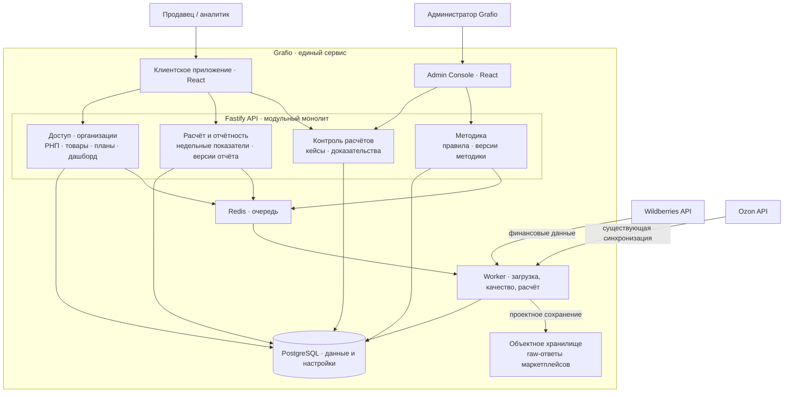

# Архитектура Grafio

Grafio проектировался и разрабатывался с нуля как **единый сервис**. Бизнес- и системный анализ охватывал платформу, интеграции, РНП, товары, планы, дашборд, контроль расчётов, команду и административные процессы. В реализации зафиксированы клиентское приложение, API, PostgreSQL, очередь и worker, синхронизация с маркетплейсами и ряд продуктовых разделов. Воспроизводимый недельный расчёт, контроль качества и расхождений, версии отчётов и методики детализированы как целевые решения.

Эта страница — основная точка входа в архитектуру. Статусы ниже различают описанную реализацию и проектные решения: экран прототипа или диаграмма не считаются подтверждением работающего backend.

## Обзорная схема

Схема показывает логические связи, а не физическую топологию развёртывания. Финансовый контур подробно спроектирован для WB; Ozon показан как интеграция, реализованная в ходе проекта. Схема объединяет реализованные и целевые компоненты, поэтому статус каждого участка указан отдельно.

## Модули и статус

| Участок Grafio | Зафиксировано в реализации | Детализировано как целевое решение |
|---|---|---|
| Платформа и доступ | React SPA, Fastify API, PostgreSQL, Redis/worker, организации и базовый доступ | Области доступа, жизненный цикл сотрудника, отдельная граница полномочий Admin Console |
| Данные маркетплейсов | API-синхронизация WB и Ozon | Единый подход к хранению raw-ответов маркетплейсов; для финансовых данных WB — контроль схемы, полноты и повторной обработки |
| Аналитика и товары | РНП, каталог, история себестоимости | Недельные показатели, детализация до операции и товара, источники себестоимости в расчёте |
| Планы и дашборд | Месячные планы и редактируемый дашборд | Версии целей, сопоставление факта с планом и листы дашборда |
| Студия | — | Библиотека KPI и графиков, поиск, просмотр, добавление копии виджета на лист и архивирование карточки |
| Расчёт и отчётность | Аналитические данные и отчёты, созданные в ходе проекта | Версия недельного отчёта, сверка, признаки качества и воспроизводимая детализация |
| Контроль расчётов | — | Клиентский кейс с доказательствами, передача в Grafio и административное решение |
| Методика | — | Правила и версии методики, контрольная проверка, публикация и пересчёт |

Технические свидетельства реализации собраны в [приложении с обзором кода](implementation-baseline.md). Правила расчёта и качества описаны в [проектировании финансового контура](financial-contour-design.md). Студия показана в [кликабельном прототипе](../../prototype/README.md).

## Основной путь данных

1. Клиент подключает разрешённый кабинет; планировщик или пользователь инициирует загрузку. API ставит задание в очередь, worker обращается к WB. Существующая синхронизация Ozon остаётся частью платформы, но финансовые правила этого кейса для неё не определены.
2. Для проектируемого финансового потока worker сохраняет ответ WB как неизменяемый raw-ответ маркетплейса в объектном хранилище. PostgreSQL хранит ссылку на документ, хеш, метаданные загрузки и результат обработки. Затем выполняются нормализация, проверки качества и классификация по опубликованной версии методики.
3. Расчёт создаёт новую версию недельного отчёта с показателями, детализацией и результатом сверки. Клиентское приложение читает опубликованную версию через API; допустимая неполнота отражается как состояние данных, а при обязательной сверке `Δ ≠ 0` новая версия не публикуется и пользователь видит проблему отдельно.
4. Клиент оформляет проблему в «Контроле расчётов». Администратор проверяет доказательства и, если нужно, публикует версию правила; пересчёт создаёт новые версии затронутых отчётов, сохраняя историю. Долгие операции выполняет worker.

## Архитектурные границы

- Fastify API остаётся модульным монолитом с явными границами предметных модулей; очередь и worker отделяют загрузку и пересчёт от синхронных запросов.
- PostgreSQL — транзакционное хранилище нормализованных данных, настроек, версий и аудита. Raw-ответы маркетплейсов в проектном решении находятся в объектном хранилище, а не в отдельной СУБД; детальный финансовый контракт пока описан для WB.
- Клиентские операции и публикация системных правил разделены полномочиями. Admin Console — отдельный интерфейс той же системы, а не второй сервис.
- [C4-модель](c4-model.md) показывает систему от контекста до модулей API; [sequence-диаграммы](sequence-diagrams.md) и [ADR](adr/README.md) раскрывают решения по финансовому контуру; [прототип](../../prototype/README.md) показывает пользовательские сценарии.
