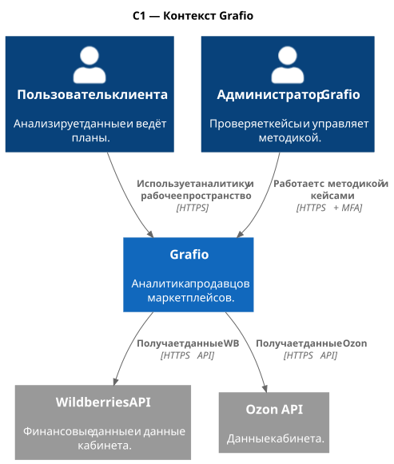
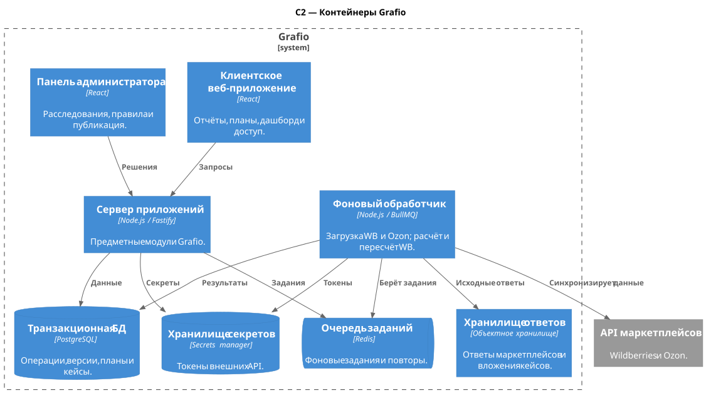
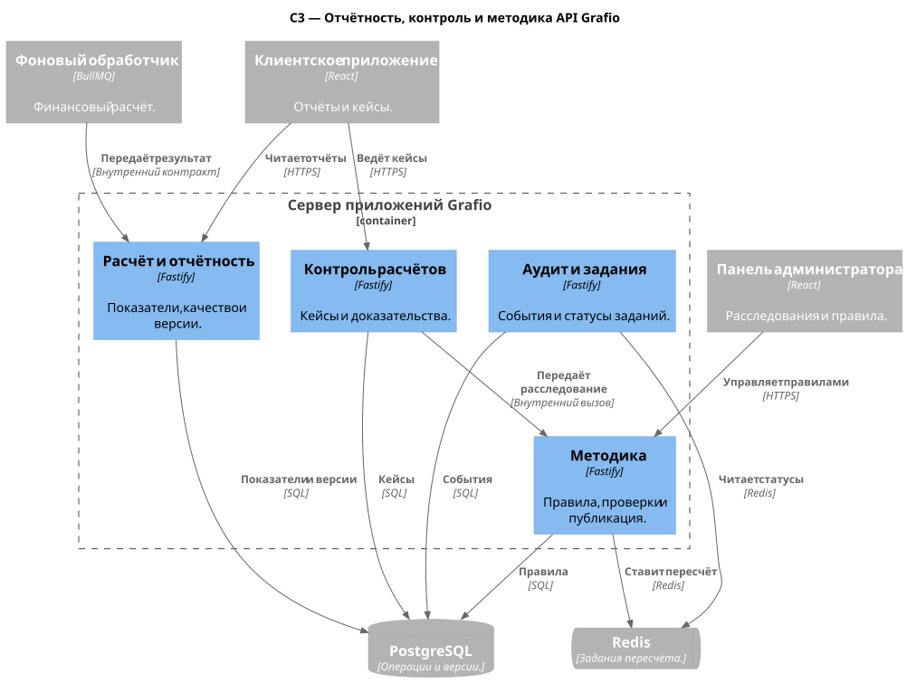
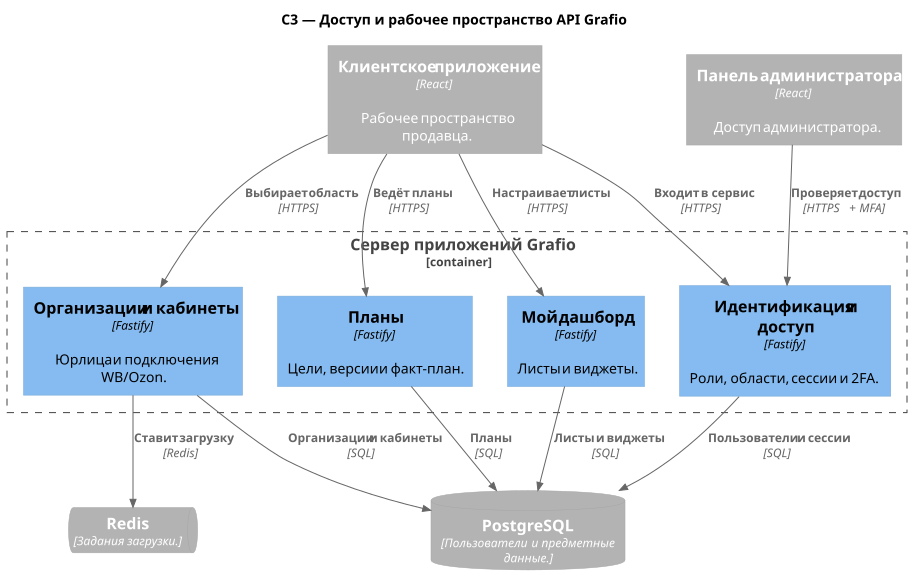

# C4-модель Grafio

Четыре схемы показывают одну систему с разной степенью детализации. C1 фиксирует пользователей и внешние системы; C2 — приложения, API, фоновый обработчик и хранилища. Две схемы C3 раскрывают **один и тот же сервер приложений**: первая — отчётность, контроль расчётов и методику, вторая — доступ и рабочее пространство.

| Уровень | Что показывает | Файл |
|---|---|---|
| C1 | Пользователи, Grafio и маркетплейсы | [SVG](c4/01-system-context.svg) · [PlantUML](c4/01-system-context.puml) |
| C2 | Интерфейсы, API, фоновый обработчик и данные | [SVG](c4/02-container.svg) · [PlantUML](c4/02-container.puml) |
| C3 · расчёты | Отчётность, кейсы, методика и аудит | [SVG](c4/03-api-components.svg) · [PlantUML](c4/03-api-components.puml) |
| C3 · рабочее пространство | Доступ, организации, планы и дашборд | [SVG](c4/03-api-workspace-components.svg) · [PlantUML](c4/03-api-workspace-components.puml) |

## C1 · Контекст системы

## C2 · Контейнеры

## C3 · Отчётность, контроль и методика

## C3 · Доступ и рабочее пространство

Внутренние процессы раскрыты в [проектировании финансового контура](financial-contour-design.md), а API — в [контрактах](../api/contracts.md).
