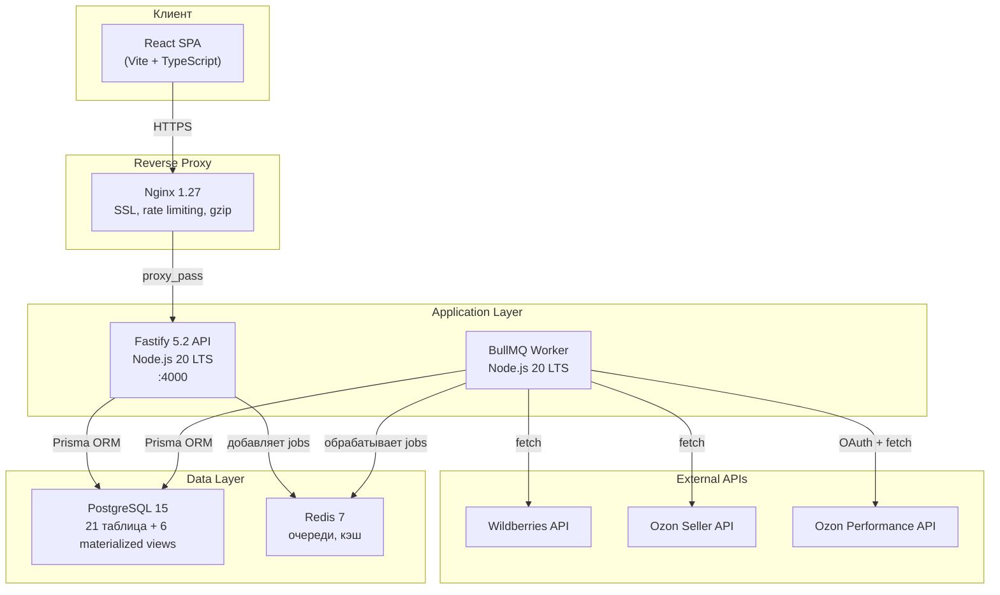
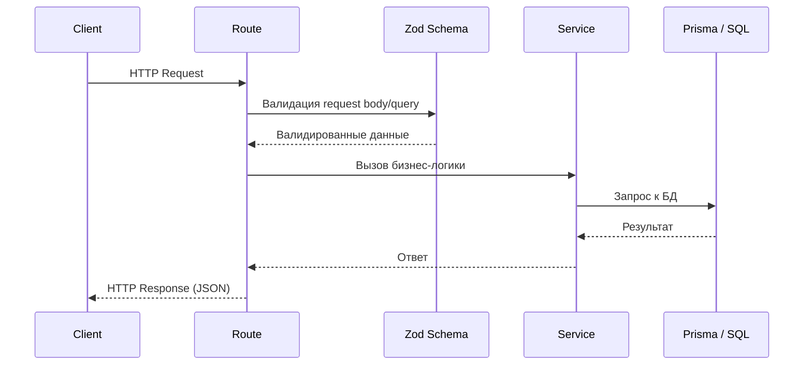
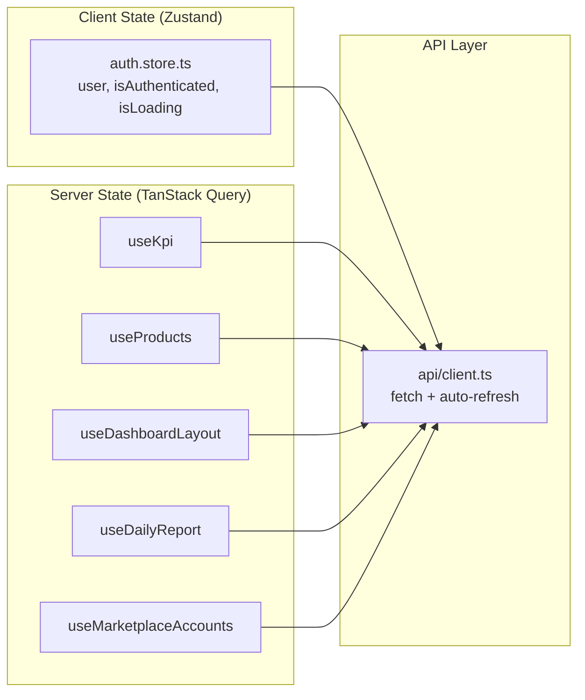
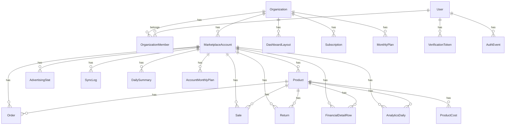
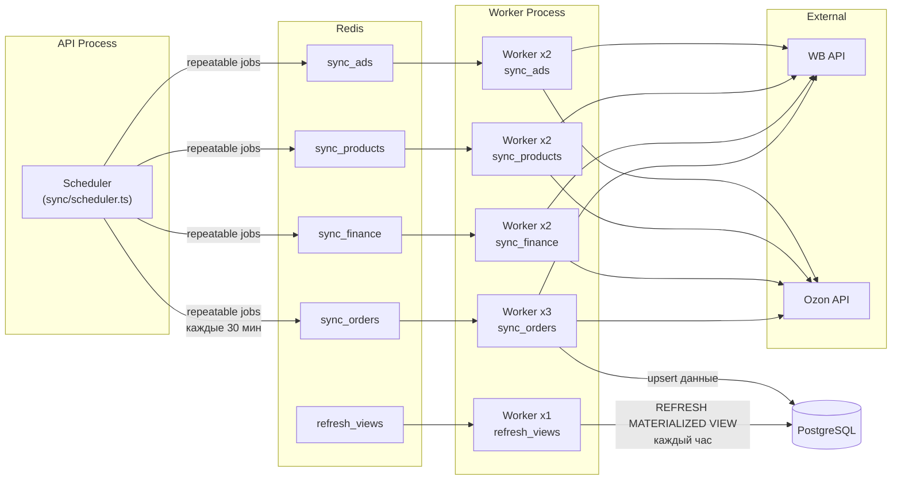
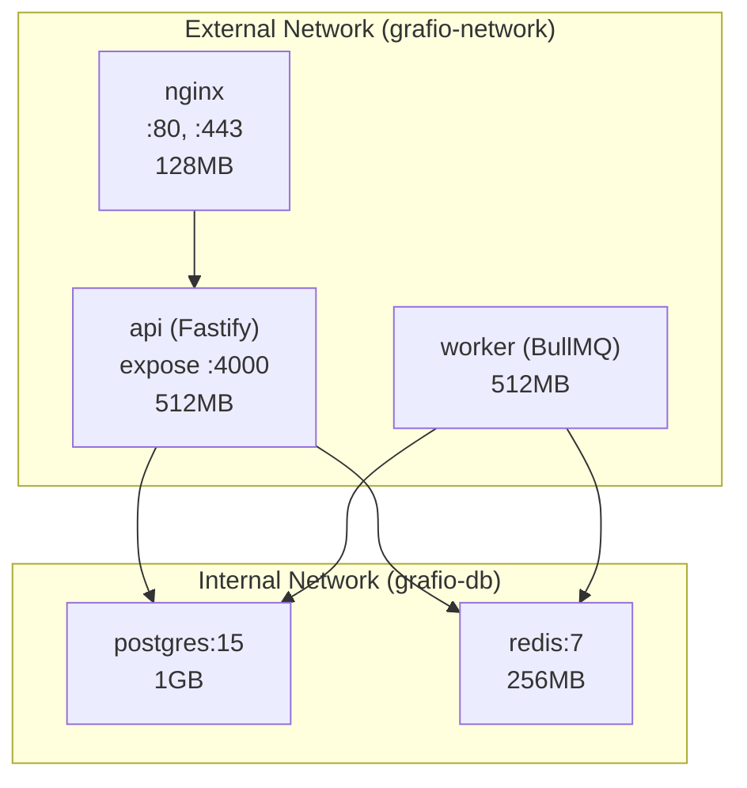
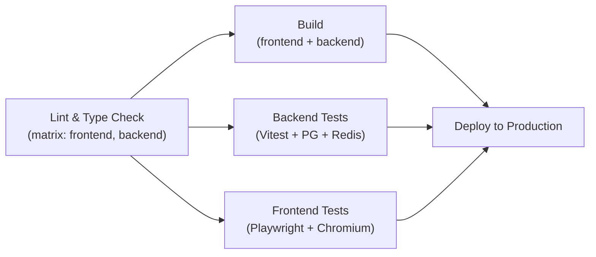
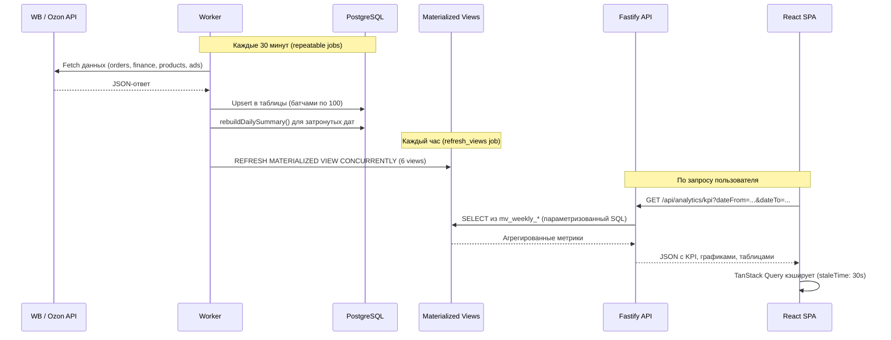
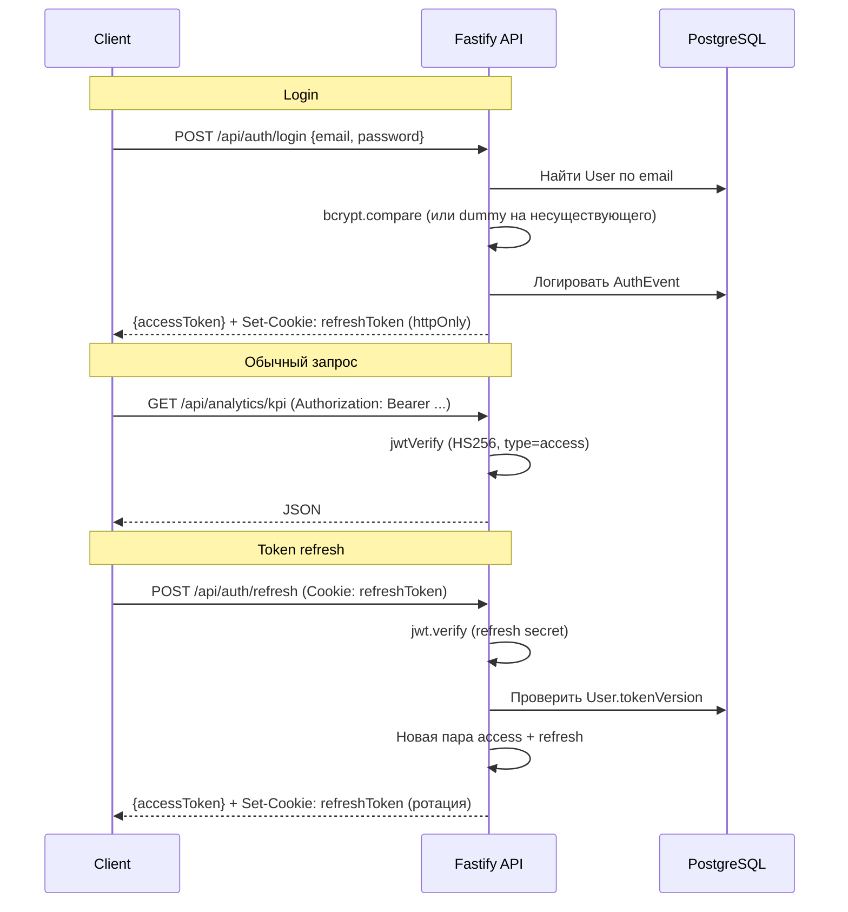

# Технический обзор реализации Grafio

> Это технический срез реализации Grafio. Его место в общей истории развития сервиса показано в [карте архитектуры](README.md); проектные решения финансового контура раскрыты в [архитектуре финансового контура](target-financial-architecture.md).

## Обзор системы

Grafio -- сервис бизнес-аналитики для селлеров маркетплейсов Wildberries и Ozon. Пользователь подключает API-ключи маркетплейсов, система автоматически синхронизирует данные (заказы, продажи, финансы, товары, рекламу) и предоставляет аналитический дашборд с KPI-метриками, графиками и ежедневными отчётами.

### Высокоуровневая архитектура



### Стек технологий

| Слой | Технологии |
|------|-----------|
| Frontend | React 19, TypeScript, Vite 7, Tailwind CSS v4, Shadcn/ui (Radix), Zustand, TanStack Query, React Router v6, Recharts, Framer Motion, Sonner |
| Backend | Node.js 20 LTS, Fastify 5.2, Prisma ORM 6, Zod, JWT (HS256) + bcrypt, BullMQ |
| Database | PostgreSQL 15 (pgcrypto), Redis 7 |
| Infrastructure | Docker Compose, Nginx, Let's Encrypt, GitHub Actions CI/CD |
| Хостинг | Timeweb Cloud (РФ, ФЗ-152) |

---

## Backend-архитектура

### Паттерн: Route -> Schema -> Service -> Prisma

Каждый API-endpoint реализован по единому паттерну:



Файловая структура backend:

```
backend/src/
  app.ts                     # Сборка Fastify-приложения, плагины, роутинг
  index.ts                   # Entrypoint — импортирует buildApp из app.ts и запускает HTTP-сервер
  worker.ts                  # BullMQ worker (отдельный процесс)
  config.ts                  # Zod-валидация env-переменных
  lib/prisma.ts              # Singleton Prisma Client
  middleware/
    auth.ts                  # authMiddleware, requireVerifiedEmail, requireOrganization
    error-handler.ts         # Централизованная обработка ошибок (AppError, ZodError, Prisma)
  routes/
    auth.ts                  # /api/auth/* (11 endpoints)
    marketplace-accounts.ts  # /api/marketplace-accounts/* (7 endpoints)
    analytics.ts             # /api/analytics/* (12 endpoints, включая РНП и sparklines)
    products.ts              # /api/products/* (7 endpoints)
    dashboard.ts             # /api/dashboard/* (4 endpoints)
    organizations.ts         # /api/organizations/* (2 endpoints)
    health.ts                # /api/health
  schemas/                   # Zod-схемы для валидации запросов
  services/
    auth.service.ts          # Аутентификация, токены, пароли
    marketplace-account.service.ts  # CRUD маркетплейс-аккаунтов, шифрование ключей
    analytics.service.ts     # KPI, графики, категории, P&L (читает materialized views)
    rnp.service.ts           # Ежедневный отчёт (РНП), планы GMV
    daily-summary.service.ts # Агрегация DailySummary из сырых данных
    dashboard.service.ts     # Layout виджетов (JSON), миграции старых форматов
    product.service.ts       # Товары, себестоимость, месячные планы
    wb-sync.service.ts       # Синхронизация данных Wildberries
    ozon-sync.service.ts     # Синхронизация данных Ozon Seller
    ozon-performance.service.ts  # Ozon Performance API (реклама, OAuth)
    sync-helpers.ts          # Общие хелперы синхронизации
    metrics-helpers.ts       # Вычисление производных метрик
    email.service.ts         # Отправка email (Resend)
  sync/
    queues.ts                # Определение BullMQ очередей, lazy init
    scheduler.ts             # Регистрация/удаление repeatable jobs
  utils/
    encryption.ts            # AES-256-GCM шифрование API-ключей
```

### Инициализация приложения (`app.ts`)

Fastify-приложение собирается функцией `buildApp()`, которая регистрирует плагины и роуты в определённом порядке:

1. **Error handler** -- `errorHandler` перехватывает все ошибки и возвращает стандартный JSON
2. **CORS** -- `@fastify/cors` (origin: `APP_URL` в production, `http://localhost:5173` в dev)
3. **Sensible** -- `@fastify/sensible` (HTTP error helpers)
4. **JWT** -- `@fastify/jwt` (HS256, единый secret для access tokens)
5. **Cookie** -- `@fastify/cookie`
6. **Swagger** -- `@fastify/swagger` + `@fastify/swagger-ui` (только в dev, `/api/docs/`)

Роуты разнесены по трём scope с разным rate limiting:

| Scope | Rate Limit | Роуты |
|-------|-----------|-------|
| `authStrictScope` | 5 req/min | `/api/auth/*` (кроме `/refresh`) |
| `authRefreshScope` | 30 req/min | `/api/auth/refresh` |
| `apiScope` | 60 req/min | Все остальные `/api/*` |

Параметры Fastify: `trustProxy: 1` (один hop за Nginx), `bodyLimit: 100KB`.

### Middleware-цепочка для защищённых роутов

Все endpoints (кроме auth и health) проходят через три `preHandler` hook, зарегистрированных в каждой route-группе:

```
authMiddleware -> requireVerifiedEmail -> requireOrganization
```

1. **`authMiddleware`** -- верифицирует JWT access token, проверяет `type === 'access'`, декорирует `request.user` (userId, email, emailVerified)
2. **`requireVerifiedEmail`** -- возвращает 403 если email не подтверждён
3. **`requireOrganization`** -- находит организацию пользователя через `OrganizationMember`, декорирует `request.organizationId`

Важная особенность Fastify: schema validation (step 5 lifecycle) выполняется ДО preHandler hooks (step 6). Запрос с невалидным body получит 400 от schema validation раньше, чем authMiddleware вернёт 401.

### Обработка ошибок (`error-handler.ts`)

Централизованный error handler обрабатывает четыре типа ошибок:

| Тип ошибки | HTTP-код | Описание |
|-----------|----------|----------|
| `ZodError` | 400 | Ошибки валидации, возвращает `fieldErrors` |
| `PrismaClientKnownRequestError` | 409/404/400 | P2002 (конфликт), P2025 (не найдено), прочее |
| `AppError` | любой | Бизнес-ошибки с кастомным `statusCode` |
| `FastifyError` | сохраняется | Ошибки rate-limit и прочих плагинов |
| Прочее | 500 | `"Something went wrong"` без деталей |

---

## Frontend-архитектура

### Общая структура

```
frontend/src/
  App.tsx                    # Роутинг, QueryClient, global providers
  api/
    client.ts                # fetch wrapper с auto-refresh
    types.ts                 # TypeScript-типы API
  stores/
    auth.store.ts            # Zustand store (user, isAuthenticated, isLoading)
  hooks/
    use-auth.ts              # useInitAuth, useLogin, useRegister, useLogout
    use-analytics.ts         # useKpi, useRevenueChart, useCategories
    use-products.ts          # useProducts, useProduct, useSetCost, useSetPlan
    use-marketplace-accounts.ts  # CRUD + тест + синхронизация
    use-dashboard-layout.ts  # useDashboardLayout, useSaveDashboardLayout
    use-daily-report.ts      # useDailyReport, useSetPlan, useBackfill
    use-report-layout.ts     # useReportLayout, useSaveReportLayout
    use-layout-history.ts    # undo/redo стек (50 состояний)
    use-snap-guides.ts       # Snap-guides и spacing-guides для canvas
    use-canvas-viewport.ts   # Масштаб и viewport canvas
    use-account.ts           # Профиль, организация, пароль
    use-mobile.ts            # Определение мобильного breakpoint
    use-document-title.ts    # Динамический document.title
  layouts/
    AuthLayout.tsx           # Split-screen для auth-страниц
    AppLayout.tsx            # Sidebar + header + content area
  components/
    sidebar/Sidebar.tsx      # Collapsible sidebar с навигацией
    auth-guard.tsx           # AuthGuard / GuestGuard
    error-boundary.tsx       # React Error Boundary
    ui/                      # Shadcn/ui компоненты
  pages/
    auth/                    # Login, Register, ForgotPassword, ResetPassword, VerifyEmail
    dashboard/               # DashboardPage, FreeGrid, KpiCards, Charts, виджеты
    reports/                 # ReportsPage, DailyReportTable, ReportCanvas, метрики
    products/                # ProductsPage, ProductDetailPage
    settings/                # SettingsPage (маркетплейс-аккаунты)
    account/                 # AccountPage (профиль, организация, безопасность, подписка)
```

### State Management

Система управления состоянием разделена на два слоя:



- **Zustand** (`stores/auth.store.ts`) -- хранит auth state в памяти (user, isAuthenticated, isLoading)
- **TanStack Query** -- весь серверный state (кэширование, background refetch, optimistic updates). `staleTime: 30s`, `refetchOnWindowFocus: false`, `retry: 1`
- **Access token** хранится в замыкании `api/client.ts` (не в localStorage и не в store), refresh token -- httpOnly cookie

### Механизм auto-refresh токенов

`apiClient()` из `api/client.ts` при получении HTTP 401 автоматически:

1. Вызывает `POST /api/auth/refresh` (credentials: include)
2. Использует promise-based lock (`refreshPromise`) -- один refresh на все параллельные запросы
3. Повторяет исходный запрос с новым access token
4. При ошибке refresh -- сбрасывает token и выбрасывает `ApiClientError(401, 'session_expired')`

### Маршрутизация (`App.tsx`)

Все страницы загружаются через `React.lazy()` с code-splitting:

| Путь | Компонент | Layout | Guard |
|------|----------|--------|-------|
| `/login` | LoginPage | AuthLayout | GuestGuard |
| `/register` | RegisterPage | AuthLayout | GuestGuard |
| `/forgot-password` | ForgotPasswordPage | AuthLayout | GuestGuard |
| `/reset-password` | ResetPasswordPage | AuthLayout | GuestGuard |
| `/verify-email` | VerifyEmailPage | AuthLayout | -- |
| `/dashboard` | DashboardPage | AppLayout | AuthGuard |
| `/rnp` | ReportsPage | AppLayout | AuthGuard |
| `/products` | ProductsPage | AppLayout | AuthGuard |
| `/products/:id` | ProductDetailPage | AppLayout | AuthGuard |
| `/settings` | SettingsPage | AppLayout | AuthGuard |
| `/account` | AccountPage | AppLayout | AuthGuard |
| `/` | Redirect -> `/dashboard` | -- | -- |

- **AuthGuard** проверяет auth state, редиректит на `/login`
- **GuestGuard** редиректит авторизованных на `/dashboard`
- **AppLayout** = collapsible sidebar + header (с title/subtitle) + `<main>` с `overflow-clip` (backstop для горизонтального скролла; dashboard использует `overflow-visible` для glass-эффекта под sidebar)

### Dashboard Canvas (FreeGrid)

`pages/dashboard/components/FreeGrid.tsx` -- кастомный free-form layout canvas:

- **Координатная система:** `REF_WIDTH = 1240px`. Все позиции виджетов (`x`, `y`, `width`, `height`) хранятся в пикселях в этой системе координат
- **Масштабирование:** `transform: scale(outerWidth / widgetExtent)`, `transformOrigin: top left`. `MIN_SCALE = 0.6`
- **Edit mode:** Drag и resize через `pointermove`/`pointerup` на `window`. Snap-guides (use-snap-guides.ts). Undo/redo стек на 50 состояний (`DashboardEditContext`)
- **Плавная анимация sidebar:** ResizeObserver напрямую обновляет `style.transform` (минуя React state), React re-render подтверждает значение на следующем макротаске
- **Сохранение:** `PUT /api/dashboard/layout` с optimistic update через TanStack Query

Компоненты canvas:

```
FreeGrid.tsx          # Canvas контейнер, drag/resize/scale
KpiCards.tsx          # KPI-виджеты (revenue, sales, orders, margin, drr, и др.)
RevenueChart.tsx      # График динамики выручки (Recharts)
CategoriesChart.tsx   # Круговая диаграмма категорий
WidgetCard.tsx        # Обёртка виджета (заголовок, drag handle, resize handle)
SnapGuideOverlay.tsx  # Визуализация snap/spacing guides
AddWidgetPanel.tsx    # Панель добавления виджетов
WidgetSettingsSheet.tsx  # Настройки виджетов
StickyNoteWidget.tsx  # Стикер-аннотации
TextBlockWidget.tsx   # Текстовые блоки
MarqueeOverlay.tsx    # Групповое выделение
GridRuler.tsx         # Линейки canvas
PresentationOverlay.tsx  # Режим презентации
MobileDashboard.tsx   # Мобильная версия (вертикальный layout)
```

---

## Слой данных

### PostgreSQL (Prisma Schema)

21 модель, 9 enum'ов. Первичные ключи -- UUID: 19 моделей используют `@default(uuid())` (Prisma `gen_random_uuid()` из pgcrypto), только DailySummary и AccountMonthlyPlan используют `uuid_generate_v4()`.



**Группы моделей:**

| Группа | Модели | Описание |
|--------|--------|----------|
| Core | Organization, User, OrganizationMember, MarketplaceAccount | Пользователи, организации, маркетплейс-аккаунты |
| Товары | Product, ProductCost | Каталог товаров, история себестоимости |
| Заказы/Продажи | Order, Sale, Return | Сырые данные из маркетплейсов |
| Финансы | FinancialDetailRow | Детальные строки финансового отчёта (WB/Ozon) |
| Аналитика | AnalyticsDaily, AdvertisingStat | Дневная аналитика, рекламная статистика |
| Ежедневный отчёт | DailySummary, AccountMonthlyPlan | Агрегированные дневные метрики, GMV-планы |
| Планирование | MonthlyPlan | Месячные планы продаж |
| Auth | VerificationToken, AuthEvent | Верификация email, аудит-лог |
| Dashboard | DashboardLayout | JSON-layout виджетов (desktop + mobile), `@@unique([organizationId, type])` |
| Система | SyncLog, Subscription, PaymentHistory | Логи синхронизации, подписки, платежи |

**Enum'ы:** MarketplaceType (`wb`, `ozon`), MemberRole, SubscriptionStatus, OrderStatus, SaleType, CampaignType, SyncStatus, TokenType, AuthEventType.

Prisma schema: `backend/prisma/schema.prisma` (606 строк, 21 миграция).

### Materialized Views

6 materialized views для агрегированных метрик, обновляются каждый час (`REFRESH MATERIALIZED VIEW CONCURRENTLY`):

| View | Назначение |
|------|-----------|
| `mv_weekly_metrics` | KPI-метрики (выручка, продажи, заказы) |
| `mv_weekly_pnl` | P&L (retail_revenue, sales_finished_amount, комиссии, доставка) |
| `mv_weekly_pnl_pct` | P&L в процентах |
| `mv_weekly_advertising` | Рекламная статистика |
| `mv_weekly_funnel` | Воронка (просмотры -> корзина -> заказы -> выкупы) |
| `mv_weekly_plans` | Планы vs. факт |

`analytics.service.ts` читает views через `$queryRawUnsafe` с параметризованными запросами (`$1`, `$2`) -- никакой конкатенации строк.

SQL-определения views: `docs/database/views.sql`.

---

## Worker и система синхронизации

### Архитектура BullMQ

Worker (`backend/src/worker.ts`) -- отдельный процесс Node.js, обрабатывающий очереди через BullMQ + Redis.



### Очереди и concurrency

| Очередь | Concurrency | Описание |
|---------|------------|----------|
| `sync_orders` | 3 | Заказы + продажи + аналитика продавца |
| `sync_finance` | 2 | Финансовые отчёты |
| `sync_products` | 2 | Каталог товаров |
| `sync_ads` | 2 | Реклама (WB + Ozon Performance) |
| `refresh_views` | 1 | Обновление materialized views + cleanup |

Все очереди инициализируются лениво (lazy init через getter-функции в `sync/queues.ts`), `closeAllQueues()` для graceful shutdown.

### Жизненный цикл sync job

1. **Создание:** При создании marketplace account `registerAccountJobs()` регистрирует 4 repeatable job (каждые 30 мин). Ручная синхронизация через `triggerManualSync()` с `priority: 1`.

2. **Обработка:** Worker определяет marketplace (`wb`/`ozon`) и syncType (`orders`/`finance`/`products`/`ads`), вызывает соответствующий sync service.

3. **Retry:** 3 попытки с exponential backoff (delay: 60s). При HTTP 429 -- Ozon fetch делает retry с ожиданием `Retry-After`.

4. **DailySummary rebuild:** После каждой успешной синхронизации (кроме products) Worker вызывает `rebuildDailySummary()` для пересчёта агрегированных метрик за затронутый период.

5. **Статус аккаунта:** По завершении/ошибке job вызывается `updateAccountSyncStatus()`, который агрегирует статусы по всем syncType и выставляет общий статус: `completed`, `partial` (mix), `failed`. При полном провале auth -- аккаунт деактивируется.

### Sync services

**WB** (`wb-sync.service.ts`):
- `syncOrders` -- FBS + FBO заказы (2 запроса к WB API)
- `syncSales` -- Продажи/возвраты
- `syncSellerAnalytics` -- Аналитика продавца (nm-report)
- `syncFinance` -- Финансовые отчёты (разбивает на месячные chunk'и)
- `syncProducts` -- Каталог товаров
- `syncAds` -- Рекламные кампании

**Ozon** (`ozon-sync.service.ts`):
- `syncOrders` -- Заказы + продажи (POST-only API, headers: Client-Id + Api-Key)
- `syncFinance` -- Финансовые транзакции
- `syncProducts` -- Каталог товаров
- `syncAnalytics` -- Аналитические данные

**Ozon Performance** (`ozon-performance.service.ts`):
- OAuth `client_credentials` flow (base URL: `api-performance.ozon.ru:443`)
- `syncPerformance` -- Рекламная статистика

Общие хелперы (`sync-helpers.ts`):
- `getAccountWithKey()` -- получение аккаунта с расшифрованным API-ключом
- `executeBatched()` -- батчевый upsert в транзакциях по 100 записей
- `loadProductMap()` -- маппинг externalId -> UUID для связывания записей
- `linkFinancialDetailRows()` -- lazy связывание финансовых строк с товарами

### Дополнительные задачи refresh_views worker

Помимо обновления 6 materialized views каждый час, worker также:
- Помечает зависшие sync_logs (status `running` > 2 часов) как `failed`
- Удаляет истёкшие `VerificationToken`
- Удаляет `AuthEvent` старше 90 дней

### Healthcheck

Worker записывает timestamp в файл `/tmp/worker-health` каждые 15 секунд. Docker healthcheck проверяет, что файл обновлялся менее 60 секунд назад.

---

## Инфраструктура

### Docker Compose

Два файла конфигурации:
- `docker-compose.yml` -- production
- `docker-compose.dev.yml` -- development

**Production-контейнеры:**



| Контейнер | Образ | Лимит RAM | Healthcheck |
|-----------|-------|-----------|-------------|
| `grafio-nginx` | nginx:1.27-alpine | 128MB | -- |
| `grafio-api` | backend/Dockerfile | 512MB | HTTP GET `/api/health` (node) |
| `grafio-worker` | backend/Dockerfile (`node dist/worker.js`) | 512MB | File heartbeat `/tmp/worker-health` |
| `grafio-postgres` | postgres:15.12-alpine | 1GB | `pg_isready` |
| `grafio-redis` | redis:7.4-alpine | 256MB | `redis-cli ping` |
| `grafio-certbot` | certbot/certbot | -- | (optional, профиль `ssl`) |

Сети изолированы: `grafio-network` (bridge) -- для nginx<->api, `grafio-db` (bridge, internal) -- для api/worker<->postgres/redis.

Все контейнеры имеют `security_opt: ["no-new-privileges:true"]`.

**Dev-контейнеры** (docker-compose.dev.yml):

Дополнительно поднимаются Adminer (`:8080`) и Redis Commander (`:8081`). Backend монтирует src read-only для hot reload (`npx tsx watch`). PostgreSQL и Redis доступны с хоста. Node.js debugger на `:9229`.

### Nginx

Два домена:
- `grafio.ru` -- SPA (статика из `/var/www/html`, fallback на `index.html`)
- `api.grafio.ru` -- API proxy (`proxy_pass http://api:4000`)

Конфигурация: `nginx/nginx.conf`, `nginx/conf.d/default.conf`, `nginx/includes/security-headers.conf`.

**Rate limiting (nginx уровень):**

| Зона | Лимит | Применяется к |
|------|-------|--------------|
| `auth_limit` | 5 req/min per IP (burst=5) | `/api/auth/(login\|register\|forgot-password\|...)` |
| `api_limit` | 10 req/s per IP (burst=20) | `/api/*` |

**Security headers:**
- `X-Frame-Options: SAMEORIGIN`
- `X-Content-Type-Options: nosniff`
- `Strict-Transport-Security: max-age=63072000; includeSubDomains; preload`
- `Content-Security-Policy` (self + api.grafio.ru)
- `Referrer-Policy: strict-origin-when-cross-origin`
- `Permissions-Policy` (камера, микрофон, геолокация отключены)

SSL: TLSv1.2/1.3, OCSP stapling, Let's Encrypt.

Статические ассеты: `Cache-Control: public, immutable`, `expires 1y`. Gzip для JSON, JS, CSS, SVG, шрифтов.

### CI/CD (GitHub Actions)

Pipeline определён в `.github/workflows/deploy.yml`:



- **Lint** -- ESLint + `tsc --noEmit` для frontend и backend параллельно (matrix)
- **Build** -- `npm run build` для обоих, frontend dist сохраняется как artifact
- **Test** -- Backend: Vitest с реальными PostgreSQL 15 и Redis 7 (GitHub Services). Frontend: Playwright с chromium
- **Deploy** -- Только при push в `main`. SSH на VPS: `git pull` -> `docker compose build` -> `prisma migrate deploy` -> `docker compose up -d` -> health check

---

## Поток данных

### Полный цикл: от маркетплейса до пользователя



### Шифрование API-ключей

API-ключи маркетплейсов шифруются AES-256-GCM при сохранении и расшифровываются только в sync worker при обращении к API маркетплейса:

```
Пользователь вводит ключ
    -> Zod валидация (max 4096 символов)
    -> encrypt(apiKey) = base64(IV + AuthTag + Ciphertext)
    -> сохранение в MarketplaceAccount.apiKeyEncrypted
    -> при синхронизации: decrypt(apiKeyEncrypted) -> использование -> сброс из памяти
    -> при отображении: maskApiKey() -> "abc***xyz"
```

Ключ шифрования -- 64 hex-символа (256 бит), валидируется Zod при старте приложения через `config.ts`.

---

## Модель безопасности

### Аутентификация



**Характеристики:**

| Параметр | Значение |
|----------|---------|
| Access token TTL | 15 минут |
| Refresh token TTL | 7 дней |
| Алгоритм JWT | HS256 (explicit) |
| JWT secrets | Отдельные для access и refresh |
| Refresh rotation | Новая пара при каждом `/refresh` |
| tokenVersion | Инкрементируется при смене пароля, проверяется в refresh |
| Account lockout | 5 неудачных попыток -> блокировка на 15 мин |
| Timing attack prevention | Dummy bcrypt на несуществующего пользователя |
| Account enumeration prevention | Одинаковый ответ при дублирующей регистрации |

### Rate Limiting (двухуровневый)

1. **Nginx уровень** (по IP): auth -- 5 req/min (burst=5), API -- 10 req/s (burst=20)
2. **Fastify уровень** (по IP, `@fastify/rate-limit`): auth -- 5 req/min, refresh -- 30 req/min, API -- 60 req/min

### Валидация данных

- **Zod** на все входные данные с max length (password: 128, email: 255, name: 200, apiKey: 4096)
- **SQL:** Только параметризованные запросы (`$1`, `$2` в `$queryRawUnsafe`)
- **CORS:** `@fastify/cors` с `credentials: true`, origin ограничен на production

### Docker-безопасность

- `security_opt: ["no-new-privileges:true"]` на всех контейнерах
- Frontend nginx: non-root user
- Healthcheck: node-based HTTP (не wget/curl) для API, file-based для Worker
- Внутренняя DB-сеть (`grafio-db`) изолирована (internal: true)

---

## Ключевые бизнес-формулы

Метрики, вычисляемые из синхронизированных данных:

```
buyouts     = revenue - returns
margin      = buyouts - (commission + delivery + agents + fbo + marketing) - cogs
drr         = ad_spend / buyouts * 100
buyout_rate = MIN(buyouts_count / orders_count, 1.0)
cr_to_cart  = add_to_cart / views_search * 100
```

Подробный маппинг полей: `docs/metrics/mapping.md`, формулы: `docs/metrics/formulas.md`.

---

## API Reference

### Auth (`/api/auth/*`)

| Метод | Endpoint | Auth | Описание |
|-------|----------|------|----------|
| POST | `/register` | -- | Регистрация + email verification token (24ч) |
| POST | `/login` | -- | Вход, lockout после 5 неудач |
| POST | `/refresh` | cookie | Обновление access token |
| POST | `/logout` | cookie | Очистка refresh cookie |
| GET | `/verify-email?token=` | -- | Подтверждение email |
| POST | `/resend-verification` | JWT | Повторная отправка verification email |
| GET | `/me` | JWT | Профиль текущего пользователя |
| POST | `/forgot-password` | -- | Запрос сброса пароля (token 1ч) |
| POST | `/reset-password` | -- | Сброс пароля по токену |
| POST | `/change-password` | JWT | Смена пароля (нужен текущий) |
| PUT | `/profile` | JWT | Обновление имени |

### Marketplace Accounts (`/api/marketplace-accounts/*`)

Все endpoints: auth + verified email + organization.

| Метод | Endpoint | Описание |
|-------|----------|----------|
| POST | `/` | Создать аккаунт, зашифровать ключ, зарегистрировать sync jobs |
| GET | `/` | Список аккаунтов организации |
| GET | `/:id` | Один аккаунт (маскированный API key) |
| PUT | `/:id` | Обновить name/apiKey/clientId |
| DELETE | `/:id` | Удалить + отменить sync jobs |
| POST | `/:id/test` | Тест API key через реальный запрос |
| POST | `/:id/sync` | Ручная синхронизация |

### Analytics (`/api/analytics/*`)

Все endpoints: auth + verified email + organization. Читает materialized views.

| Метод | Endpoint | Описание |
|-------|----------|----------|
| GET | `/kpi` | KPI-метрики с динамикой |
| GET | `/revenue-chart` | Данные для графика выручки |
| GET | `/categories` | Разбивка по категориям |
| GET | `/pnl` | P&L отчёт |
| GET | `/data-range` | Диапазон доступных данных |
| GET | `/rnp` | Ежедневный отчёт за месяц |
| POST | `/rnp/backfill` | Пересчитать DailySummary |
| GET | `/plan` | Получить GMV-план |
| PUT | `/plan` | Установить GMV-план |
| DELETE | `/plan` | Удалить GMV-план |

### Products (`/api/products/*`)

| Метод | Endpoint | Описание |
|-------|----------|----------|
| GET | `/` | Список товаров (поиск, фильтры, пагинация) |
| GET | `/summary` | Сводка: всего, без себестоимости, средняя маржа |
| GET | `/:id` | Товар с себестоимостью и планом |
| PUT | `/:id/cost` | Установить себестоимость |
| GET | `/:id/costs` | История себестоимости |
| PUT | `/:id/plan` | Установить месячный план |
| GET | `/:id/plans` | История планов |

### Dashboard (`/api/dashboard/*`)

| Метод | Endpoint | Описание |
|-------|----------|----------|
| GET | `/layout` | Layout виджетов (fallback на DEFAULT_LAYOUT) |
| PUT | `/layout` | Сохранить layout (upsert по org+type) |
| GET | `/report-layout` | Layout виджетов отчётов |
| PUT | `/report-layout` | Сохранить layout отчётов |

### Organizations (`/api/organizations/*`)

| Метод | Endpoint | Описание |
|-------|----------|----------|
| GET | `/current` | Данные текущей организации |
| PUT | `/current` | Обновить название |
