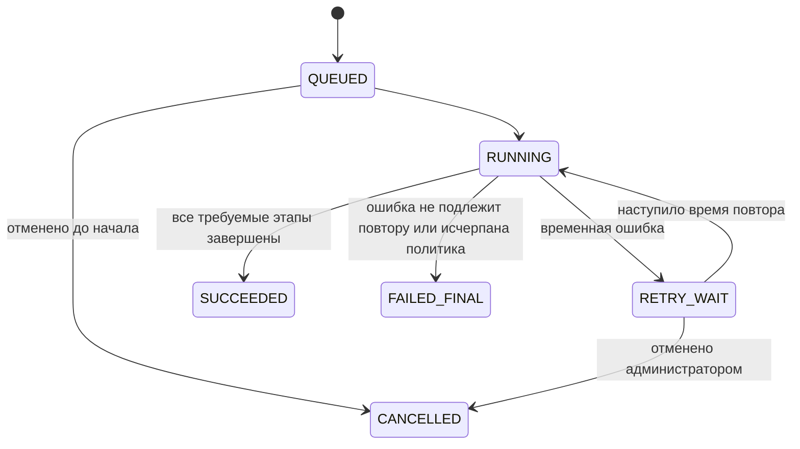

# Интеграционная спецификация Grafio

Спецификация описывает взаимодействие компонентов при недельной загрузке данных WB: последовательности, команды, события, состояния и ошибки. Она не зависит от языка программирования и способа размещения компонентов.

## Коротко

**Зачем документ:** объяснить, как финансовый отчёт проходит путь от API Wildberries до доступной пользователю версии Grafio.

```text
WB API → сохранить исходный ответ → проверить полноту → нормализовать
→ классифицировать → сверить → рассчитать → опубликовать версию отчёта
```

**Главное решение:** загрузка и расчёт выполняются фоновым заданием. Каждый этап имеет собственное состояние, а безопасный повтор продолжает работу без дублей.

**Пример:** если связь оборвалась на третьей странице ответа WB, Grafio не публикует частичный отчёт. После повтора загрузка продолжается с подтверждённой границы, а уже сохранённые операции не учитываются второй раз.

При первом чтении достаточно разделов «Основной асинхронный конвейер», «Последовательность недельной загрузки», «Политика ошибок и повторов» и «Контракт чтения отчёта». Команды и события нужны для передачи спецификации команде разработки.

## Цель и принципы

Интеграция должна получать финансовые и опциональные рекламные данные, сохранять доказуемый исходный ответ, безопасно повторять прерванные действия и создавать воспроизводимую версию отчёта.

Принятые принципы:

1. пользовательский запрос отчёта не вызывает WB API напрямую;
2. каждый этап конвейера имеет вход, выход и независимое состояние;
3. исходный ответ сохраняется до нормализации;
4. повтор команды не дублирует операции и версии отчёта;
5. частичная загрузка не выдаётся за полный источник;
6. ошибка одного опционального источника не скрывает независимые финансовые показатели;
7. опубликованная версия отчёта не изменяется;
8. правила классификации применяются в своей подтверждённой области, а кабинетное исключение остаётся явным.

## Компоненты и ответственность

| Компонент | Ответственность | Не делает |
|---|---|---|
| Планировщик | Создаёт запрос на проверку готовности отчёта и повторные проверки по расписанию | Не обращается к WB и не рассчитывает метрики |
| Оркестратор конвейера | Ведёт состояние задания, запускает этапы, управляет повтором и блокировкой области | Не интерпретирует бизнес-поля WB |
| Адаптер WB | Применяет контракт конкретного метода, лимиты и пагинацию; возвращает исходные ответы | Не классифицирует операции |
| Хранилище исходных документов | Неизменяемо хранит ответы, параметры без секретов и хеши | Не используется как пользовательский отчёт |
| Нормализатор | Проверяет типы и преобразует известные поля в операции, суммы и контрольные итоги | Не назначает категории расходов |
| Детектор качества | Сравнивает схему, полноту, ключи, хеши и контрольные суммы; создаёт сигналы | Не утверждает причину расхождения |
| Классификатор | Применяет опубликованную версию правил и создаёт объяснимые эффекты | Не изменяет исходную операцию или опубликованное правило |
| Расчёт отчёта | Строит показатели, зависимости, статусы и контроль структуры | Не округляет по пользовательским настройкам |
| Публикатор отчёта | Фиксирует новую неизменяемую версию и делает её доступной согласно правилам качества | Не заменяет прежнюю версию физически |
| Сервис администрирования | Управляет проблемой, проектом правила, проверкой и пересчётом | Не обходит блокирующие проверки |
| Сервис уведомлений | Создаёт и доставляет сообщения утверждённой области | Не объявляет исправление до публикации проверенного результата |
| API отчётов | Возвращает версии, значения, детализацию и состояния | Не ждёт завершения фонового задания |

## Основной асинхронный конвейер

| № | Этап | Вход | Выход | Успешное завершение | При ошибке |
|---:|---|---|---|---|---|
| 1 | Запрос загрузки | кабинет, источник, период, причина запуска | задание с `job_id` | область заблокирована от параллельного дубля | существующее активное задание возвращается вызывающему |
| 2 | Поиск отчёта | FIN-LIST, точные границы недели | метаданные отчёта и контрольные итоги | найден один подходящий отчёт | нет отчёта — состояние «данные пока не готовы»; неоднозначность — проблема качества |
| 3 | Получение деталей | `reportId`, начальный `rrdId = 0` | страницы FIN-DETAIL | все страницы сохранены, завершение подтверждено `204` | частичный набор сохраняется, загрузка не становится полной |
| 4 | Фиксация источника | исходные документы и хеши | неизменяемая `source_load` | рассчитан хеш набора и определена связь с прежней загрузкой | повреждённый документ блокирует нормализацию |
| 5 | Нормализация | завершённая загрузка | операции, денежные компоненты, итоги | известные типы разобраны с точностью | неизвестное поле сохраняется в raw и создаёт наблюдение схемы |
| 6 | Технические проверки | операции и метаданные | состояния полноты, дублей, валюты, периода и схемы | нет блокирующей технической ошибки | создаётся проблема; доступность расчётов определяется зависимостями |
| 7 | Классификация | операции и подходящая опубликованная версия правил | классификации и эффекты | нет необъяснённой неоднозначности | неизвестные операции остаются нераспределёнными; конфликт правил блокирует затронутые эффекты |
| 8 | Сверка | эффекты и контрольные итоги FIN-LIST | результаты сверки | сопоставимое расхождение в полной расчётной точности равно 0 | любое ненулевое значение даёт «Требует проверки» и блокирует публикацию новой версии |
| 9 | Расчёт | эффекты, себестоимость, налог, реклама, пользовательские расходы | черновик версии отчёта | каждый показатель имеет значение либо объяснимую причину отсутствия | ошибка одной зависимости не превращается в ноль и не скрывает независимые показатели |
| 10 | Решение о публикации | черновик и матрица качества | статус публикации и отдельный уровень качества | нет блокирующих условий, обязательная сверка равна 0 | сохраняется непубликуемая новая версия и последняя опубликованная версия |
| 11 | Завершение | версия отчёта и сигналы | события результата, задания администратору, пользовательские статусы | итог задания зафиксирован | техническая ошибка завершения повторяется идемпотентно |

## Решение о публикации

Условия проверяются сверху вниз. Обязательная сверка сравнивает точные суммы одного периода и области; если контрольный итог отсутствует, неизвестную разницу нельзя считать нулевой.

| Приоритет | Условие | Решение | Что видит пользователь |
|---|---|---|---|
| 1 | Обязательная загрузка или контрольный итог недоступны; схема, период либо валюта неверны; сумму или знак нельзя надёжно определить; обязательная сверка имеет `Δ ≠ 0` или не может быть выполнена; нет ни одного безопасного независимого показателя | Не публиковать новую версию: `publicationStatus=not_publishable`, `qualityLevel=unavailable` | Причину и последнюю опубликованную версию, если она есть |
| 2 | Блокирующих условий нет; данные для всех показателей полны, классификация определена, обязательные сверки имеют `Δ = 0` | Опубликовать полный отчёт: `publicationStatus=published`, `qualityLevel=full` | Все рассчитанные показатели и детализацию |
| 3 | Блокирующих условий нет; обязательные сверки имеют `Δ = 0`; есть проверенные независимые показатели, но отдельная зависимость недоступна или категория операции неизвестна при достоверных сумме и знаке | Опубликовать ограниченный отчёт: `publicationStatus=published`, `qualityLevel=limited` | Независимые значения; для зависимых — «Не рассчитывается» с причиной, для неизвестной категории — «Нераспределённые» |

Ограниченный результат не обходит обязательную сверку. Объяснение ненулевой разницы также не разрешает публикацию отчёта или новой версии правила. Статус публикации, сводный уровень качества и отдельные состояния источника, полноты, сверки и методики хранятся раздельно.

## Последовательность недельной загрузки

Порядок сообщений показан в двух схемах: [запрос загрузки](sequence/02-request-source-load.svg) и [фоновая обработка с публикацией](sequence/02-source-load-and-report-publication.svg). Условия каждого этапа заданы таблицей конвейера выше.

## Взаимодействие с финансовым API WB

Актуальные методы и поля определены в [контракте WB](../data/wb-data-contract.md). Интеграционная спецификация использует:

- `POST /api/finance/v1/sales-reports/list` для поиска отчёта и контрольных итогов;
- `POST /api/finance/v1/sales-reports/detailed/{reportId}` как основной способ получения деталей;
- метод детализации за период как резерв для поддержанных контрактом случаев;
- `rrdId = 0` для первой страницы и последний `rrdId` для продолжения;
- `204` как признак завершения последовательности деталей.

Устаревший метод `GET /api/v5/supplier/reportDetailByPeriod` не используется новым конвейером.

### Проверки пагинации

1. Последний `rrdId` следующего запроса должен продвигаться вперёд.
2. Повтор страницы с тем же хешем не создаёт новые операции.
3. Повтор идентификатора внутри одной загрузки регистрируется как дубль.
4. `204` на первой странице при ненулевых контрольных итогах создаёт проблему качества.
5. Бесконечный цикл курсора прерывается и не считается завершённой загрузкой.
6. Достижение технического лимита ответа не принимается за конец данных без terminal `204`.

## Идемпотентность и параллельность

### Ключи

| Операция | Ключ идемпотентности |
|---|---|
| Запрос загрузки | переданный `command_id`; бизнес-область `account + source + period + purpose` |
| Исходный документ | `load_id + document_type + cursor/page + content_hash` |
| Финансовая операция | `load_id + reportId + rrdId` |
| Нормализация | `load_id + normalizer_contract_version` |
| Классификация | `operation_id + rule_version_id` |
| Контрольный расчёт | `validation_run_id + input_hash` |
| Версия отчёта | `account_id + period_id + input_hash + calculation_contract_version` |
| Уведомление | `notification_type + scope_hash + source_version_id` |

Одинаковый `input_hash` не создаёт вторую версию отчёта. Новый хеш входов, правил либо влияющих настроек создаёт новую версию.

### Блокировка области

В один момент выполняется не более одного изменяющего задания для сочетания `account + source + period`. Второй запрос получает ссылку на активное задание. Задания разных кабинетов или источников могут выполняться независимо с учётом общего лимита WB на кабинет.

Истёкшая техническая блокировка не означает успех. Новое выполнение сначала читает сохранённое состояние этапов и продолжает с последней доказанно завершённой границы.

## Состояния фонового задания



Для каждого этапа отдельно хранятся номер попытки, начало, окончание, код результата и ссылка на диагностические данные. `SUCCEEDED` означает завершение конвейера, но режим результата отчёта может быть полным, ограниченным или непубликуемым.

## Политика ошибок и повторов

| Ситуация | Классификация | Поведение |
|---|---|---|
| `400` WB | постоянная ошибка запроса | Не повторять без изменения параметров; сохранить безопасное описание ответа |
| `401` WB | ошибка доступа | Остановить задания кабинета, пометить подключение, запросить восстановление доступа |
| `429` WB | временное ограничение | Учитывать `Retry-After`, если он предоставлен; иначе применить увеличивающуюся задержку с разбросом |
| `5xx`, сеть, тайм-аут | временная техническая ошибка | Повторить этап ограниченное число раз, не теряя уже сохранённые страницы |
| FIN-LIST не содержит закрытую неделю | данные пока не готовы | Не создавать пустой отчёт; запланировать следующую проверку |
| Повторяется курсор | нарушение пагинации | Прервать загрузку, отметить её незавершённой, создать проблему |
| Не разбирается денежная строка | ошибка данных/контракта | Сохранить raw, не подменять нулём, создать проблему схемы или данных |
| Новое поле | изменение схемы | Сохранить, сравнить отпечаток, определить влияние на правила |
| Новое значение операции | бизнес-неизвестность | Оставить нераспределённым, создать проблему администратора |
| Расхождение ≠ 0 | ошибка сверки | Сохранить обе суммы и точную разницу, не назначать причину |
| Не завершён опциональный источник | частичная доступность | Не рассчитывать зависимые показатели; независимые финансовые данные доступны |

Число попыток и интервалы повторов являются эксплуатационными настройками. Спецификация не выдумывает значения, которых нет в официальных лимитах или утверждённых требованиях.

## Команды конвейера

Каждая изменяющая команда содержит:

| Поле | Назначение |
|---|---|
| `command_id` | идемпотентность повторной отправки |
| `correlation_id` | связь всех действий одного пользовательского или планового процесса |
| `causation_id` | команда или событие, вызвавшее действие |
| `requested_at` | время запроса |
| `actor_type` и `actor_id` | планировщик, система или пользователь |
| `organization_id`, `account_id` | клиентская область и кабинет |
| `period_id` | точный отчётный период |
| `contract_version` | версия формата команды |

Основные команды:

| Команда | Дополнительные данные | Результат |
|---|---|---|
| `RequestSourceLoad` | источник, причина запуска | `job_id` существующего или нового задания |
| `NormalizeSourceLoad` | `load_id`, версия контракта | нормализованные факты и наблюдение схемы |
| `ClassifyOperations` | `load_id`, версия правил | классификации и эффекты |
| `CalculateReport` | кабинет, период, точные входы | черновик версии и матрица качества |
| `RunRuleValidation` | проект правила, контрольные загрузки | протокол проверки до/после |
| `PublishRuleVersion` | проверка, область, способ применения | опубликованная версия и команда пересчёта/активации |
| `RecalculateReports` | версия правила, кабинеты, периоды | набор заданий расчёта новых версий |
| `PublishNotification` | шаблон, область, связанная версия | неизменяемое уведомление и доставки |

## Внутренние события

События сообщают о свершившемся факте и не изменяются после записи:

| Событие | Минимальные данные | Получатели |
|---|---|---|
| `SourceLoadCompleted` | `load_id`, область, хеш, полнота | нормализатор, контроль качества |
| `SourceLoadFailed` | этап, код ошибки, повторяемость | оркестратор, наблюдаемость |
| `SchemaChangeDetected` | старая/новая версия схемы, изменённые ключи | сервис качества |
| `UnknownOperationDetected` | значения признаков, число строк, сумма?, область | очередь администратора |
| `ReconciliationFailed` | расчётная и контрольная суммы, разница | очередь администратора |
| `RuleValidationCompleted` | проект, входной хеш, результаты проверок | рабочее пространство администратора |
| `RuleVersionPublished` | версия, общая область или явное исключение, период | классификатор, оркестратор пересчёта |
| `ReportVersionCalculated` | версия, режим качества, входной хеш | публикатор |
| `ReportVersionPublished` | новая и предыдущая версии, изменённые показатели | API отчётов, уведомления |
| `NotificationPublished` | тип и область | доставка и аудит |

Запись бизнес-состояния и события должна быть атомарной: система не должна сохранить опубликованную версию без события о публикации или отправить событие о версии, которой нет.

## Пересчёт после публикации правила

Порядок сообщений показан в пяти схемах: [кейс клиента](sequence/03-client-case.svg), [расследование](sequence/03-investigation.svg), [проверка правила](sequence/03-rule-validation.svg), [публикация](sequence/03-rule-publication.svg) и [применение с результатом кейса](sequence/03-rule-application.svg). Блокирующие проверки приведены в [жизненном цикле методики](../processes/calculation-lifecycle.md).

Уведомление «история пересчитана» создаётся только после того, как обработаны все ожидаемые кабинет-периоды либо область результата явно уменьшена и обоснована. Частичный успех не называется полным пересчётом.

## Контракт чтения отчёта

Пользовательский запрос содержит юридическое лицо, кабинет, период и необязательную версию. API проверяет доступ пользователя и возвращает:

- точный контекст кабинета и периода;
- выбранную и актуальную версии отчёта;
- версии правил и область их действия;
- состояния источников, полноты, сверки и методики по отдельности;
- значения метрик или `не рассчитывается` с кодом и пояснением причины;
- включённые опции;
- предупреждения и доступное сравнение версий;
- ссылки на разрешённую детализацию.

Если версия не указана, возвращается последняя опубликованная версия. Черновик или непроверенный пересчёт пользовательскому API не выдаётся как актуальный отчёт.

## Безопасность и изоляция

- Токен WB извлекается по `secret_ref` только адаптером и не попадает в команду, журнал или raw-документ.
- Каждая команда и запрос несут клиентскую область; доступ проверяется до чтения данных.
- Исходные документы доступны только административной роли с аудитом просмотра.
- Диагностические сообщения исключают токены и полный исходный ответ.
- Право создать проект правила отделено от права опубликовать его.
- Кабинетное исключение требует отдельного полномочия публикации, области и обоснования.

## Наблюдаемость

Для каждой операции сквозными идентификаторами являются `correlation_id`, `job_id`, `load_id`, `account_id`, `period_id`, `rule_version_id` и `report_version_id` по мере их появления.

Наблюдаются:

- число заданий по состояниям и этапам;
- возраст активного задания;
- ответы `429`, `401`, `5xx` и задержки повторов;
- страницы, строки и продвижение курсора;
- изменения схемы и неизвестные значения операций;
- результаты сверок;
- число нераспределённых и неоднозначных операций;
- версии отчётов по режимам качества;
- длительность и полнота исторического пересчёта.

## Проверяемые результаты

Успешная постраничная загрузка показана в [примере AT-07](../requirements/acceptance-criteria.md). Обязательное поведение определено в [требованиях к интерфейсам](../requirements/interface-requirements.md). Поля WB и контрольные итоги определены в [контракте источника](../data/wb-data-contract.md), а сущности хранения — в [логической модели](../data/logical-data-model.md).

Связь бизнес-требований со сценариями, сущностями, интерфейсами и проверками зафиксирована в [матрице прослеживаемости](../requirements/traceability-matrix.md).
