# Диаграммы последовательности Grafio

Диаграммы показывают порядок взаимодействий компонентов Grafio. Для первого чтения достаточно трёх сценариев: просмотр отчёта, загрузка источника и изменение методики. Остальные раскрывают планы, подключение кабинета, управление доступом и закрытие организации.

## Основной маршрут

| Сценарий | Диаграмма | Покрываемые требования |
|---|---|---|
| Просмотр недельного отчёта | [PNG](sequence/01-weekly-report-view.png) · [SVG](sequence/01-weekly-report-view.svg) · [PlantUML](sequence/01-weekly-report-view.puml) | PFR-01—PFR-09 |
| Загрузка WB: запрос | [PNG](sequence/02-request-source-load.png) · [SVG](sequence/02-request-source-load.svg) · [PlantUML](sequence/02-request-source-load.puml) | PFR-02—PFR-10 |
| Загрузка WB: обработка и публикация | [PNG](sequence/02-source-load-and-report-publication.png) · [SVG](sequence/02-source-load-and-report-publication.svg) · [PlantUML](sequence/02-source-load-and-report-publication.puml) | PFR-02—PFR-10 |
| Кейс клиента | [PNG](sequence/03-client-case.png) · [SVG](sequence/03-client-case.svg) · [PlantUML](sequence/03-client-case.puml) | PFR-11—PFR-12 |
| Расследование и проект правила | [PNG](sequence/03-investigation.png) · [SVG](sequence/03-investigation.svg) · [PlantUML](sequence/03-investigation.puml) | PFR-13 |
| Проверка правила | [PNG](sequence/03-rule-validation.png) · [SVG](sequence/03-rule-validation.svg) · [PlantUML](sequence/03-rule-validation.puml) | PFR-13—PFR-14 |
| Публикация правила | [PNG](sequence/03-rule-publication.png) · [SVG](sequence/03-rule-publication.svg) · [PlantUML](sequence/03-rule-publication.puml) | PFR-14 |
| Применение правила и результат кейса | [PNG](sequence/03-rule-application.png) · [SVG](sequence/03-rule-application.svg) · [PlantUML](sequence/03-rule-application.puml) | PFR-15—PFR-16 |

### Просмотр недельного отчёта

[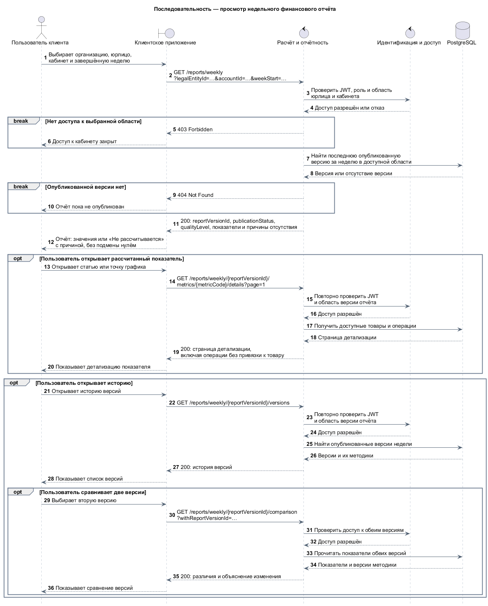](sequence/01-weekly-report-view.svg)

### Загрузка WB и публикация отчёта

**02а. Запрос загрузки** · [исходник PlantUML](sequence/02-request-source-load.puml)

[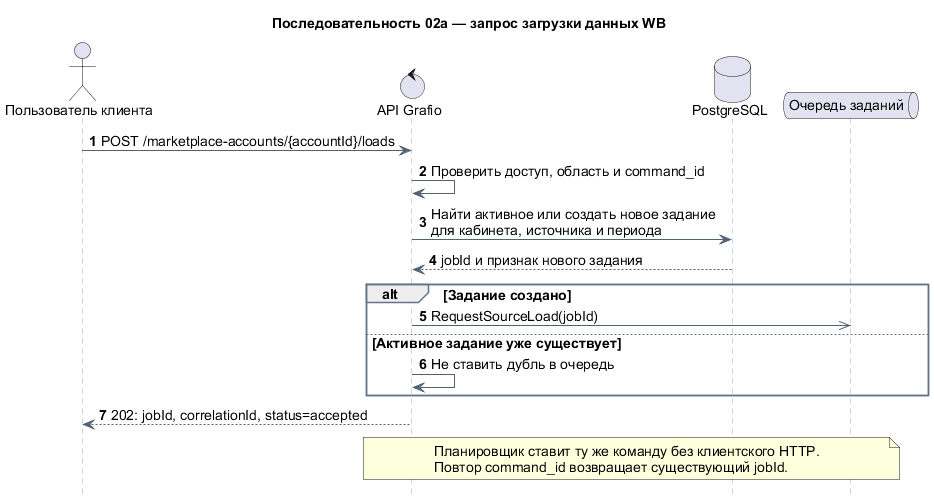](sequence/02-request-source-load.svg)

**02б. Фоновая обработка и публикация** · [исходник PlantUML](sequence/02-source-load-and-report-publication.puml)

[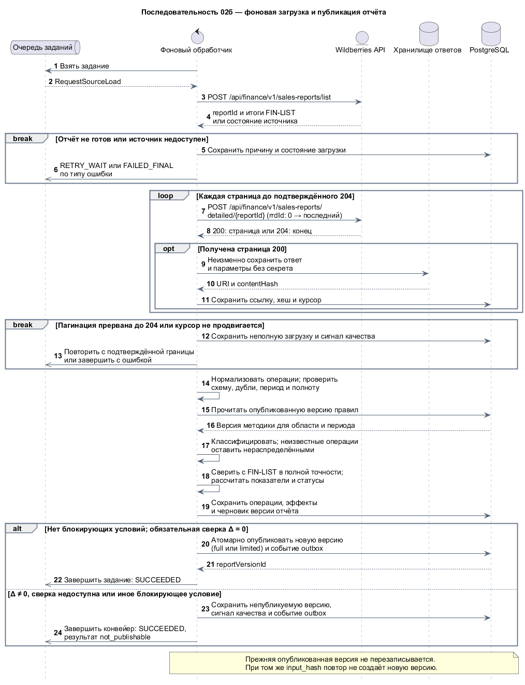](sequence/02-source-load-and-report-publication.svg)

### Кейс клиента, методика и пересчёт

**03а. Клиентский кейс** · [исходник PlantUML](sequence/03-client-case.puml)

[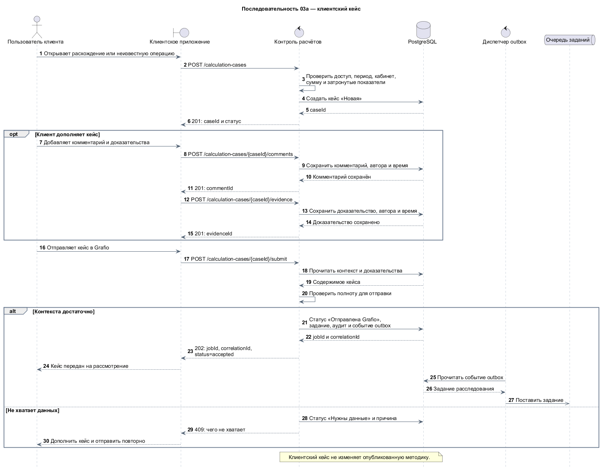](sequence/03-client-case.svg)

**03б. Расследование и проект правила** · [исходник PlantUML](sequence/03-investigation.puml)

[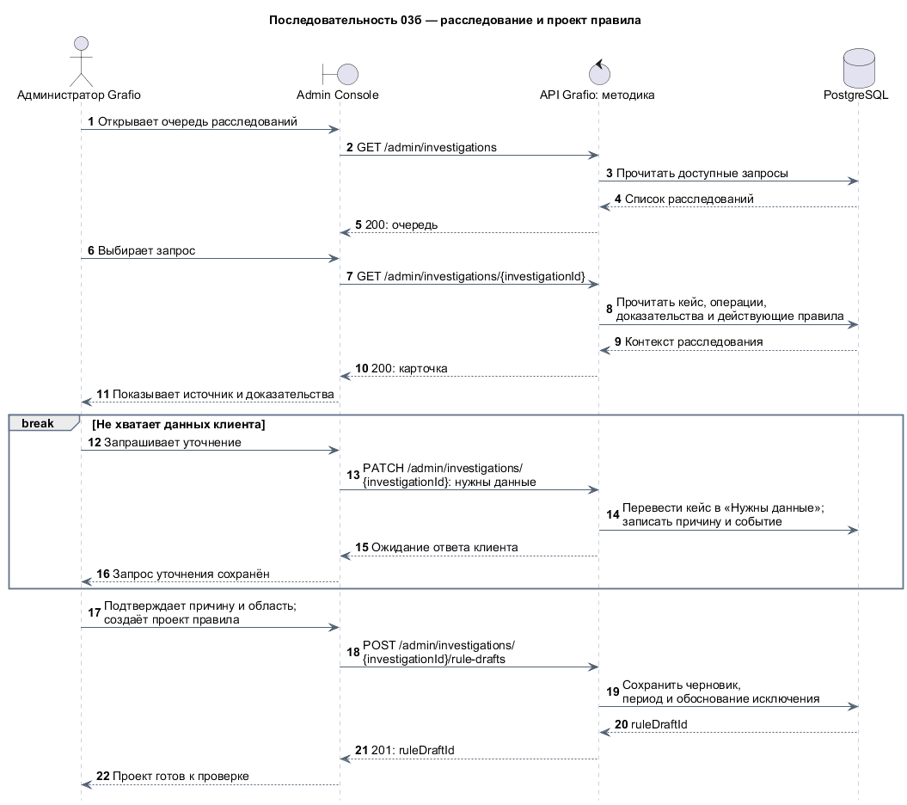](sequence/03-investigation.svg)

**03в. Контрольная проверка правила** · [исходник PlantUML](sequence/03-rule-validation.puml)

[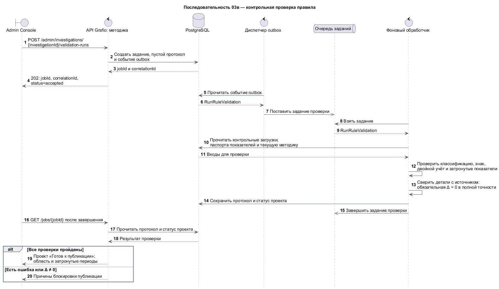](sequence/03-rule-validation.svg)

**03г. Публикация правила** · [исходник PlantUML](sequence/03-rule-publication.puml)

[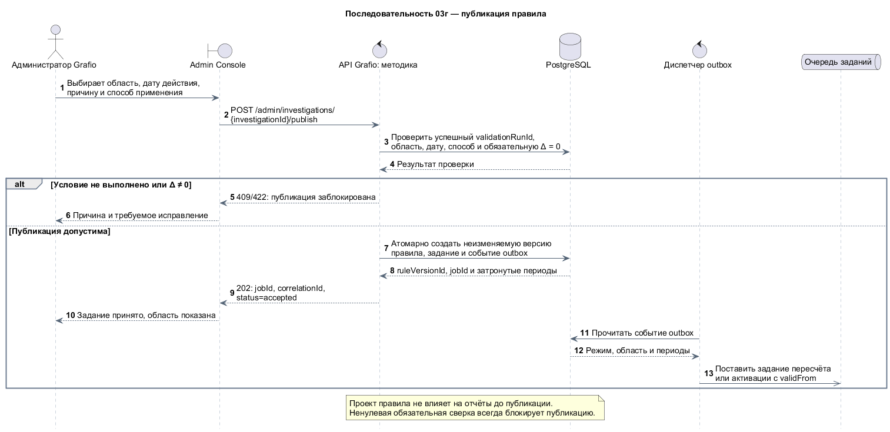](sequence/03-rule-publication.svg)

**03д. Применение правила и результат кейса** · [исходник PlantUML](sequence/03-rule-application.puml)

[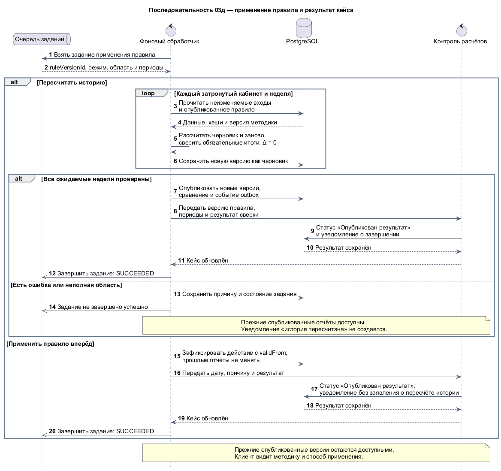](sequence/03-rule-application.svg)

## Дополнительные сценарии

| Сценарий | Диаграмма | Покрываемые требования |
|---|---|---|
| Жизненный цикл плана | [PNG](sequence/04-plan-lifecycle.png) · [SVG](sequence/04-plan-lifecycle.svg) · [PlantUML](sequence/04-plan-lifecycle.puml) | PFR-17—PFR-18, AC-22—AC-24 |
| Регистрация организации и кабинета WB | [PNG](sequence/05-wb-account-onboarding.png) · [SVG](sequence/05-wb-account-onboarding.svg) · [PlantUML](sequence/05-wb-account-onboarding.puml) | US-18, AC-34 |
| Проверка кабинета WB | [PNG](sequence/05-wb-account-verification.png) · [SVG](sequence/05-wb-account-verification.svg) · [PlantUML](sequence/05-wb-account-verification.puml) | US-18, AC-34; результат загрузки — 02б |
| Жизненный цикл доступа сотрудника | [PNG](sequence/06-employee-access-lifecycle.png) · [SVG](sequence/06-employee-access-lifecycle.svg) · [PlantUML](sequence/06-employee-access-lifecycle.puml) | PFR-24—PFR-25, PFR-27; AC-32—AC-33 |
| Запрос закрытия и архивирование | [PNG](sequence/07-organization-closure.png) · [SVG](sequence/07-organization-closure.svg) · [PlantUML](sequence/07-organization-closure.puml) | US-19, AC-36 |
| Срок хранения и удаление | [PNG](sequence/07-retention-and-deletion.png) · [SVG](sequence/07-retention-and-deletion.svg) · [PlantUML](sequence/07-retention-and-deletion.puml) | US-19, AC-36, NFR-18—NFR-20 |
| Отмена закрытия | [PNG](sequence/07-closure-cancellation.png) · [SVG](sequence/07-closure-cancellation.svg) · [PlantUML](sequence/07-closure-cancellation.puml) | US-19, AC-36 |

### Жизненный цикл плана

[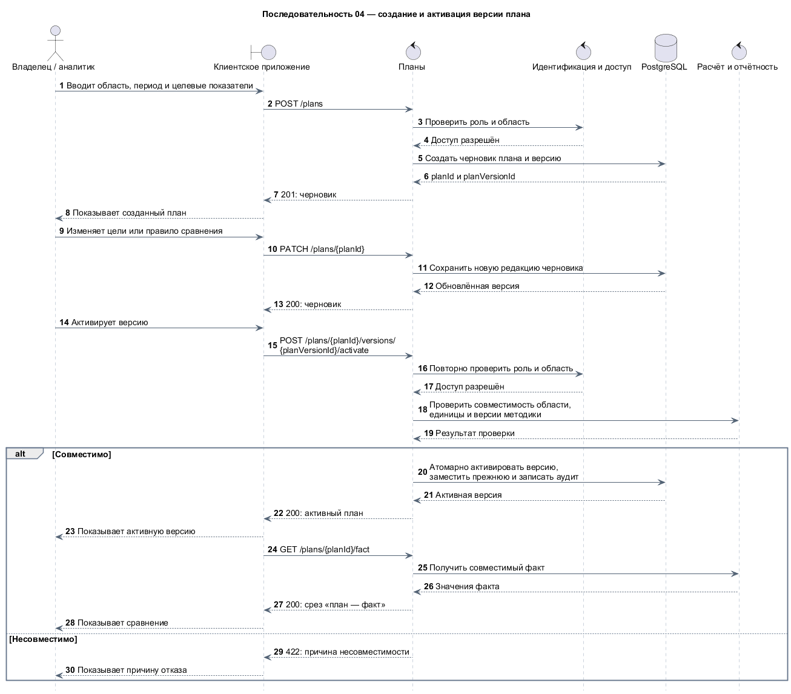](sequence/04-plan-lifecycle.svg)

### Подключение организации и кабинета WB

**05а. Регистрация организации и кабинета** · [исходник PlantUML](sequence/05-wb-account-onboarding.puml)

[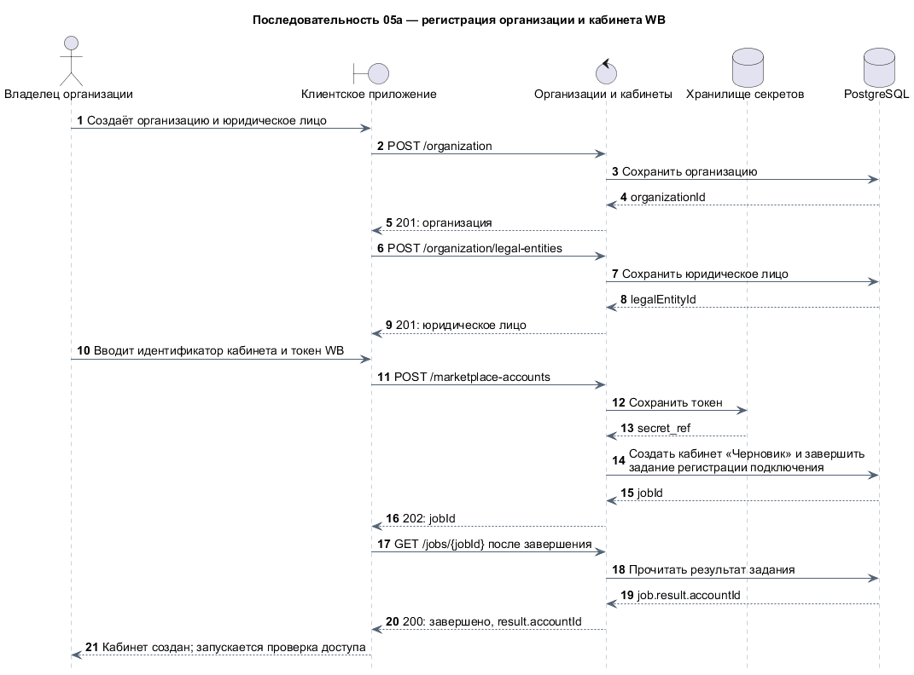](sequence/05-wb-account-onboarding.svg)

**05б. Проверка доступа и запуск первой загрузки** · [исходник PlantUML](sequence/05-wb-account-verification.puml). Обработка загрузки и публикация результата показаны в [02б](#загрузка-wb-и-публикация-отчёта).

[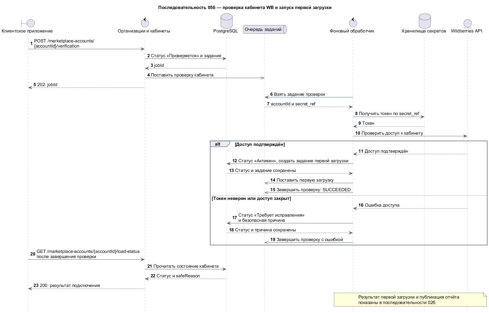](sequence/05-wb-account-verification.svg)

### Жизненный цикл доступа сотрудника

[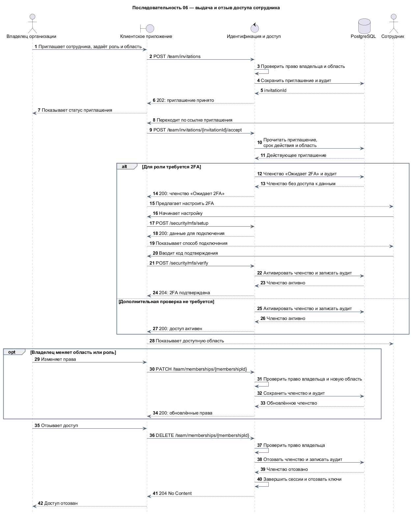](sequence/06-employee-access-lifecycle.svg)

### Закрытие организации

**07а. Запрос закрытия и архивирование** · [исходник PlantUML](sequence/07-organization-closure.puml)

[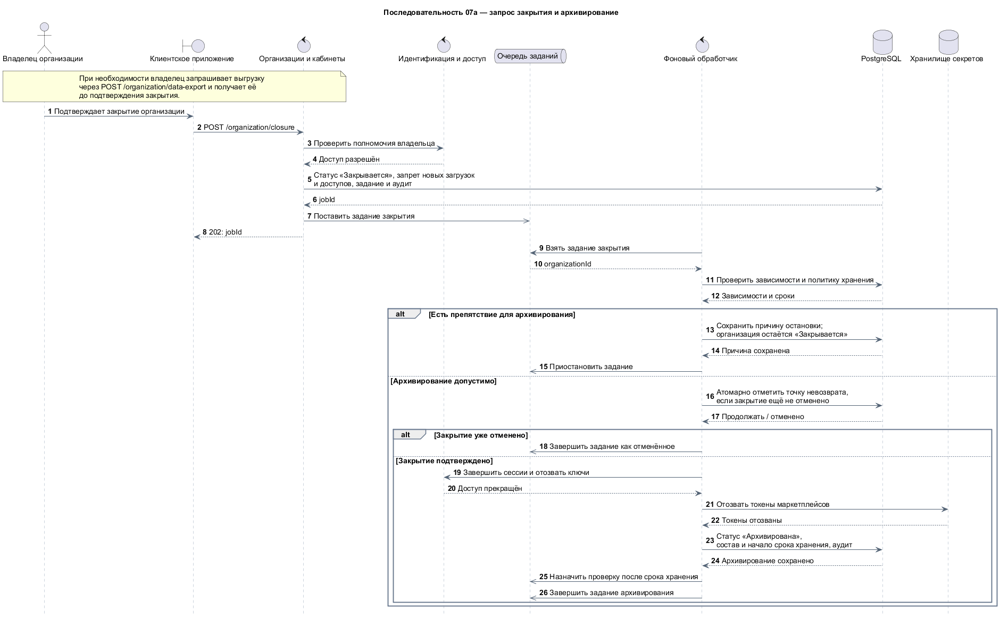](sequence/07-organization-closure.svg)

**07б. Срок хранения и удаление** · [исходник PlantUML](sequence/07-retention-and-deletion.puml)

[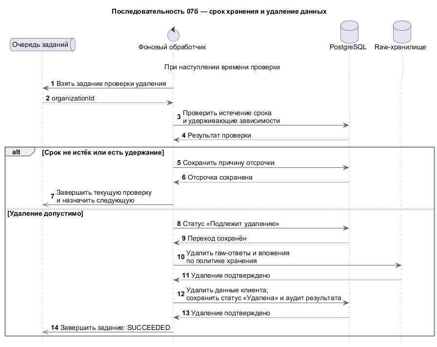](sequence/07-retention-and-deletion.svg)

**07в. Попытка отмены закрытия** · [исходник PlantUML](sequence/07-closure-cancellation.puml)

[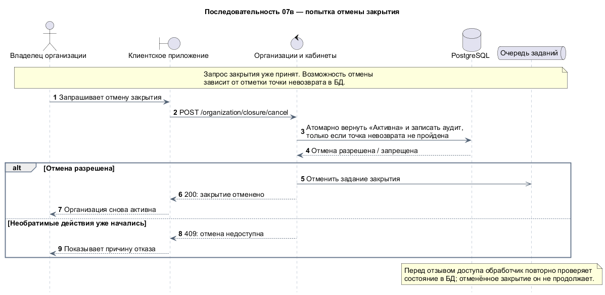](sequence/07-closure-cancellation.svg)

Диаграммы написаны в PlantUML. Они дополняют, а не заменяют [BPMN-процессы](../processes/bpmn-index.md): BPMN показывает процесс и участников, sequence — сообщения между компонентами.
