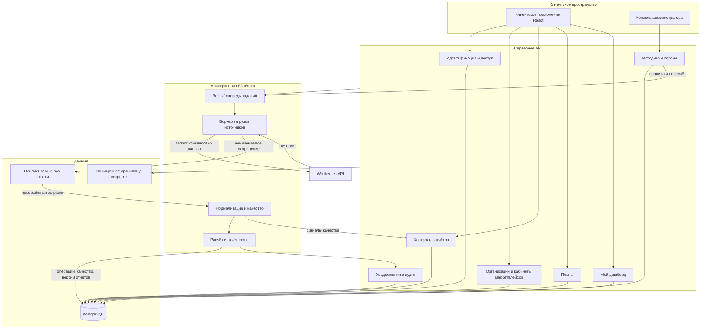

# Архитектура финансового контура Grafio

Этот документ раскрывает финансовый контур в [единой архитектуре Grafio](README.md) и требования [SRS](../requirements/srs.md). Он описывает проектные решения; технический состав исходной платформы зафиксирован в [обзоре реализации](current-service-overview.md). Описание модуля здесь само по себе не подтверждает его внедрение.

C4-представление этой архитектуры: [контекст, контейнеры и компоненты API](c4-model.md).

Последовательности ключевых взаимодействий: [sequence-диаграммы](sequence-diagrams.md).

Причины ключевых архитектурных решений: [ADR](adr/README.md).

## 1. Архитектурное решение

Финансовый контур развивается как **модульный монолит с отдельным асинхронным worker-процессом**. Модули могут находиться в одном репозитории, одном приложении и одной PostgreSQL-базе, но сохраняют явные интерфейсы, собственные команды, события и ответственность.

Это решение соответствует первой версии: оно сохраняет простую эксплуатацию, транзакционную целостность правил, версий и аудита, но не препятствует выделению компонента в отдельный сервис при подтверждённой нагрузке или независимом жизненном цикле.

## 2. Границы модулей backend

| Модуль | Ответственность | Владеет | Не делает |
|---|---|---|---|
| Идентификация и доступ | Вход, роли, области доступа, 2FA, сессии, аудит доступа | пользователь, членство, роль, область, сессия | Не рассчитывает финансовые показатели. |
| Организации и кабинеты маркетплейсов | Организация, юрлицо, подключение WB, безопасная ссылка на токен | организация, юрлицо, кабинет, период подключения, `secret_ref` | Не хранит сам токен в аналитической БД. |
| Загрузка источников | Создаёт задания, получает и сохраняет ответы WB, повторяет безопасно | загрузка, raw-документ, курсор, хеш | Не классифицирует расход. |
| Нормализация и качество | Нормализует операции, проверяет схему, период, дубли, полноту и контрольные суммы | операция, денежный компонент, наблюдение схемы, сигнал качества | Не утверждает причину расхождения. |
| Методика | Ведёт категории, проекты и опубликованные версии правил | правило, область действия, версия методики | Не меняет raw-операцию. |
| Расчёт и отчётность | Создаёт версии отчёта, показатели, детализацию и сверку | версия отчёта, значение, связь с входами | Не перезаписывает опубликованную историю. |
| Контроль расчётов | Ведёт клиентский кейс, доказательства, задачи и передачу в Admin Console | кейс, комментарий, вложение, статус | Не публикует системное правило от имени клиента. |
| Plans | Ведёт версии планов и сопоставляет их с совместимым фактом | план, версия, область, цель, единица | Не меняет факт и методику. |
| Мой дашборд | Хранит личные листы, виджеты и layout | лист, виджет, layout пользователя | Не меняет корпоративный показатель. |
| Уведомления и аудит | Доставляет события в нужную область и хранит существенные действия | уведомление, аудит, `correlation_id` | Не создаёт бизнес-решение самостоятельно. |

## 3. API и асинхронные команды

### Синхронный API

HTTP API возвращает только быстрые операции чтения или подтверждение принятой команды. Проверка полномочий выполняется до выдачи данных и до изменения состояния.

| Группа | Примеры операций |
|---|---|
| Отчёт | получить версию отчёта, историю, детализацию, статусы источников, показатели |
| Кейс | создать, дополнить, отправить в Grafio, прочитать статус и результат |
| Методика | получить очередь Admin Console, проект правила, контроль, историю публикаций |
| Планы | создать черновик, проверить, активировать, получить факт–план |
| Команда | пригласить, назначить роль/область, отозвать, завершить сессии |
| Кабинет | создать подключение, проверить токен, прочитать статус первой загрузки |
| Dashboard | создать лист, добавить/изменить виджет, сохранить layout |

### Асинхронные команды

| Команда | Инициатор | Результат |
|---|---|---|
| `RequestSourceLoad` | Планировщик, пользователь или пересчёт | `job_id`, идемпотентная загрузка источника |
| `NormalizeLoad` | Worker после завершения загрузки | нормализованные операции и сигналы качества |
| `CalculateReport` | Оркестратор | черновик версии отчёта и матрица качества |
| `PublishReportVersion` | Публикатор | опубликованная/ограниченная/непубликуемая версия |
| `PublishRuleVersion` | Admin Console | версия методики и команда пересчёта либо применения вперёд |
| `RecalculatePeriods` | Methodology | новые версии затронутых периодов |
| `DeactivateOrganization` | Подтверждённое закрытие клиента | остановка интеграций, аудит и запуск политики хранения |

Команда возвращает `job_id`, `correlation_id` и безопасный статус принятия. Долгая загрузка или пересчёт не удерживают HTTP-соединение.

## 4. События и согласованность

События нужны для связи модулей и уведомлений, а не как замена транзакциям предметной области.

| Событие | Производитель | Потребители |
|---|---|---|
| `SourceLoadCompleted` / `SourceLoadFailed` | Source Ingestion | Quality, Notification |
| `QualityIssueDetected` | Normalization & Quality | Calculation Control, Admin Console |
| `UnknownOperationDetected` | Methodology / Quality | Admin Console |
| `ReconciliationFailed` | Calculation | Calculation Control, Admin Console |
| `ReportVersionPublished` | Calculation & Reporting | UI cache, Notification, Plans |
| `RuleVersionPublished` | Methodology | Recalculation, Calculation Control, Audit |
| `PlanVersionActivated` | Plans | Analytics, Audit |
| `AccessChanged` | Identity & Access | Audit, active-session management |
| `OrganizationDeactivated` | Organization | Ingestion, Secrets, Retention |

Запись доменного изменения и исходящего события выполняется атомарно через outbox-паттерн: нельзя зафиксировать публикацию версии без события о ней или отправить событие о несуществующей версии.

## 5. Модель данных и хранение

PostgreSQL остаётся транзакционной системой записи для метаданных, настроек, нормализованных операций, версий и аудита. Неизменяемые raw-ответы WB хранятся отдельно от пользовательских витрин, с хешем и ссылкой на загрузку. Материализованные представления допустимы для оптимизации аналитического чтения, но не заменяют версию отчёта как воспроизводимый результат.

| Слой данных | Назначение | Правило |
|---|---|---|
| Секреты | Токены внешних API | В БД аналитики хранится только `secret_ref`. |
| Raw | Ответы WB и параметры без секрета | Не изменяются; защищены хешем и политикой хранения. |
| Нормализованный | Операции, суммы, справочники, связи | Ноль, отсутствие и ошибка различимы. |
| Версионный | Правила, отчёты, планы | Публикация создаёт версию, не переписывает прежнюю. |
| Операционный | Кейсы, задачи, уведомления, аудит | Хранит актор, время, область и `correlation_id`. |

Подробные сущности и инварианты: [логическая модель данных](../data/logical-data-model.md).

## 6. Безопасность и границы доступа

1. Каждый запрос проходит аутентификацию и проверку организации, роли, юридического лица, кабинета и действия.
2. Клиентские данные изолированы по организации; прямой идентификатор другого клиента не даёт доступ.
3. Admin Console — отдельный интерфейс и permission boundary. Клиентская роль не получает доступ к публикации методики.
4. Для административных ролей обязательны MFA и неизменяемый аудит значимых действий.
5. Токены WB не попадают в логи, raw-ответы, сообщения об ошибках или JSON-ответы API.
6. При закрытии организации сначала останавливаются новые интеграции и сессии, затем применяется политика хранения и удаления.

## 7. Развёртывание и наблюдаемость

Целевая топология сохраняет отдельные процессы API и Worker за reverse proxy, PostgreSQL и Redis. Масштабирование начинается с независимого увеличения worker-экземпляров и ограничителей API WB; чтение опубликованных отчётов не должно конкурировать с массовым пересчётом за очередь или ресурсы БД.

Наблюдаемость должна позволять восстановить путь `запрос → job_id → load_id → версия правила → версия отчёта → уведомление`. Минимальные сигналы: возраст заданий, повторы, ошибки WB, изменение схемы, полнота, неизвестные операции, расхождение, длительность пересчёта и ошибка публикации.

Целевые показатели производительности, восстановления и доступности определены в [NFR](../requirements/non-functional-requirements.md).

## 8. Связь с платформой и прототипом

Текущая кодовая архитектура уже содержит SPA, Fastify API, PostgreSQL, Redis и отдельный worker. Целевой финансовый контур добавляет или уточняет предметные модули, интерфейсы и версии из этого документа. Он не требует немедленного разделения на микросервисы.

Кликабельный [прототип](../../prototype/README.md) — визуальная демонстрация пользовательских путей. Он не является источником фактического статуса backend-модулей и не подтверждает работу API, очередей, базы, авторизации или WB-интеграции.

## Нормативные связи

- [SRS](../requirements/srs.md) — границы и системные требования;
- [интеграционная спецификация](../data/integration-specification.md) — детальный конвейер, ошибки и события;
- [операционные процессы](../processes/operational-workflows.md) — клиентский кейс и Admin Console;
- [статусные модели](../processes/status-models.md) — состояния объектов;
- [требования к интерфейсам](../requirements/interface-requirements.md) — UI/API-контракты;
- [ограничения и допущения](../requirements/constraints-and-assumptions.md) — границы и открытые проверки.
