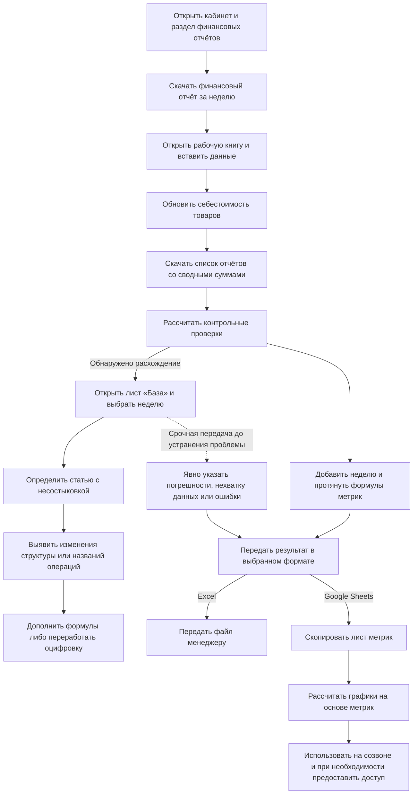

# AS-IS: подготовка недельного отчёта WB

AS-IS показывает ручную подготовку отчёта: от выгрузки WB до передачи Excel или представления данных через Google Sheets, включая срочную передачу с известными ограничениями. Детальные правила сверки и повторной проверки в исходных материалах не установлены.

## Источник и границы

Источник — описание ручной подготовки отчёта и обезличенная рабочая книга WB. Книга помогла проверить смысл показателей, ограничения формул и причины возможных расхождений.

- Исполнитель описанных действий: финансовый аналитик.
- Площадка в примере: Wildberries.
- Среда работы: кабинет площадки и рабочая книга проекта. Результат передавался в Excel либо лист метрик копировался в Google Sheets для расчёта графиков и совместного доступа.
- Назначение: подготовить недельные показатели для [сценария анализа расходов](../requirements/weekly-expense-use-case.md).
- Период в описании процесса: предыдущая неделя, понедельник–воскресенье. Если отчёт готовят в понедельник, выбирают завершившуюся неделю.
- Доступность источника: в исходном процессе недельные финансовые отчёты получали в начале следующей недели. Это описание прежней практики, а не проверенная гарантия текущего расписания WB или полноты всех начислений.
- Повод начала: подготовка недельной отчётности; точный регламент и срок готовности неизвестны.
- Конечные результаты описанного процесса: Excel передан менеджеру либо метрики перенесены в Google Sheets, где на их основе рассчитывались графики для созвонов; при необходимости менеджерам и клиентам выдавался доступ. Использование отчёта не всегда означало отсутствие известных ошибок.
- На встрече с клиентом показывали основной набор графиков. Для других кабинетов набор мог дополняться; единого неизменного состава визуализаций для всех клиентов не подтверждено.

## Последовательность действий

Шаги 1–9 описывают подготовку отчёта; шаги 10–11 — передачу результата. Основной исполнитель — финансовый аналитик; расчёты происходят в таблицах. Ответственность за выдачу доступа и проведение встреч отдельно не установлена.

| Шаг | Действие | Данные / инструмент | Результат |
|---|---|---|---|
| 1 | Открыть кабинет маркетплейса | Кабинет WB | Открыт кабинет |
| 2 | Перейти в раздел финансовых отчётов | Раздел отчётности | Доступен выбор отчёта |
| 3 | Скачать Excel-отчёт за выбранный период | Недельный финансовый отчёт | Получен исходный файл за предыдущую неделю |
| 4 | Открыть рабочую книгу оцифровки проекта | Ранее подготовленная книга с формулами | Открыт инструмент обработки; формулы могли устаревать при изменении источника |
| 5 | Вставить финансовый отчёт на лист «База» для хранения и первичной обработки | Исходный файл, формулы и поля рабочей книги | Данные добавлены для первичных расчётов |
| 6 | Обновить себестоимость существующих и новых товаров | Лист себестоимости | Обновлены значения; источник, дата действия и правила истории не уточнены |
| 7 | Скачать список отчётов со сводными суммами | Отдельная выгрузка из WB | Получены суммы по отчётам для последующей сверки |
| 8 | Выполнить расчёты проверок | Проверки по неделе и статьям | Получены контрольные значения; для поля «Проверка» ожидался ноль |
| 9 | Добавить новую неделю на листе метрик и протянуть формулы | Недели по горизонтали, метрики по вертикали | Показатели подтягиваются из финансового отчёта |
| 10 | Передать Excel менеджеру либо скопировать лист метрик в Google Sheets | Рабочая книга или копия метрик | Результат доступен в выбранном формате; при срочной передаче недоработанного результата аналитик явно указывал известные ограничения |
| 11 | Для варианта Google Sheets использовать рассчитанные на основе метрик графики на созвонах; при необходимости выдать доступ | Google Sheets, графики, доступ менеджерам и клиентам | Данные представлены участникам; точные роли доступа и способ переноса предупреждений не уточнены |

Правила вставки повторно скачанного отчёта, поведение пересчёта после изменения себестоимости и формулы сверок не определены. Исходный процесс не устанавливает, что аналитик всегда переходил к шагу 9 независимо от результата шага 8.

## Укрупнённая схема описанного фрагмента

Схема последовательности. Показаны расследование расхождения и варианты передачи результата. Детальное правило обычного допуска отчёта к использованию ещё не установлено.

Стрелка между проверками и метриками отражает исходное описание порядка, а не правило допуска к следующему шагу. Пунктир показывает возможность срочной передачи до устранения проблемы; точный момент и согласование этой передачи не установлены. Связь исправления с повторной проверкой пока не показана. Изменения площадки указаны как возможная, но не единственная причина расхождений.

## Передача результата и известные ограничения

При крайней необходимости отчёт могли передать менеджеру с явным указанием погрешностей, нехватки информации или ошибок. Это исключение из практики, а не установленное разрешение использовать любой непроверенный отчёт.

Было два варианта предоставления результата:

1. Передача самого Excel-файла.
2. Копирование листа метрик в Google Sheets. На основе перенесённых данных там рассчитывались графики, которые показывали на созвонах. При необходимости доступ предоставляли менеджерам и клиентам.

Пока неизвестны способ фиксации предупреждений, их видимость клиентам, критерии допустимой погрешности, согласующий срочную передачу, права просмотра / редактирования и порядок обновления данных после исправления исходной книги.

### Значение для анализа

- Различаются доступность результата и его проверенность. Переданный отчёт мог содержать известные ограничения.
- Предупреждение об ограничениях было частью передачи результата; при проектировании нужно определить, как оно достигает пользователя конкретной таблицы или графика.
- Копирование метрик создаёт отдельное представление данных. Возникает вопрос согласованности исходной книги и Google Sheets после исправлений; фактические случаи расхождения этих копий не задокументированы.
- В AS-IS есть как минимум подготовка аналитиком, получение менеджером и просмотр на встречах с клиентами. Эти роли не определяют автоматически матрицу доступа будущего сервиса.

## Зависания и сроки

Большие финансовые отчёты увеличивали объём рабочей книги. Зависание при расчёте формул могло замедлять работу на 1–3 часа; при более длительном зависании расчёт приостанавливали и заводили новую таблицу. Детали переноса данных и восстановления расчёта пока не выяснены.

Регулярная недельная аналитика, по ретроспективной оценке, занимала 30–90 минут для небольшого селлера и до 3 часов для крупного, иногда больше. Эти оценки относятся к работе по селлеру и зависят также от количества кабинетов; их нельзя без уточнения приписать одному отчёту WB. Включённость задержек в общий диапазон неизвестна.

Сроки назначались с учётом важности клиента для консалтинговой компании: его размера и приносимого дохода. Дополнительные исследования, новые метрики и товарные срезы не входят в оценки стандартной недельной аналитики. Оценки не разделяют активную работу, ожидание расчёта и полное время до передачи результата; сравнение AS-IS и TO-BE требует одинаковых границ периода, объёма данных и состава результата. Эффект автоматизации и численные цели не измерены.

## Обработка расхождений

1. При несостыковке аналитик переходил на лист «База», где хранился финансовый отчёт.
2. Выбирал нужную неделю.
3. Определял проблемное направление по проверкам: продажи, к перечислению, логистика, штрафы, доплаты, хранение, приёмка, прочие удержания. Точное расположение контрольных формул в книге пока не установлено.
4. Искал изменения, которые не учитывались прежней логикой обработки. Частой причиной считались нововведения площадки.
5. При небольших изменениях обнаруживал новые или изменённые расходы, удержания, компенсации и добавлял их учёт в формулы.
6. При существенных изменениях требовалась переработка оцифровки. Кто её выполнял, сколько времени она занимала и как проверялась, пока не уточнено.

Это описание ручного исходного процесса. Формальная граница между «небольшим» и «существенным» изменением не задана.

### Два вида изменений внешнего источника

| Вид изменения | Наблюдение | Последствие для обработки |
|---|---|---|
| Изменение структуры выгрузки | WB добавлял столбцы, таблица становилась шире и переставала помещаться в прежний шаблон | Шаблон оцифровки переставал корректно принимать или обрабатывать изменившийся файл; точный механизм нарушения ссылок и диапазонов не исследован |
| Изменение наименований / состава операций | Менялись названия статей расходов, удержаний и компенсаций; встречались новые операции | Прежние формулы требовали обновления правил учёта новых или изменённых операций |

Переименование операции не обязательно означает изменение её экономического смысла. При дальнейшем проектировании нужно отличать новое название известной операции от нового вида операции.

## Как наблюдения отражены в требованиях

Ручные шаги Excel не переносились в продукт буквально. Проблемы исходного процесса получили проверяемое поведение в [функциональных требованиях](../requirements/functional-requirements.md), [ограничениях](../requirements/constraints-and-assumptions.md) и [критериях приёмки](../requirements/acceptance-criteria.md).

| Наблюдение AS-IS | Решение для Grafio |
|---|---|
| Изменение структуры выгрузки и названий операций нарушало формулы | Контроль схемы источника и сохранение неизвестной операции без автоматической классификации (`CON-08`, `PFR-10`) |
| Расхождение приходилось искать вручную | Сверка с точной разницей и сохранением периода, кабинета и сравниваемых сумм (`PFR-05`, `AC-08`) |
| Отчёт могли передать с известными ошибками | Раздельные состояния получения, полноты, сверки и расчёта показателя (`PFR-09`, `AC-07`) |
| Исправление формулы могло изменить уже переданный результат | Публикация версии методики, пересчёт с сохранением прежних версий и объяснение изменения (`PFR-14—PFR-16`, `AC-20—AC-21`) |

В ходе разработки Grafio реализована загрузка данных WB и Ozon через API; её [технический обзор](../architecture/implementation-baseline.md) приведён отдельно. AS-IS с Excel объясняет возникновение потребностей, но не задаёт способ загрузки для целевого отчёта. Совместимость расчётных правил с новым финансовым API WB ещё требует подтверждения.

## Данные и их назначение

| Рабочее обозначение | Содержание | Назначение |
|---|---|---|
| Детальный финансовый отчёт | Исходная выгрузка финансовых операций за период | Основа расчётов в рабочей книге |
| Список отчётов | Периоды, юридическое лицо, сводные суммы продаж, удержаний и выплат | Источник контрольных сумм для ручной сверки |
| Лист себестоимости | Значения себестоимости по товарам | Дополнительные данные: в предоставленной книге значения подтягиваются из листа «реестр товаров»; внешний первоисточник не установлен |
| Лист «База» | Финансовый отчёт и первичная обработка | Хранение исходных данных, подготовка расчётов и поиск расхождений по выбранной неделе |
| Лист проверок / область проверок | Контрольные расчёты по неделям и статьям | Выявление возможных расхождений |
| Лист метрик | Недели по горизонтали, показатели по вертикали | Представление недельных результатов |
| Передаваемый Excel-файл | Рабочий результат аналитика | Предоставление отчёта менеджеру |
| Google Sheets с копией метрик | Перенесённые показатели и рассчитанные на их основе графики | Представление на созвонах и доступ менеджерам / клиентам по необходимости |

«Детальный финансовый отчёт» и «список отчётов» — рабочие названия исходных выгрузок; официальные названия, форматы и способ связи файлов требуют сверки с источником. Обе выгрузки относятся к одной площадке: сверка между ними не является независимым аудитом источника.

## Выявленные затруднения и вопросы

| Основание | Значение для дальнейшего анализа |
|---|---|
| Расхождения связывали с расширением выгрузки и новыми или изменёнными наименованиями операций | Выявлен механизм устаревания шаблона; ответственность за его переработку, сроки и порядок проверки не формализованы |
| Себестоимость обновляли на отдельном листе | Требуется определить источник, связь с товаром, даты действия и влияние обновления на прошлые недели |
| Сводные суммы скачивали отдельно, выполняли проверки и искали несостыковки на листе «База» | Контроль качества уже существовал; известен вариант срочной передачи с предупреждениями, но формулы, повторная проверка и точные условия допуска требуют уточнения |
| Новую неделю и формулы добавляли вручную | Это конкретный ручной шаг, который может быть связан с ранее описанными ошибками формул; какие ошибки возникали именно здесь, ещё не уточнено |
| Перечислены коэффициенты, ключи, налог, внешние расходы и фильтр самовыкупов | Список содержит разные виды полей; происхождение и бизнес-смысл каждого нельзя определить только по названию |
| Подробные источники рекламных и органических показателей не описаны | Полученный процесс пока не покрывает всю проверку рекламной стратегии из предыдущего сценария |

## Предварительное правило контроля

Для поля «Проверка (должно быть 0)» ожидалось нулевое значение.

Пока неизвестны формула, сравниваемые суммы, допустимое округление, область проверки (отчёт, неделя, юридическое лицо), а также означает ли ненулевой результат ошибку обработки, особенность начисления или иную ситуацию. Нельзя автоматически распространять правило точного нуля на все перечисленные проверки или объявлять его блокирующим условием готовности отчёта.

## Что показал просмотр книги

- Похожие названия показателей не всегда означали одинаковую денежную базу: сумма продаж до возвратов и результат после возвратов в разных листах назывались выручкой. Для нового отчёта определения закреплены в [паспортах показателей](../data/metric-passports.md).
- Часть недельных формул отбирала строки только по номеру недели, без явного года, кабинета и юридического лица. В новом расчёте период и область данных должны быть заданы явно.
- В книге встречались сломанные ссылки и формулы, скрывающие ошибку пустым результатом. Сохранённое число нельзя считать доказательством актуального пересчёта; состояние источника и причина отсутствия показателя должны быть видны пользователю.

Различия между формулами старой книги и полями нового финансового API WB, включая незакрытые проверки, приведены в [контракте данных WB](../data/wb-data-contract.md). Порядок изменения методики описан в [жизненном цикле правил и версий](../processes/calculation-lifecycle.md).
