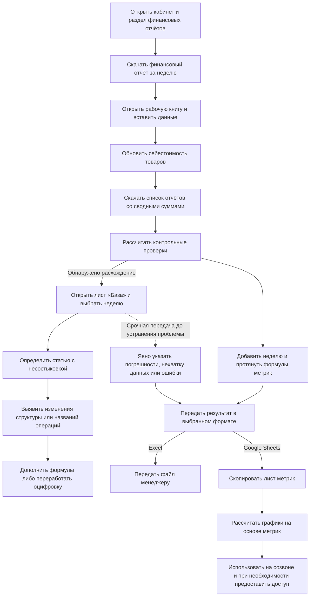

# AS-IS: подготовка недельного отчёта WB

Статус: первая сквозная версия AS-IS по рассказу автора — от выгрузки WB до передачи Excel или представления данных через Google Sheets, включая срочную передачу с известными ограничениями. Детальные правила сверки, повторной проверки, согласования и обновления переданных данных ещё требуют уточнения.

## Источник и границы

Источник — девять шагов, описанных автором из личного опыта работы финансовым аналитиком, и последующие уточнения обработки расхождений и передачи результата. Названия полей сохранены для дальнейшего уточнения. Исходные файлы и формулы пока не предоставлены и не проверены.

- Исполнитель описанных действий: финансовый аналитик.
- Площадка в примере: Wildberries.
- Среда работы: кабинет площадки и рабочая книга проекта. По уточнению автора, результат передавался в Excel либо лист метрик копировался в Google Sheets для расчёта графиков и совместного доступа.
- Назначение: подготовить недельные показатели, необходимые для [анализа расходов](../research/weekly-expense-analysis.md).
- Период по рассказу автора: предыдущая неделя, понедельник–воскресенье. Если отчёт готовят в понедельник, выбирают завершившуюся неделю.
- Доступность источника: по опыту автора, недельные финансовые отчёты формировались в начале следующей недели. Это описание прежней практики, а не проверенная гарантия текущего расписания WB или полноты всех начислений.
- Повод начала: подготовка недельной отчётности; точный регламент и срок готовности неизвестны.
- Конечные результаты описанного процесса: Excel передан менеджеру либо метрики перенесены в Google Sheets, где на их основе рассчитывались графики для созвонов; при необходимости менеджерам и клиентам выдавался доступ. Использование отчёта не всегда означало отсутствие известных ошибок.
- По уточнению автора, на клиентском созвоне показывали весь основной набор предоставленных графиков. Для других кабинетов набор мог дополняться; единого неизменного состава визуализаций для всех клиентов не подтверждено.

## Последовательность действий

Шаги 1–9 соответствуют первоначальному рассказу автора; шаги 10–11 добавлены по уточнению передачи результата. Основной исполнитель — аналитик; расчёты происходят в таблицах. Ответственность за выдачу доступа и проведение встреч отдельно не установлена.

| Шаг | Действие | Данные / инструмент | Результат |
|---|---|---|---|
| 1 | Открыть кабинет маркетплейса | Кабинет WB | Открыт кабинет |
| 2 | Перейти в раздел финансовых отчётов | Раздел отчётности | Доступен выбор отчёта |
| 3 | Скачать Excel-отчёт за выбранный период | Недельный финансовый отчёт | Получен исходный файл за предыдущую неделю |
| 4 | Открыть рабочую книгу оцифровки проекта | Ранее подготовленная книга с формулами | Открыт инструмент обработки; по рассказу автора, логика могла устаревать |
| 5 | Вставить финансовый отчёт на лист «База» для хранения и первичной обработки | Исходный файл, формулы и поля рабочей книги | Данные добавлены для первичных расчётов |
| 6 | Обновить себестоимость существующих и новых товаров | Лист себестоимости | Обновлены значения; источник, дата действия и правила истории не уточнены |
| 7 | Скачать список отчётов со сводными суммами | Отдельная выгрузка из WB | Получены суммы по отчётам для последующей сверки |
| 8 | Выполнить расчёты проверок | Проверки по неделе и статьям | Получены контрольные значения; для поля «Проверка» автор указал ожидаемый ноль |
| 9 | Добавить новую неделю на листе метрик и протянуть формулы | Недели по горизонтали, метрики по вертикали | Показатели подтягиваются из финансового отчёта |
| 10 | Передать Excel менеджеру либо скопировать лист метрик в Google Sheets | Рабочая книга или копия метрик | Результат доступен в выбранном формате; при срочной передаче недоработанного результата аналитик явно указывал известные ограничения |
| 11 | Для варианта Google Sheets использовать рассчитанные на основе метрик графики на созвонах; при необходимости выдать доступ | Google Sheets, графики, доступ менеджерам и клиентам | Данные представлены участникам; точные роли доступа и способ переноса предупреждений не уточнены |

Правила вставки повторно скачанного отчёта, поведение пересчёта после изменения себестоимости и формулы сверок не определены. В рассказе нет подтверждения, что аналитик всегда переходил к шагу 9 независимо от результата шага 8.

## Укрупнённая схема описанного фрагмента

Это схема последовательности, а не BPMN. Показаны расследование расхождения и варианты передачи результата. Детальное правило обычного допуска отчёта к использованию ещё не установлено.

Стрелка между проверками и метриками отражает порядок в первоначальном рассказе, а не правило допуска к следующему шагу. Пунктир показывает возможность срочной передачи до устранения проблемы; точный момент и согласование этой передачи не установлены. Связь исправления с повторной проверкой пока не показана. Изменения площадки названы автором основной, но не единственной причиной расхождений в его практике.

## Передача результата и известные ограничения

По словам автора, при крайней необходимости он мог передать менеджеру работу с недоработками, явно указав погрешности, нехватку информации или ошибки. Это исключение из практики, а не установленное разрешение использовать любой непроверенный отчёт.

Было два варианта предоставления результата:

1. Передача самого Excel-файла.
2. Копирование листа метрик в Google Sheets. На основе перенесённых данных там рассчитывались графики, которые показывали на созвонах. При необходимости доступ предоставляли менеджерам и клиентам.

Пока неизвестны способ фиксации предупреждений, их видимость клиентам, критерии допустимой погрешности, согласующий срочную передачу, права просмотра / редактирования и порядок обновления данных после исправления исходной книги.

### Значение для анализа

- Различаются доступность результата и его проверенность. Переданный отчёт мог содержать известные ограничения.
- Предупреждение об ограничениях было частью передачи результата; при проектировании нужно определить, как оно достигает пользователя конкретной таблицы или графика.
- Копирование метрик создаёт отдельное представление данных. Возникает вопрос согласованности исходной книги и Google Sheets после исправлений; фактические случаи расхождения этих копий автором пока не описаны.
- В AS-IS есть как минимум подготовка аналитиком, получение менеджером и просмотр на встречах с клиентами. Эти роли не определяют автоматически матрицу доступа будущего сервиса.

## Зависания и сроки: уточнение автора

Большие финансовые отчёты увеличивали объём рабочей книги. Зависание при расчёте формул могло замедлять работу на 1–3 часа; при более длительном зависании расчёт приостанавливали и заводили новую таблицу. Детали переноса данных и восстановления расчёта пока не выяснены.

Регулярная недельная аналитика, по оценке автора, занимала 30–90 минут для небольшого селлера и до 3 часов для крупного, иногда больше. Эти оценки относятся к работе по селлеру и зависят также от количества кабинетов; их нельзя без уточнения приписать одному отчёту WB. Включённость задержек в общий диапазон неизвестна.

Сроки назначались с учётом важности клиента для консалтинговой компании: его размера и приносимого дохода. Дополнительные исследования, новые метрики и товарные срезы не входят в оценки стандартной недельной аналитики. Подробности и ограничения сохранены в [исходной базе оценок](baseline-and-constraints.md).

## Обработка расхождений: уточнение автора

1. При несостыковке аналитик переходил на лист «База», где хранился финансовый отчёт.
2. Выбирал нужную неделю.
3. Определял проблемное направление по проверкам: продажи, к перечислению, логистика, штрафы, доплаты, хранение, приёмка, прочие удержания. Точное расположение контрольных формул в книге пока не установлено.
4. Искал изменения, которые не учитывались прежней логикой обработки. По опыту автора, основная причина была связана с нововведениями площадки.
5. При небольших изменениях обнаруживал новые или изменённые расходы, удержания, компенсации и добавлял их учёт в формулы.
6. При существенных изменениях требовалась переработка оцифровки. Кто её выполнял, сколько времени она занимала и как проверялась, пока не уточнено.

Это описание фактической работы со слов автора. Формальная граница между «небольшим» и «существенным» изменением не задана.

### Два вида изменений внешнего источника

| Вид изменения | Что описал автор | Последствие для обработки |
|---|---|---|
| Изменение структуры выгрузки | WB добавлял столбцы, таблица становилась шире и переставала помещаться в прежний шаблон | Шаблон оцифровки переставал корректно принимать или обрабатывать изменившийся файл; точный механизм нарушения ссылок и диапазонов не исследован |
| Изменение наименований / состава операций | Менялись названия статей расходов, удержаний и компенсаций; встречались новые операции | Прежние формулы требовали обновления правил учёта новых или изменённых операций |

Переименование операции не обязательно означает изменение её экономического смысла. При дальнейшем проектировании нужно отличать новое название известной операции от нового вида операции.

## Выводы для будущего решения — кандидаты на требования

Следующие направления предложены ассистентом на основе описанного затруднения. Они пока не утверждены и не означают, что Grafio обязан воспроизводить Excel-процесс или загружать те же файлы.

- Проверять совместимость поступивших данных с ожидаемой структурой.
- Выявлять операции, для которых нет согласованного правила учёта.
- Показывать расхождение с привязкой к периоду и проверяемой статье.
- Определить порядок обновления правил и проверки пересчитанных результатов.
- Различать готовность / проверенность отчёта и его доступность; определить условия использования при известных ограничениях и отображение предупреждений получателям.
- Определить порядок обновления представлений и уведомления получателей после исправления данных, если такое поведение будет включено в будущий процесс.

Автор подтвердил API как замысел получения данных Grafio; существующая [реализация проверена отдельно](../research/current-api-implementation-review.md). AS-IS с Excel служит источником потребностей, а не предписанием для будущего способа загрузки. Совместимость правил с внешним источником остаётся предметом требований при API-интеграции.

## Данные и их назначение

| Рабочее обозначение | Содержание | Назначение |
|---|---|---|
| Детальный финансовый отчёт | Исходная выгрузка финансовых операций за период | Основа расчётов в рабочей книге |
| Список отчётов | Периоды, юридическое лицо, сводные суммы продаж, удержаний и выплат | Источник контрольных сумм; пары для предоставленной книги описаны в [разборе расчётов](../research/workbook-calculation-review.md) |
| Лист себестоимости | Значения себестоимости по товарам | Дополнительные данные: в предоставленной книге значения подтягиваются из листа «реестр товаров»; внешний первоисточник не установлен |
| Лист «База» | Финансовый отчёт и первичная обработка | Хранение исходных данных, подготовка расчётов и поиск расхождений по выбранной неделе |
| Лист проверок / область проверок | Контрольные расчёты по неделям и статьям | Выявление возможных расхождений |
| Лист метрик | Недели по горизонтали, показатели по вертикали | Представление недельных результатов |
| Передаваемый Excel-файл | Рабочий результат аналитика | Предоставление отчёта менеджеру |
| Google Sheets с копией метрик | Перенесённые показатели и рассчитанные на их основе графики | Представление на созвонах и доступ менеджерам / клиентам по необходимости |

«Детальный финансовый отчёт» и «список отчётов» — рабочие названия по рассказу; официальные названия, форматы и способ связи файлов ещё не проверены. Обе выгрузки относятся к одной площадке: сверка между ними не является независимым аудитом источника.

## Выявленные затруднения и вопросы

| Основание | Значение для дальнейшего анализа |
|---|---|
| Автор связал большинство расхождений в своей практике с расширением выгрузки и новыми / изменёнными наименованиями операций | Установлен механизм устаревания шаблона; ещё нужно выяснить ответственность за его переработку, сроки и порядок проверки |
| Себестоимость обновляли на отдельном листе | Требуется определить источник, связь с товаром, даты действия и влияние обновления на прошлые недели |
| Сводные суммы скачивали отдельно, выполняли проверки и искали несостыковки на листе «База» | Контроль качества уже существовал; известен вариант срочной передачи с предупреждениями, но формулы, повторная проверка и точные условия допуска требуют уточнения |
| Новую неделю и формулы добавляли вручную | Это конкретный ручной шаг, который может быть связан с ранее описанными ошибками формул; какие ошибки возникали именно здесь, ещё не уточнено |
| Перечислены коэффициенты, ключи, налог, внешние расходы и фильтр самовыкупов | Список содержит разные виды полей; происхождение и бизнес-смысл каждого нельзя определить только по названию |
| Подробные источники рекламных и органических показателей не описаны | Полученный процесс пока не покрывает всю проверку рекламной стратегии из предыдущего сценария |

## Предварительное правило контроля

По словам автора, значение поля «Проверка (должно быть 0)» должно равняться нулю.

Пока неизвестны формула, сравниваемые суммы, допустимое округление, область проверки (отчёт, неделя, юридическое лицо), а также означает ли ненулевой результат ошибку обработки, особенность начисления или иную ситуацию. Нельзя автоматически распространять правило точного нуля на все перечисленные проверки или объявлять его блокирующим условием готовности отчёта.

## Инвентаризация названий полей

Списки сохранены из сообщения автора; переносы строк внутри заголовков убраны, «финансовый ответ» в описании шага 5 интерпретирован как «финансовый отчёт». Названия не являются согласованным словарём данных. Колонки первичной обработки нельзя автоматически считать полями, приходящими из WB.

### Лист хранения и первичной обработки

koef GENERAL; koef LOG; koef SALES; Продано шт.; Возвращено шт.; Продано руб.; Возвращено руб.; Продаж шт.; Выручка руб.; К перечислению; Комиссия; Эквайринг; Корректировка эквайринга; СПП; key for брак; key for ущерб; Компенсация брака; Компенсация ущерба; Количество брака; Кол-во ущерба; Прямая логистика; Обратная логистика; Кол-во доставок; Оплата на РС; WB реализовал; Налоговая база; Налог; Себестоимость; Хранение; Затраты на самовыкупы; Фильтр самовыкупов; Внешние расходы; Неделя (ПН); Конец недели; Номер недели; Неделя заказа; Месяц; Год; Бренд; Артикул поставщика; Товар; Размер; Детали штрафа; Группа; Юридическое лицо.

### Список отчётов

Юридическое лицо; Дата начала; Дата конца; Дата формирования; Тип отчета; Продажа; В том числе Компенсация скидки по программе лояльности; К перечислению за товар; Согласованная скидка, %; Стоимость логистики; Стоимость хранения; Стоимость платной приемки; Прочие удержания/выплаты; Общая сумма штрафов; Корректировка Вознаграждения Вайлдберриз (ВВ); Стоимость участия в программе лояльности; Итого к оплате; Валюта.

### Область контрольных расчётов

#недели; Начало; Конец; Проверка (должно быть 0); Проверка продажи; Проверка к перечислению; Проверка логистики; Проверка штрафов; Проверка доплат; Хранения; Приёмки; Проч.удерж.

## Подтверждение по книге

Формулы и пары контрольных сумм извлечены из предоставленного примера в [разборе книги](../research/workbook-calculation-review.md). Итоговый процесс изменения расчётов описан в [жизненном цикле правил и версий](../processes/calculation-lifecycle.md).
