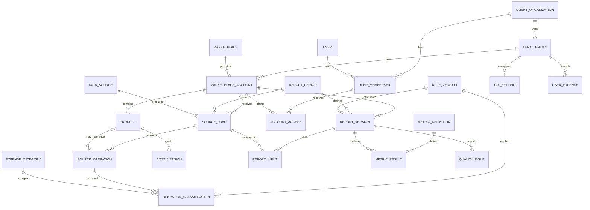

# Концептуальная модель данных

Статус: рабочая модель первой версии недельного финансового сценария. Она описывает смысл сущностей и связей без выбора СУБД, таблиц и типов полей.

## Принцип разделения

| Слой | Что хранится | Зачем отделён |
|---|---|---|
| Справочники | юридические лица, площадки, кабинеты, товары, категории расходов, определения показателей | Единые идентификаторы и названия |
| Исходные факты | загрузки источников, финансовые операции, рекламные данные, пользовательские расходы | Воспроизводимость и детализация до источника |
| Настройки | себестоимость, налоговые правила, подключённые опции, пользовательское отображение | Отделение введённых параметров от фактов площадки |
| Версии и правила | опубликованные версии расчёта и классификация операций | Объяснение изменения методики |
| Результаты | версии отчётов, значения показателей и проблемы качества | Сохранение рассчитанной истории без перезаписи |

## Сущности первой версии

| Сущность | Назначение | Владелец данных |
|---|---|---|
| Клиентская организация | Изолированный контур клиента, объединяющий пользователей и юридические лица | Grafio |
| Пользователь и доступ | Роль в клиентской организации и доступ к конкретным кабинетам | Клиент и Grafio |
| Юридическое лицо | Клиентский контекст налогов, себестоимости и пользовательских расходов | Клиент / уполномоченный пользователь |
| Площадка | Справочник маркетплейсов; в первой версии используется WB | Grafio |
| Кабинет | Подключение продавца к площадке и отдельная платная единица | Клиент и Grafio |
| Отчётный период | Неделя ПН–ВС с точными датами; тип периода хранится явно | Grafio |
| Источник данных | Финансовый, рекламный или иной поставщик фактов | Grafio |
| Загрузка источника | Результат получения данных кабинета за период: покрытие, время, полнота, статус | Grafio |
| Исходная операция | Запись источника с суммой, датой, видом операции и внешним идентификатором | Площадка; Grafio хранит полученную копию |
| Товар | Артикул и доступные признаки товара кабинета | Площадка / клиент |
| Категория расходов | Стабильный код статьи и родительская группа | Grafio |
| Классификация операции | Связь операции с категорией по конкретной версии правила | Grafio |
| Себестоимость | Значение для товара и интервал его действия | Клиент / уполномоченный пользователь |
| Налоговая настройка | Выбранное правило юрлица, параметры и интервал действия | Клиент / уполномоченный пользователь |
| Пользовательский расход | Сумма, категория и способ учёта: неделя оплаты либо период | Клиент / уполномоченный пользователь |
| Версия правил | Опубликованная методика с автором, причиной и периодом действия | Администратор Grafio |
| Версия отчёта | Неизменяемый результат расчёта для кабинета и периода | Grafio |
| Вход версии отчёта | Ссылка на точные загрузки и снимки настроек, использованные в расчёте | Grafio |
| Определение показателя | Код, название, единица и паспорт метрики | Grafio |
| Значение показателя | Результат метрики в версии отчёта и доступный разрез | Grafio |
| Проблема качества | Неполнота, расхождение или неизвестная операция и её состояние | Grafio / администратор |

## Связи и кратности

Ключевое бизнес-правило: **юридическое лицо 1:N кабинет**. Один кабинет является самостоятельным контекстом UC-01 и отдельной платной единицей подключения. Сводный расчёт нескольких кабинетов первой версией не обещан.

Связь операции с товаром необязательна. Поэтому операция без артикула остаётся в финансовой сумме и попадает в детализацию «Без привязки к товару».

Логические таблицы, ключи, интервалы действия и ограничения целостности определены в [логической модели данных](logical-data-model.md).

## Ключи прослеживаемости

| Результат | Минимальная цепочка до основания |
|---|---|
| Значение показателя | значение → версия отчёта → определение показателя |
| Сумма статьи | значение → классификации → исходные операции → загрузка источника |
| Себестоимость | значение → товар → версия себестоимости с датой действия |
| Маржа | значение → выкупы, себестоимость, расходы и включённые настройки той же версии отчёта |
| Предупреждение | проблема качества → источник/операция/показатель → состояние исследования |

Точный ключ исходной операции определяется контрактом WB. Предпочтителен устойчивый идентификатор источника в границах кабинета. Составной резервный ключ допустим только после анализа полей, повторных загрузок и поздних корректировок.

## История и версии

1. Полученная загрузка сохраняется как отдельный пакет; повторное получение не должно незаметно менять уже опубликованный отчёт.
2. Опубликованная версия правил не редактируется задним числом. Изменение создаёт новую версию.
3. Версия отчёта ссылается на точные загрузки, версию правил и снимок влияющих настроек.
4. Пересчёт создаёт новую версию отчёта. Предыдущая остаётся доступной для сравнения.
5. Настройка количества знаков после запятой относится к представлению пользователя и не создаёт новую версию расчёта.

## Расширение второй очереди

Планы добавят сущности «План» и «Целевое значение»: кабинет или согласованный состав кабинетов, показатель, единица, период, цель и версия изменения. Рыночные показатели, позиции и поисковая воронка потребуют отдельных источников и фактов. Они будут добавлены после проверки доступности данных и не меняют ядро модели первой версии.

Правила планов и прогнозов описаны в [отдельной спецификации](../product/plans-and-forecasts.md).

## Что проверит следующий этап

- Какие внешние идентификаторы и даты реально предоставляет API WB.
- Можно ли надёжно отличать новую операцию от исправленной или повторно полученной.
- Какие контрольные суммы доступны для проверки полноты.
- Какие операции имеют товарную связь.
- Какие рекламные данные можно согласовать с финансовым периодом.

Ответы фиксируются в контракте данных, а не предполагаются моделью заранее.
