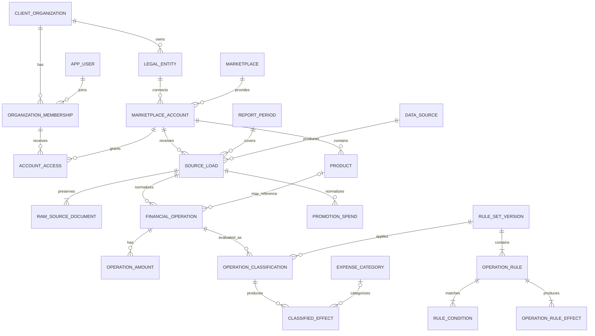
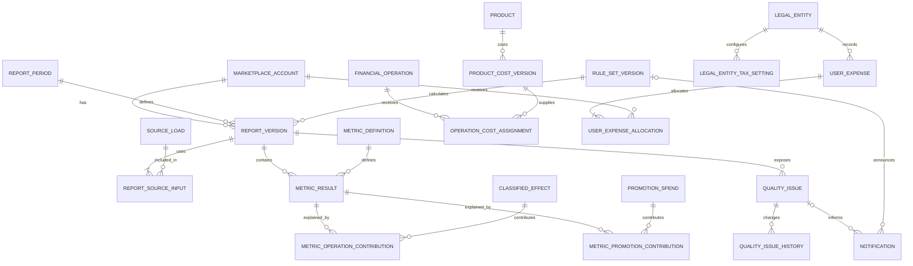

# Логическая модель данных Grafio

Логическая модель описывает финансовые данные недельного сценария WB, их ключи, связи и ограничения. Она не привязана к конкретной СУБД.

Расширение модели для кейсов контроля, Admin Console, планов, dashboard, безопасности и закрытия организации собрано в [Расширенной ERD](target-erd.md). Оно является целевым дополнением и не меняет границы финансового ядра первой версии.

## Коротко

**Зачем документ:** определить, какие данные нужны Grafio, как они связаны и что нельзя перезаписывать при повторной загрузке или пересчёте.

**Главное решение:** исходный ответ маркетплейса хранится отдельно и неизменно. В первой версии финансового сценария это ответ WB. Операции, правила и версии отчёта связаны ссылками, поэтому любую цифру можно проследить до источника и воспроизвести.

**Пример:** если администратор исправил классификацию штрафа, исходная операция остаётся прежней. Новая версия правила создаёт новую версию отчёта, а старая сохраняется для сравнения.

При первом чтении достаточно разделов «Принятый подход», «Основные связи», «Инварианты модели» и «Прослеживаемость результата». Таблицы полей нужны для детальной проверки.

## Назначение и границы

Модель переводит концептуальные сущности в структуры с ключами, связями и ограничениями. Она поддерживает один недельный отчёт одного кабинета, несколько кабинетов у юридического лица, неизменяемые исходные загрузки, версионные правила, пересчёт без потери истории и детализацию показателя до операции.

Эта модель ограничена финансовым результатом одного кабинета. Сводный отчёт нескольких кабинетов, планы и другие продуктовые сущности показаны отдельно в [расширенной ERD](target-erd.md); ядро допускает их добавление без изменения идентичности существующих фактов.

## Принятый подход

Используется нормализованное ядро и отдельное хранение неизменяемого ответа источника:

1. исходный документ сохраняется без преобразований и получает контрольный хеш;
2. известные поля преобразуются в типизированные сущности и денежные компоненты;
3. неизвестные поля и значения остаются в исходном документе и создают сигнал качества;
4. классификация выполняется опубликованной версией правил;
5. отчёт сохраняет ссылки на точные входы и рассчитанные значения;
6. повторная загрузка или пересчёт создают новые версии, а не изменяют опубликованный результат.

Такой подход отделяет факт площадки от интерпретации Grafio. Изменение правила не переписывает полученную операцию.

## Типы данных

| Логический тип | Применение | Правило |
|---|---|---|
| `id` | внутренние первичные ключи | Не несёт бизнес-смысла и не переиспользуется |
| `code` | устойчивые коды справочников и метрик | Уникален в границах справочника, не меняется при переименовании |
| `decimal_amount` | денежные значения | Точное десятичное число, минимум четыре знака после запятой; без промежуточного округления |
| `decimal_rate` | проценты, доли, коэффициенты | Точное десятичное число с большей точностью, чем отображение |
| `date` | отчётные границы и интервалы действия | Обе границы включаются только там, где это явно указано |
| `timestamp` | события системы | Хранится с часовым поясом; интерфейс показывает согласованную зону |
| `json` | снимок параметров и условие правила | Используется для версионного описания, но не заменяет основные ключи и суммы |
| `hash` | контроль неизменности | Рассчитывается по исходному содержимому или каноническому снимку |

Исходные денежные строки API сохраняются в необработанном документе. Нормализованное значение хранится как десятичное число вместе с валютой.

## Контур клиента и доступа

| Таблица | Ключи | Основные атрибуты | Ограничения |
|---|---|---|---|
| `client_organization` | PK `organization_id` | название, состояние, дата создания | Изолирует данные одного клиента от другого |
| `app_user` | PK `user_id` | внешний идентификатор входа, состояние | Персональные настройки не хранятся у юридического лица |
| `organization_membership` | PK `membership_id`; FK `organization_id`, `user_id` | роль клиента, даты действия | Уникальная активная связь пользователя с организацией и ролью |
| `legal_entity` | PK `legal_entity_id`; FK `organization_id` | название, налоговый идентификатор в защищённом виде, состояние | Принадлежит одной клиентской организации |
| `marketplace` | PK `marketplace_id`; UK `code` | название | Первая версия использует `WB` |
| `marketplace_account` | PK `account_id`; FK `legal_entity_id`, `marketplace_id` | внешний ID кабинета, название, состояние подключения, `secret_ref`, даты действия | Связь юрлицо 1:N кабинет; уникален внешний ID в границах площадки и организации |
| `account_access` | PK `account_access_id`; FK `membership_id`, `account_id` | роль в кабинете, даты действия | Ограничивает пользователя доступными кабинетами; доступ администратора Grafio задаётся отдельно |
| `billing_account_period` | PK `billing_period_id`; FK `account_id` | дата начала и конца платного подключения, тарифный код | Один кабинет является отдельной платной единицей |
| `display_preference` | PK `preference_id`; FK `user_id` | вид значения, число знаков после запятой | Влияет только на представление, не на расчёт |

`secret_ref` ссылается на защищённое хранилище секрета. Токен площадки не должен находиться в аналитических таблицах или исходных документах.

## Справочники и периоды

| Таблица | Ключи | Основные атрибуты | Ограничения |
|---|---|---|---|
| `report_period` | PK `period_id`; UK тип + начало + конец + зона | тип периода, `date_from`, `date_to`, часовая зона | Для недели WB: понедельник–воскресенье, семь календарных дней |
| `data_source` | PK `source_id`; UK `code` | площадка, область данных, обязательность, версия контракта | Финансы, реклама и контрольный источник различаются |
| `product` | PK `product_id`; FK `account_id` | `nm_id`, артикул продавца, название, бренд, размер, штрихкод, состояние | Уникальность строится по устойчивому ID площадки в границах кабинета; товар может быть неизвестен операции |
| `expense_category` | PK `category_id`; FK `parent_category_id` | код, название, тип эффекта, порядок отображения, состояние | Родительская группа и конечная статья различаются; в расчёт входит только конечная статья |
| `metric_definition` | PK `metric_id`; UK `code` | название, единица, ссылка на паспорт, состояние | Код метрики стабилен; название можно уточнять версией паспорта |
| `amount_type` | PK `amount_type_id`; UK `code` | поле источника, бизнес-описание, денежное/количественное | Например `RETAIL_PRICE_WITH_DISC`, `FOR_PAY`, `PENALTY` |
| `tax_rule` | PK `tax_rule_id`; UK `code + version` | название, формула или параметры, состояние публикации | Опубликованная версия неизменяема |

## Получение и нормализация источника

### Пакет загрузки

| Таблица | Ключи | Основные атрибуты | Ограничения |
|---|---|---|---|
| `source_load` | PK `load_id`; FK `account_id`, `period_id`, `source_id`, `previous_load_id` | внешний ID отчёта, попытка, время начала/окончания, статус получения, полнота, статус сверки, хеш набора | Завершённая загрузка неизменяема; повторное получение создаёт новый `load_id` |
| `raw_source_document` | PK `document_id`; FK `load_id` | тип документа, номер страницы/курсор, параметры запроса без секрета, ссылка на содержимое, хеш, время получения, HTTP-статус | Один ответ хранится один раз; совпадение хеша не переписывает прежнюю запись |
| `source_schema_observation` | PK `schema_observation_id`; FK `document_id` | отпечаток схемы, известная версия контракта, новые и отсутствующие ключи | Изменение структуры создаёт проблему качества |
| `source_control_total` | PK `control_total_id`; FK `load_id`, `amount_type_id` | сумма, валюта, внешний код итога | Уникален по загрузке и виду контрольного итога |

Статусы получения, полноты и сверки хранятся раздельно. Значение «ошибка получения» не подменяет состояние полноты, пока загрузка не завершена.

### Финансовая операция

| Таблица | Ключи | Основные атрибуты | Ограничения |
|---|---|---|---|
| `financial_operation` | PK `operation_id`; FK `load_id`, `document_id`, `product_id?` | `report_id`, `rrd_id`, `srid`, тип документа, вид операции, дополнительный вид, даты заказа/продажи/начисления, количество, исходный порядковый номер | Уникальна по `load_id + report_id + rrd_id`; отсутствие товара допустимо |
| `operation_amount` | PK `operation_amount_id`; FK `operation_id`, `amount_type_id` | исходная строка суммы, нормализованная сумма, валюта | Одна сумма данного типа на операцию; ноль и отсутствие различаются |
| `operation_link` | PK `operation_link_id`; FK `from_operation_id`, `to_operation_id` | тип связи, способ и уверенность сопоставления | Используется для продажи–возврата, сторно и исправления; связь не создаётся без основания |
| `promotion_spend` | PK `promotion_spend_id`; FK `load_id` | внешний ID кампании/транзакции, дата списания, сумма, валюта | Уникален по загрузке и устойчивому внешнему ID; хранится отдельно от финансового удержания до проверки двойного учёта |

Денежные поля вынесены в `operation_amount`, потому что одна строка WB содержит несколько разных сумм. Это позволяет добавить новое подтверждённое поле без расширения таблицы операции десятками пустых колонок. Произвольные пользовательские поля в эту таблицу не попадают.

## Правила и классификация

| Таблица | Ключи | Основные атрибуты | Ограничения |
|---|---|---|---|
| `rule_set_version` | PK `rule_version_id`; FK `marketplace_id`, `published_by`, `exception_account_id?` | номер версии, состояние, причина, тип отчёта, дополнительные признаки области, `valid_from`, `valid_to?`, сценарий применения, время публикации, обоснование исключения? | По умолчанию действует для общей области площадки; `exception_account_id` допустим только вместе с обоснованием и отдельной проверкой; опубликованная версия неизменяема |
| `operation_rule` | PK `rule_id`; FK `rule_version_id` | приоритет, код назначения операции, состояние | Несколько правил одной версии не должны одновременно совпадать с одной операцией; иначе результат неоднозначен |
| `rule_condition` | PK `condition_id`; FK `rule_id` | код поля, оператор, сравниваемое значение, группа условий | Разрешены только опубликованные поля и операторы; порядок условий не меняет смысл группы |
| `operation_rule_effect` | PK `rule_effect_id`; FK `rule_id`, `amount_type_id`, `category_id?`, `metric_id?` | вид эффекта, множитель/правило знака | Одно правило может получить несколько эффектов из разных денежных компонентов операции |
| `operation_classification` | PK `classification_id`; FK `operation_id`, `rule_version_id`, `rule_id?` | состояние `MATCHED`, `UNMATCHED`, `AMBIGUOUS`, время расчёта, объяснение | Уникальна по операции и версии правил; отсутствие совпадения не превращается в «Прочие» |
| `classified_effect` | PK `effect_id`; FK `classification_id`, `rule_effect_id`, `metric_id?`, `category_id?`, `operation_amount_id?` | вид эффекта, точная сумма?, количество?, валюта? | Сохраняет знак после применения правила; один исходный компонент нельзя учесть дважды в одной роли |

`operation_classification` отвечает на вопрос «какое правило сработало», `operation_rule_effect` задаёт ожидаемые выходы этого правила, а `classified_effect` фиксирует фактический денежный или количественный результат. Одно правило может, например, использовать разные компоненты строки для выручки и корректировки. Разделение позволяет показать пользователю исходную операцию, условие, поле суммы и применённый знак.

## Настройки клиента

| Таблица | Ключи | Основные атрибуты | Ограничения |
|---|---|---|---|
| `product_cost_version` | PK `cost_version_id`; FK `product_id`, `created_by` | себестоимость единицы, валюта, `valid_from`, `valid_to?`, источник записи | Интервалы одного товара не пересекаются; отсутствие стоимости не равно нулю |
| `operation_cost_assignment` | PK `cost_assignment_id`; FK `operation_id`, `cost_version_id`, `original_sale_operation_id?` | количество, сумма себестоимости, способ определения | Возврат использует себестоимость связанной продажи; неподтверждённая связь создаёт неполноту |
| `legal_entity_tax_setting` | PK `tax_setting_id`; FK `legal_entity_id`, `tax_rule_id`, `changed_by` | включено/выключено, параметры, `valid_from`, `valid_to?` | Интервалы настройки не пересекаются; неполная настройка не считается нулевым налогом |
| `user_expense` | PK `user_expense_id`; FK `legal_entity_id`, `category_id`, `created_by` | сумма, валюта, способ учёта, дата оплаты или период, описание, состояние | Ровно один способ учёта; сумма хранится независимо от распределения по кабинетам |
| `user_expense_allocation` | PK `allocation_id`; FK `user_expense_id`, `account_id` | сумма или доля распределения | Кабинет должен принадлежать тому же юрлицу; сумма распределений равна расходу с допуском округления |

Распределение пользовательского расхода обязательно, если у юридического лица больше одного кабинета и расход должен войти в кабинетный отчёт. Это предотвращает включение одной суммы в каждый кабинет. Варианты распределения: вся сумма на один кабинет либо явно заданные суммы/доли между кабинетами.

## Версии отчёта и результаты

| Таблица | Ключи | Основные атрибуты | Ограничения |
|---|---|---|---|
| `report_version` | PK `report_version_id`; FK `account_id`, `period_id`, `rule_version_id`, `supersedes_report_version_id?` | номер версии, `publication_status`, `quality_level`, время расчёта/публикации, включённые опции, хеш входов | Уникальна по кабинету, периоду и номеру; опубликованная версия неизменяема; качество не определяет статус публикации |
| `report_source_input` | составной PK; FK `report_version_id`, `load_id` | роль источника | Фиксирует точные загрузки, включая контрольные |
| `report_tax_input` | составной PK; FK `report_version_id`, `tax_setting_id` | снимок параметров и его хеш | Используется только если налог включён |
| `report_cost_input` | составной PK; FK `report_version_id`, `cost_assignment_id` | — | Перечисляет фактически применённые себестоимости |
| `report_user_expense_input` | составной PK; FK `report_version_id`, `allocation_id` | сумма, вошедшая в неделю | Фиксирует распределение и недельный сплит |
| `metric_result` | PK `metric_result_id`; FK `report_version_id`, `metric_id`, `category_id?` | состояние расчёта, значение?, валюта/единица, код причины отсутствия | Уникален по версии, метрике и категории; `NULL` с причиной отличается от нуля |
| `metric_operation_contribution` | составной PK; FK `metric_result_id`, `effect_id` | вклад в результат | Сумма вкладов объясняет доступную операционную детализацию |
| `metric_cost_contribution` | составной PK; FK `metric_result_id`, `cost_assignment_id` | вклад себестоимости | Объясняет себестоимость до товара и версии стоимости |
| `metric_promotion_contribution` | составной PK; FK `metric_result_id`, `promotion_spend_id` | вклад рекламного списания | Не допускает повторного учёта того же расхода из финансового отчёта |
| `metric_user_expense_contribution` | составной PK; FK `metric_result_id`, `allocation_id` | сумма, вошедшая в отчётную неделю | Объясняет кабинет, способ учёта и недельный сплит |
| `metric_tax_calculation` | PK `tax_calculation_id`; FK `metric_result_id`, `tax_setting_id`, `tax_base_result_id` | снимок параметров, рассчитанная сумма | Показывает правило и метрику, использованную как налоговую базу |
| `metric_dependency` | составной PK; FK `metric_result_id`, `depends_on_result_id` | роль зависимости | Например, маржа ссылается на выкупы, расходы и себестоимость той же версии |
| `source_reconciliation` | PK `reconciliation_id`; FK `report_version_id`, `load_id`, `amount_type_id` | расчётная сумма, контрольная сумма, точное расхождение, результат проверки | Сравнивает одну валюту и одну область; успех только при расхождении 0 в полной расчётной точности |

Отчётные опции в `report_version` — это канонический снимок: налог, реклама и пользовательские расходы включены, выключены либо недоступны. Пользовательское округление туда не входит.

## Качество, исследование и уведомления

| Таблица | Ключи | Основные атрибуты | Ограничения |
|---|---|---|---|
| `quality_issue` | PK `issue_id`; FK `account_id?`, `period_id?`, `load_id?`, `rule_version_id?`, `report_version_id?` | тип сигнала, состояние исследования, сумма/валюта?, описание сигнала, подтверждённая причина?, автор и время решения | Причина при обнаружении пуста; изменение состояния журналируется |
| `quality_issue_operation` | составной PK; FK `issue_id`, `operation_id` | роль примера | Позволяет показать обезличенные примеры операций |
| `quality_issue_metric` | составной PK; FK `issue_id`, `metric_id` | влияние | Отделяет затронутые метрики от остальных |
| `quality_issue_history` | PK `issue_history_id`; FK `issue_id`, `changed_by` | старое и новое состояние, комментарий, время | Неизменяемый журнал переходов |
| `notification` | PK `notification_id`; FK `issue_id?`, `rule_version_id?`, `created_by` | тип, заголовок, текст, время публикации | Уведомление связано с подтверждённым событием или нейтральным статусом исследования |
| `notification_scope` | PK `notification_scope_id`; FK `notification_id`, `legal_entity_id?`, `account_id?`, `period_id?` | область действия | Нельзя публиковать уведомление без области |
| `notification_receipt` | составной PK; FK `notification_id`, `user_id` | доставлено, прочитано | Прочтение не изменяет содержание уведомления |

## Основные связи





## Инварианты модели

1. Юридическое лицо может иметь любое число кабинетов; кабинет принадлежит ровно одному юрлицу в период действия подключения.
2. Финансовая операция принадлежит одной загрузке. Одинаковый `rrdId` в новой загрузке не обновляет старую операцию.
3. Неизменяемый исходный документ и его хеш сохраняются до нормализации.
4. Неизвестное поле или значение операции не получает категорию автоматически.
5. Опубликованные версия правил и версия отчёта не редактируются.
6. Один исходный денежный компонент нельзя дважды включить в одну и ту же роль расчёта; финансовое удержание рекламы и рекламное списание не складываются без доказательства, что это разные расходы.
7. Отсутствующее значение хранится как отсутствие с причиной, а не как ноль.
8. Операция без товара остаётся в финансовом результате и группе «Без привязки к товару».
9. Настройки себестоимости и налога имеют непересекающиеся интервалы действия в своей области.
10. Пользовательский расход входит в кабинетный отчёт только через распределение на этот кабинет.
11. Все компоненты одного денежного расчёта имеют одну валюту; конвертация валют первой версией не выполняется.
12. Настройка отображения не изменяет `metric_result`, сверку или хеш входов.
13. Обнаружение сигнала в одном кабинете не ограничивает правило этим кабинетом. Кабинетная область допустима только как явное обоснованное исключение.

## Идемпотентность и поздние изменения

| Ситуация | Поведение |
|---|---|
| Повторно получен тот же ответ | Создаётся техническая попытка либо ссылка на тот же хеш; опубликованный отчёт не меняется |
| Получен изменённый ответ за закрытую неделю | Создаётся новая загрузка со ссылкой на предыдущую и проблема качества |
| Опубликовано новое правило | Создаётся новая версия правил; прежняя остаётся доступной |
| Выполнен пересчёт | Создаётся новая версия отчёта со своими входами и результатами |
| Изменена себестоимость задним числом | Создаётся новая версия себестоимости и, после принятого решения, новая версия отчёта |
| Пользователь изменил число знаков | Меняется только `display_preference` |

## Прослеживаемость результата

```text
metric_result
→ report_version
→ report_source_input
→ source_load
→ financial_operation
→ operation_amount
→ operation_classification
→ operation_rule + rule_condition
```

Для маржи цепочка дополнительно включает `operation_cost_assignment`, налоговую настройку и распределённые пользовательские расходы. По этой цепочке пользователь или администратор может ответить, из каких данных, правил и настроек получено значение.

## Покрытие требований

| Требования | Элементы модели |
|---|---|
| AR-01–AR-03, PFR-01 | организация, членство, кабинет и доступ к кабинету |
| PFR-02, PFR-09 | загрузка, отдельные статусы получения/полноты/сверки |
| PFR-03, PFR-08, PFR-15 | версия отчёта и точные входы |
| PFR-04—PFR-05, PFR-10 | операции, суммы, классифицированные эффекты и результаты метрик |
| PFR-07 | вклад операции и необязательная связь с товаром |
| PFR-05, PFR-09—PFR-10 | сверка, проблема качества, история и уведомление |
| PFR-28 | пользовательский расход и распределение по кабинетам |
| PFR-29 | версионная налоговая настройка юридического лица |
| PFR-06 | отдельная настройка отображения |
| PBR-08, PFR-14 | общая область версии правила и контролируемое кабинетное исключение |
| QR-01–QR-07 | неизменяемые входы, точные числа, причины отсутствия, версии и прослеживаемость |

## Решения, найденные на логическом уровне

1. Пользовательский расход юрлица требует распределения по кабинетам, иначе возникает двойной учёт.
2. Денежные компоненты операции хранятся отдельно от самой операции и отдельно друг от друга.
3. Классификация и полученный денежный эффект являются разными сущностями.
4. Неизменяемый ответ источника состоит из документов/страниц одной загрузки, а не из одного перезаписываемого файла.
5. Состояния получения, полноты, сверки и расчёта не объединяются в один общий статус.
6. Настройки, использованные отчётом, фиксируются ссылками и снимками; последующее изменение настройки не меняет старый отчёт.

Административный процесс поверх этих сущностей описан в [операционных сценариях](../processes/operational-workflows.md), а состав экрана — в [требованиях к интерфейсам](../requirements/interface-requirements.md#admin-console-int-06).

## Информационные требования финансового сценария

Идентификаторы `IR-01—IR-15` определяют необходимый состав данных без утверждения, что поля источника имеют те же имена. Их связь с проектными сущностями дана в разделах выше.

| ID | Данные | Минимальный состав | Назначение |
|---|---|---|---|
| IR-01 | Контекст отчёта | кабинет, юридическое лицо, площадка, начало и конец недели | Изоляция и воспроизводимость расчёта |
| IR-02 | Исходная операция | идентификатор источника, вид/наименование, сумма, валюта, дата или отчётный период, кабинет, юридическое лицо, идентификатор отчёта | Классификация, расчёт и защита от повторного учёта |
| IR-03 | Товарная связь | артикул/идентификатор товара при наличии, бренд и другие доступные признаки группировки | Детализация; связь допускается пустой |
| IR-04 | Состояние источника | источник, период покрытия, статус получения, полнота, время обновления, описание ошибки | Обработка загрузки и неполноты |
| IR-05 | Категория расходов | код, название, родительская группа, правило знака, версия и период действия | Единая структура расходов и отсутствие двойного учёта |
| IR-06 | Себестоимость | товар, значение, валюта, дата начала действия, источник записи | Расчёт себестоимости и воспроизведение истории |
| IR-07 | Налоговая настройка | юридическое лицо, правило, параметры, дата начала действия, состояние включения | Опциональный расчёт налога |
| IR-08 | Пользовательский расход | юридическое лицо, категория, сумма, валюта, способ учёта, дата оплаты либо границы периода, описание | Добавление собственных расходов без смешения с операциями WB |
| IR-09 | Рекламные данные | источник, расход, период, валюта, статус полноты; атрибуция заказов только при подтверждённом источнике | Рекламный расход и условный расчёт ДРР |
| IR-10 | Версия правила | номер, автор, причина, дата публикации, период действия, затронутые операции и показатели | Управление методикой и аудит изменений |
| IR-11 | Версия отчёта | версия правил, снимок входных данных, время расчёта, включённые опции, статус публикации и отдельный уровень качества | Открытие и сравнение воспроизводимых результатов |
| IR-12 | Проблема качества | тип, источник, период, сумма/расхождение, затронутые показатели, состояние исследования | Неизвестные операции, расхождения и уведомления |
| IR-13 | Подключение кабинета | юридическое лицо, площадка, внешний идентификатор кабинета, состояние подключения, тарифная единица, период действия | Поддержка нескольких кабинетов и платного доступа |
| IR-14 | Настройка отображения | пользователь, вид показателя, количество знаков после запятой | Пользовательское представление без изменения расчётных значений |
| IR-15 | Область версии правила | площадка, тип отчёта, дополнительные подтверждённые признаки, кабинет при исключении, обоснование исключения, период действия | Единая методика и контролируемые кабинетные исключения |

Точные названия и доступность полей WB устанавливаются в контракте данных. Информационные требования описывают необходимый смысл, а не предполагают наличие одноимённых полей API.

Измеримые требования к производительности, доступности, восстановлению, безопасности, хранению, наблюдаемости и совместимости собраны в [стартовом коммерческом профиле NFR](../requirements/non-functional-requirements.md).
