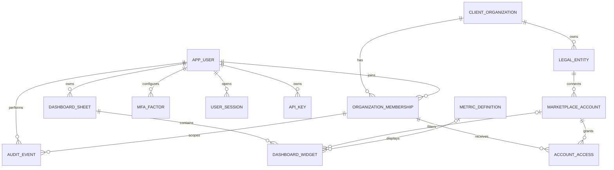
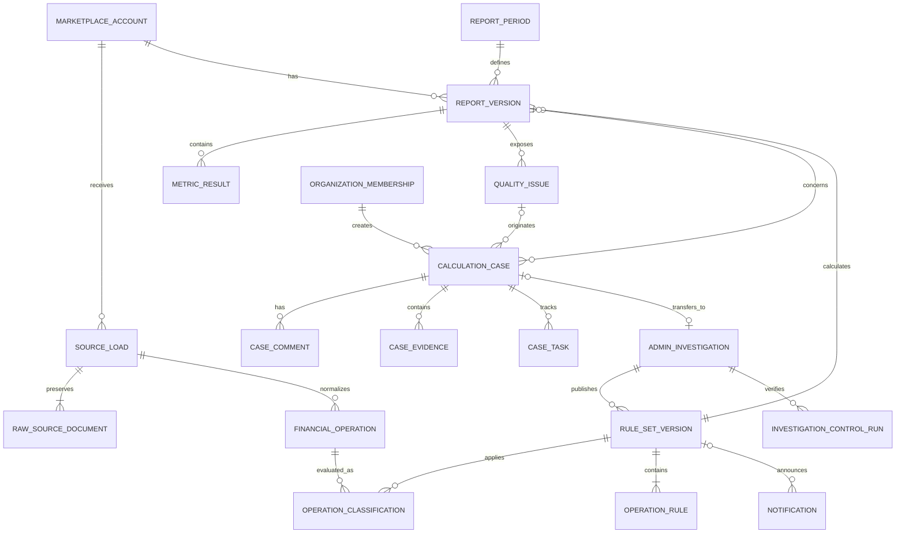
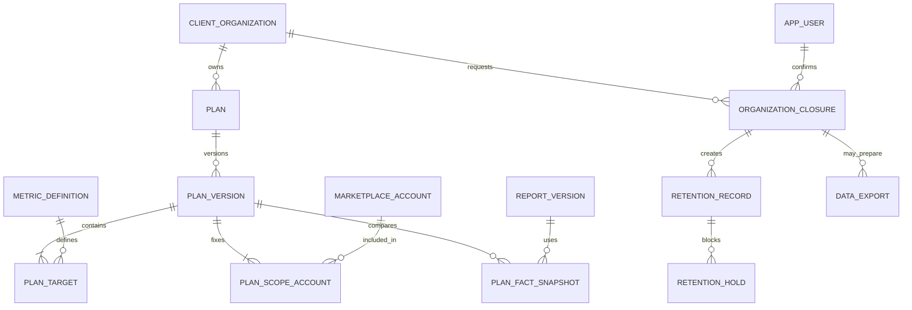

# Расширенная ERD целевого контура Grafio

Статус: целевая логическая ERD. Она расширяет [логическую модель первой версии](logical-data-model.md), не заменяя её. Диаграммы показывают сущности и кратности, необходимые для новых продуктовых модулей: контроль расчётов, Admin Console, планы, личный dashboard, безопасность и закрытие организации.

Сущности `calculation_case`, `admin_investigation`, `plan*`, `dashboard*`, `mfa_factor`, `user_session`, `organization_closure` и `retention_record` — проектируемые. До физической реализации их поля, ключи и индексы должны пройти отдельное уточнение.

## 1. Каноническая master ERD

Это единая схема всех сущностей целевого контура. Диаграммы ниже не являются альтернативными моделями: они увеличивают отдельные области этой master ERD.

```mermaid
erDiagram
    CLIENT_ORGANIZATION ||--o{ LEGAL_ENTITY : owns
    CLIENT_ORGANIZATION ||--o{ ORGANIZATION_MEMBERSHIP : has
    CLIENT_ORGANIZATION ||--o{ PLAN : owns
    CLIENT_ORGANIZATION ||--o{ ORGANIZATION_CLOSURE : closes
    APP_USER ||--o{ ORGANIZATION_MEMBERSHIP : joins
    APP_USER ||--o{ MFA_FACTOR : configures
    APP_USER ||--o{ USER_SESSION : opens
    APP_USER ||--o{ API_KEY : owns
    APP_USER ||--o{ AUDIT_EVENT : performs
    APP_USER ||--o{ DASHBOARD_SHEET : owns
    APP_USER ||--o{ ORGANIZATION_CLOSURE : confirms
    ORGANIZATION_MEMBERSHIP ||--o{ ACCOUNT_ACCESS : receives
    ORGANIZATION_MEMBERSHIP ||--o{ AUDIT_EVENT : scopes
    ORGANIZATION_MEMBERSHIP ||--o{ CALCULATION_CASE : creates

    LEGAL_ENTITY ||--o{ MARKETPLACE_ACCOUNT : connects
    LEGAL_ENTITY ||--o{ LEGAL_ENTITY_TAX_SETTING : configures
    LEGAL_ENTITY ||--o{ USER_EXPENSE : records
    MARKETPLACE ||--o{ MARKETPLACE_ACCOUNT : provides
    MARKETPLACE_ACCOUNT ||--o{ ACCOUNT_ACCESS : grants
    MARKETPLACE_ACCOUNT ||--o{ PRODUCT : contains
    MARKETPLACE_ACCOUNT ||--o{ SOURCE_LOAD : receives
    MARKETPLACE_ACCOUNT ||--o{ REPORT_VERSION : has
    MARKETPLACE_ACCOUNT ||--o{ USER_EXPENSE_ALLOCATION : receives
    MARKETPLACE_ACCOUNT o|--o{ DASHBOARD_WIDGET : filters

    REPORT_PERIOD ||--o{ SOURCE_LOAD : covers
    REPORT_PERIOD ||--o{ REPORT_VERSION : defines
    DATA_SOURCE ||--o{ SOURCE_LOAD : produces
    SOURCE_LOAD ||--|{ RAW_SOURCE_DOCUMENT : preserves
    SOURCE_LOAD ||--o{ SOURCE_CONTROL_TOTAL : totals
    SOURCE_LOAD ||--o{ FINANCIAL_OPERATION : normalizes
    SOURCE_LOAD ||--o{ PROMOTION_SPEND : normalizes
    FINANCIAL_OPERATION ||--o{ OPERATION_AMOUNT : has
    PRODUCT o|--o{ FINANCIAL_OPERATION : may_reference
    PRODUCT ||--o{ PRODUCT_COST_VERSION : costs
    FINANCIAL_OPERATION ||--o{ OPERATION_COST_ASSIGNMENT : receives
    PRODUCT_COST_VERSION ||--o{ OPERATION_COST_ASSIGNMENT : supplies

    RULE_SET_VERSION ||--|{ OPERATION_RULE : contains
    OPERATION_RULE ||--|{ RULE_CONDITION : matches
    OPERATION_RULE ||--|{ OPERATION_RULE_EFFECT : produces
    FINANCIAL_OPERATION ||--o{ OPERATION_CLASSIFICATION : evaluated_as
    RULE_SET_VERSION ||--o{ OPERATION_CLASSIFICATION : applies
    OPERATION_CLASSIFICATION ||--o{ CLASSIFIED_EFFECT : produces
    EXPENSE_CATEGORY o|--o{ CLASSIFIED_EFFECT : categorizes
    RULE_SET_VERSION ||--o{ REPORT_VERSION : calculates
    RULE_SET_VERSION ||--o{ NOTIFICATION : announces

    REPORT_VERSION ||--|{ REPORT_SOURCE_INPUT : uses
    SOURCE_LOAD ||--o{ REPORT_SOURCE_INPUT : included_in
    REPORT_VERSION ||--o{ METRIC_RESULT : contains
    METRIC_DEFINITION ||--o{ METRIC_RESULT : defines
    METRIC_RESULT ||--o{ METRIC_OPERATION_CONTRIBUTION : explained_by
    CLASSIFIED_EFFECT ||--o{ METRIC_OPERATION_CONTRIBUTION : contributes
    METRIC_RESULT ||--o{ METRIC_PROMOTION_CONTRIBUTION : explained_by
    PROMOTION_SPEND ||--o{ METRIC_PROMOTION_CONTRIBUTION : contributes
    USER_EXPENSE ||--|{ USER_EXPENSE_ALLOCATION : allocates
    REPORT_VERSION ||--o{ QUALITY_ISSUE : exposes

    QUALITY_ISSUE o|--o{ CALCULATION_CASE : originates
    REPORT_VERSION o|--o{ CALCULATION_CASE : concerns
    CALCULATION_CASE ||--o{ CASE_COMMENT : has
    CALCULATION_CASE ||--o{ CASE_EVIDENCE : contains
    CALCULATION_CASE ||--o{ CASE_TASK : tracks
    CALCULATION_CASE o|--o| ADMIN_INVESTIGATION : transfers_to
    ADMIN_INVESTIGATION ||--o{ INVESTIGATION_CONTROL_RUN : verifies
    ADMIN_INVESTIGATION ||--o{ RULE_SET_VERSION : publishes
    QUALITY_ISSUE o|--o{ NOTIFICATION : informs
    NOTIFICATION ||--o{ NOTIFICATION_SCOPE : scopes
    NOTIFICATION ||--o{ NOTIFICATION_RECEIPT : delivers
    APP_USER ||--o{ NOTIFICATION_RECEIPT : receives

    PLAN ||--o{ PLAN_VERSION : versions
    PLAN_VERSION ||--|{ PLAN_TARGET : contains
    PLAN_VERSION ||--|{ PLAN_SCOPE_ACCOUNT : fixes
    MARKETPLACE_ACCOUNT ||--o{ PLAN_SCOPE_ACCOUNT : included_in
    METRIC_DEFINITION ||--o{ PLAN_TARGET : defines
    PLAN_VERSION ||--o{ PLAN_FACT_SNAPSHOT : compares
    REPORT_VERSION ||--o{ PLAN_FACT_SNAPSHOT : uses

    DASHBOARD_SHEET ||--o{ DASHBOARD_WIDGET : contains
    METRIC_DEFINITION o|--o{ DASHBOARD_WIDGET : displays
    ORGANIZATION_CLOSURE ||--o{ RETENTION_RECORD : creates
    ORGANIZATION_CLOSURE ||--o{ DATA_EXPORT : may_prepare
    RETENTION_RECORD ||--o{ RETENTION_HOLD : blocks
```

## 2. Проекция: организация, доступ, безопасность и личный dashboard

| Сущность | Ключевой состав | Инвариант |
|---|---|---|
| `mfa_factor` | пользователь, тип, секретная ссылка, состояние, время подтверждения | Активный фактор не хранит секрет в открытом виде. |
| `user_session` | пользователь, устройство, время выдачи/истечения/отзыва | Отзыв членства завершает сессии в его области. |
| `api_key` | пользователь/организация, хеш, область, дата истечения/отзыва | Исходный ключ показывается только при создании. |
| `audit_event` | актор, область, действие, объект, время, `correlation_id`, результат | Существенные записи неизменяемы. |
| `dashboard_sheet` | владелец, название, порядок, дата создания | Лист принадлежит одному пользователю и не задаёт общую методику. |
| `dashboard_widget` | лист, тип, позиция, размер, конфигурация, контекст фильтра | Виджет принадлежит одному листу; отображает только доступную метрику. |

## 3. Проекция: финансовый результат, кейс и методика

| Сущность | Ключевой состав | Инвариант |
|---|---|---|
| `calculation_case` | организация, кабинет/период?, проблема, отчёт/issue?, статус, автор, время | Клиентский кейс не содержит редактируемое опубликованное правило. |
| `case_comment` | кейс, автор, текст, время | Комментарий не меняет статус без отдельного события перехода. |
| `case_evidence` | кейс, тип, ссылка/снимок, автор, время | Секреты и полный токен WB не допускаются во вложении. |
| `case_task` | кейс, исполнитель, статус, срок | Задача не расширяет полномочия исполнителя на методику. |
| `admin_investigation` | кейс?, область, статус, администратор, результат | Внутренняя запись не доступна клиентской роли напрямую. |
| `investigation_control_run` | расследование, входной хеш, сверка, результат, время | Успех сверки равен точному `Δ = 0`, если сверка сопоставима. |

## 4. Проекция: планы, закрытие организации и хранение

| Сущность | Ключевой состав | Инвариант |
|---|---|---|
| `plan` | организация, название, состояние | План отделён от факта и имеет версии. |
| `plan_version` | план, предшествующая версия?, автор, причина, статус, период | Одновременно активна максимум одна совместимая версия одной области. |
| `plan_target` | версия, метрика, единица, цель, правило сравнения, база отношения? | Нельзя сравнивать факт с иной единицей или базой ДРР. |
| `plan_scope_account` | версия, кабинет | Состав кабинетов фиксируется в версии. |
| `plan_fact_snapshot` | версия плана, отчёт, полнота, факт, числитель/знаменатель | Снимок ссылается на конкретную версию отчёта. |
| `organization_closure` | организация, инициатор, основание, статус, время подтверждения | Закрытие сначала останавливает новые интеграции и доступ. |
| `retention_record` | закрытие, тип данных, срок, состояние | Удаление не выполняется при активной удерживающей зависимости. |
| `retention_hold` | запись хранения, основание, владелец, дата проверки | Блокирует удаление до снятия основания. |
| `data_export` | закрытие, состав, статус, время выдачи/истечения | Выгрузка создаётся контролируемо и не содержит секретов. |

## Связь с архитектурой и статусами

- Модули-владельцы сущностей описаны в [целевой backend-архитектуре](../architecture/target-financial-architecture.md).
- Допустимые статусы `source_load`, `report_version`, `calculation_case`, `plan_version`, членства, кабинета и закрытия определены в [Статусные модели Grafio](../processes/status-models.md).
- Потоки создания и изменения сущностей закреплены в [BPMN-наборе](../processes/bpmn-index.md).
- Первая версия финансового ядра с полями и ограничениями остаётся в [Логическая модель данных Grafio](logical-data-model.md).

## Вопросы для физического проектирования

1. Определить, какие вложения кейса хранятся в БД, а какие — в объектном хранилище; в модели остаётся ссылка и хеш.
2. Утвердить границу личного и общего dashboard: первая версия предполагает личное владение листом.
3. Формализовать область API-ключей: пользовательская, организационная или сервисная.
4. Утвердить политику хранения и юридические основания для `retention_record` и `retention_hold`.
5. Проверить ключи и состав финансовой операции на фактической неделе нового API WB до физической схемы.
