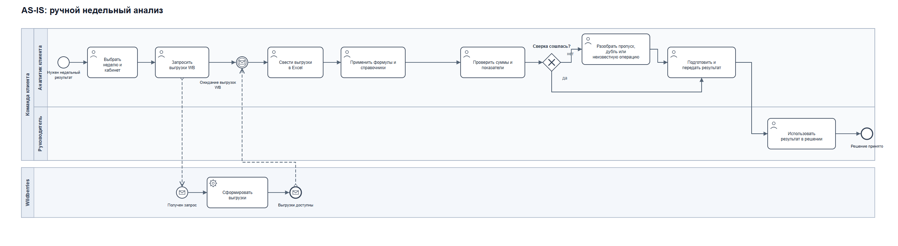
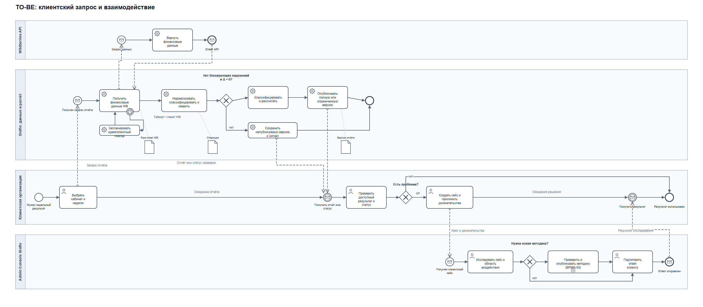
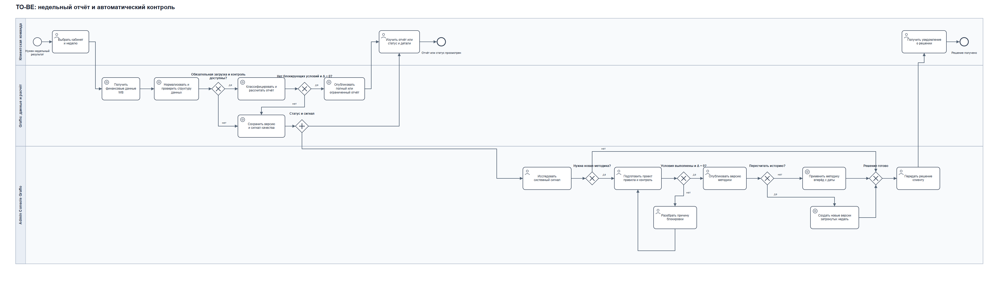
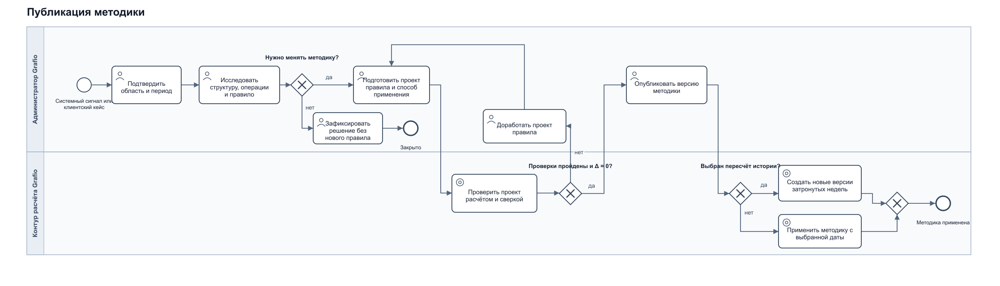
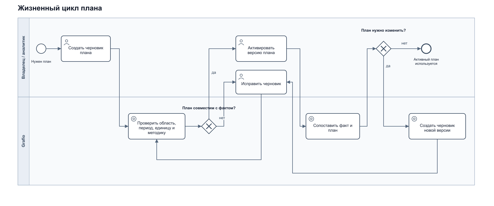
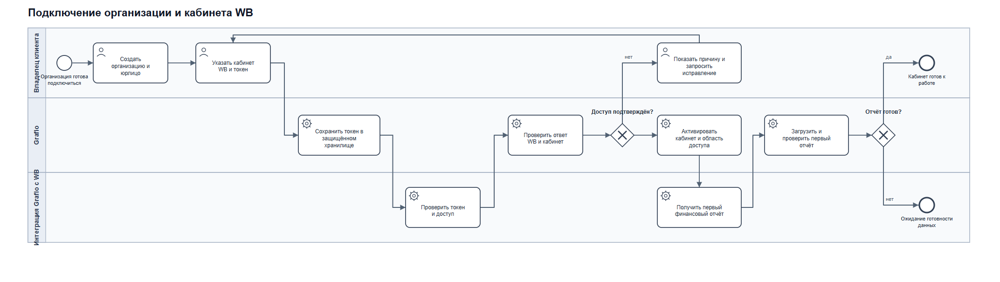
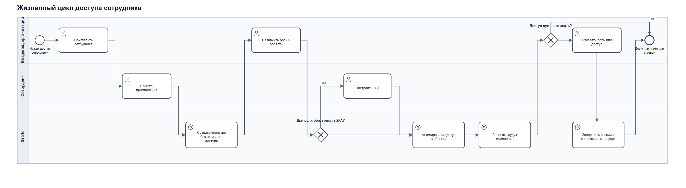
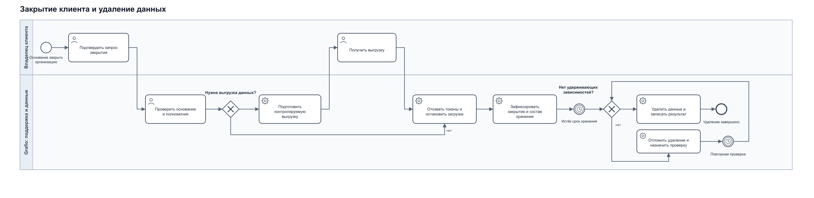

# Процессы AS-IS и TO-BE · BPMN 2.0

Восемь схем показывают ручной недельный анализ, работу сервиса и отдельные жизненные циклы. Для быстрого просмотра доступны PNG и SVG; файлы BPMN 2.0 можно открыть и изменить в совместимом редакторе.

## Основной маршрут

| Процесс | Что показывает | Диаграмма |
|---|---|---|
| AS-IS: ручной недельный анализ | Пулы команды клиента и Wildberries; аналитик работает с выгрузками в Excel, сверяет показатели и передаёт результат. | [PNG](bpmn/01-as-is-weekly-analysis.png) · [SVG](bpmn/01-as-is-weekly-analysis.svg) · [BPMN](bpmn/01-as-is-weekly-analysis.bpmn) |
| TO-BE: клиентский запрос | Дополнительный путь, когда клиент сам отправляет кейс; пулы Wildberries, Grafio, клиента и Admin Console, обмен сообщениями и таймаут. | [PNG](bpmn/02-to-be-client-case-flow.png) · [SVG](bpmn/02-to-be-client-case-flow.svg) · [BPMN](bpmn/02-to-be-client-case.bpmn) |
| TO-BE: недельный отчёт и автоматический контроль | Grafio сам фиксирует блокирующее расхождение или изменение схемы, показывает статус клиенту и создаёт сигнал для Admin Console. | [PNG](bpmn/02-to-be-weekly-report-and-methodology-auto.png) · [SVG](bpmn/02-to-be-weekly-report-and-methodology-auto.svg) · [BPMN](bpmn/02-to-be-weekly-report-and-methodology.bpmn) |

## Дополнительные процессы

| Процесс | Что показывает | Диаграмма |
|---|---|---|
| Публикация методики | Администратор исследует сигнал, готовит проект правила, проверяет расчёт и сверку. Новая версия публикуется только после успешной проверки; если методика не меняется, решение фиксируется отдельно. | [PNG](bpmn/03-methodology-publication.png) · [SVG](bpmn/03-methodology-publication.svg) · [BPMN](bpmn/03-methodology-publication.bpmn) |
| Жизненный цикл плана | Черновик проходит проверку совместимости с фактом, затем активируется. Для изменения активного плана создаётся черновик новой версии. | [PNG](bpmn/04-plan-lifecycle-flow.png) · [SVG](bpmn/04-plan-lifecycle-flow.svg) · [BPMN](bpmn/04-plan-lifecycle.bpmn) |
| Подключение организации и WB-кабинета | Проверка токена, первая загрузка и готовность кабинета. | [PNG](bpmn/05-organization-and-wb-onboarding.png) · [SVG](bpmn/05-organization-and-wb-onboarding.svg) · [BPMN](bpmn/05-organization-and-wb-onboarding.bpmn) |
| Жизненный цикл доступа сотрудника | Приглашение, роль и область, 2FA, отзыв доступа и завершение сессий. | [PNG](bpmn/06-employee-access-lifecycle.png) · [SVG](bpmn/06-employee-access-lifecycle.svg) · [BPMN](bpmn/06-employee-access-lifecycle.bpmn) |
| Закрытие клиента и удаление данных | Выгрузка, остановка интеграций, хранение и контролируемое удаление; при удерживающих зависимостях система откладывает удаление до повторной проверки. | [PNG](bpmn/07-client-offboarding-and-deletion-flow.png) · [SVG](bpmn/07-client-offboarding-and-deletion-flow.svg) · [BPMN](bpmn/07-client-offboarding-and-deletion.bpmn) |

## Просмотр схем

### AS-IS: ручной недельный анализ

После запроса процесс клиента ждёт выгрузки у события с конвертом. Пунктирная стрелка от Wildberries приносит ответ; только затем процесс идёт дальше.

[Открыть SVG](bpmn/01-as-is-weekly-analysis.svg)

### TO-BE: клиентский запрос

Этот путь дополняет автоматический контроль: клиент может сообщить о собственной проблеме и приложить контекст. Для системного сигнала его действия не требуются.

[Открыть SVG](bpmn/02-to-be-client-case-flow.svg)

### TO-BE: недельный отчёт и автоматический контроль

Изменение структуры ответа или ненулевая сверка обнаруживаются при обработке данных. Grafio сохраняет сигнал и непубликуемую версию, показывает клиенту статус, а администрация исследует исходные данные. При неуспешной проверке правило дорабатывают и проверяют снова — ответ клиента не является обязательным шагом.

[Открыть SVG](bpmn/02-to-be-weekly-report-and-methodology-auto.svg)

### Публикация методики

[Открыть SVG](bpmn/03-methodology-publication.svg)

### Жизненный цикл плана

[Открыть SVG](bpmn/04-plan-lifecycle-flow.svg)

### Подключение организации и WB-кабинета

[Открыть SVG](bpmn/05-organization-and-wb-onboarding.svg)

### Жизненный цикл доступа сотрудника

[Открыть SVG](bpmn/06-employee-access-lifecycle.svg)

### Закрытие клиента и удаление данных

[Открыть SVG](bpmn/07-client-offboarding-and-deletion-flow.svg)

Детали формул и версий вынесены в [паспорта показателей](../data/metric-passports.md), [жизненный цикл расчёта](calculation-lifecycle.md) и [операционные процессы](operational-workflows.md).
