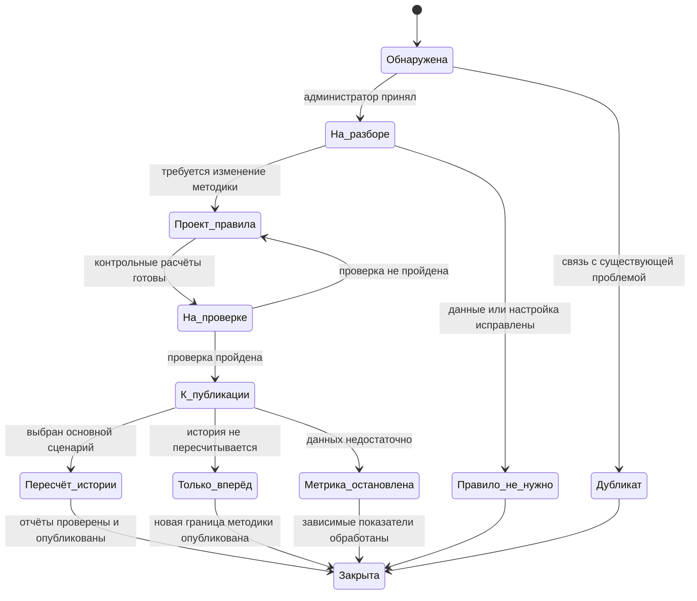

# Жизненный цикл правил и версий отчёта

Статус: целевой процесс первой версии. Он развивает утверждённые требования FR-21–FR-24 и решения TO-BE.

## Как читать документ

Документ отвечает на вопрос: что происходит после того, как Grafio обнаружил неизвестную операцию, расхождение или изменение схемы WB. Основной принцип — опубликованные правила и отчёты не перезаписываются: исправление создаёт новую версию с понятной областью действия.

На первом чтении проследите один путь: проблема качества → проверка → версия правила → пересчёт или применение вперёд → новая версия отчёта → уведомление пользователя.

## Объекты управления

| Объект | Смысл | Правило изменения |
|---|---|---|
| Проблема качества | Неизвестная операция, расхождение, изменение схемы или неполнота | Меняет состояние по мере исследования; не меняет расчёт сама |
| Версия правила | Опубликованная классификация и формула с областью и датами действия | После публикации неизменяема |
| Версия отчёта | Снимок результата для кабинета и периода | Новый расчёт создаёт новую версию |
| Уведомление | Сообщение о проверке либо опубликованном изменении | Ссылается на проблему или версию правила |

## Состояния проблемы

Расхождение и неизвестная операция регистрируются как разные сигналы. Их связывают одной причиной только после исследования.

## Обнаружение

Проблема создаётся при одном из событий:

- значение `sellerOperName`, `docTypeName`, `bonusTypeName` или сочетание признаков не соответствует опубликованному правилу;
- в ответе источника появился неизвестный ключ схемы;
- расхождение сверки не равно 0;
- обязательный источник или часть пагинации отсутствует;
- повторная загрузка закрытого периода отличается от использованной версии.

Карточка проблемы содержит площадку, кабинеты и периоды, сигнал, суммы, примеры обезличенных операций, затронутые показатели и ссылку на загрузку. Причина при создании не назначается автоматически.

## Доступность отчёта во время исследования

Пользователь продолжает видеть последнюю опубликованную версию. В отчёте и его выгрузке показываются:

- нейтральное сообщение о проверке корректности;
- затронутые показатели и периоды;
- состояние данных и время обновления;
- пометка «Не рассчитывается», если достоверного значения зависимого показателя нет.

Сообщение о проверке не утверждает, что площадка изменила тариф. Такая причина указывается только после подтверждения.

## Состав проекта правила

| Поле | Назначение |
|---|---|
| Код и номер версии | Устойчивая ссылка из отчёта |
| Причина | Подтверждённое изменение или исправляемая ошибка |
| Условие классификации | Поля и значения операции, по которым применяется правило |
| Денежный эффект | Поле суммы, знак, категория и влияние на маржу |
| Область | Площадка, вид отчёта и при необходимости подтверждённый контекст регистрации продавца |
| Период действия | Дата начала и окончания либо открытый конец |
| Затронутые результаты | Показатели, отчёты и зависимые формулы |
| Автор и время | Аудит изменения |

Правила первой версии общие для подтверждённой области WB. Исключение для одного кабинета допускается только как явно опубликованная область правила, а не скрытая ручная корректировка.

### Принцип области правила

По умолчанию версия правила распространяется на все кабинеты подтверждённой области: площадку WB, тип отчёта, виды операций и период действия. Кабинет, в котором впервые обнаружен сигнал, является источником наблюдения, но не становится областью правила автоматически.

Правило одного кабинета допускается только при одновременно выполненных условиях:

1. подтверждена особенность именно этого кабинета или его договорного/источникового контекста;
2. указан конкретный кабинет и период действия исключения;
3. сохранено обоснование, почему общее правило неприменимо;
4. исключение прошло отдельный контрольный расчёт;
5. отчёт показывает, что применена кабинетная версия правила.

Отсутствие данных других кабинетов само по себе не доказывает необходимость кабинетного исключения. Такое правило нельзя создавать как незаметную ручную корректировку.

## Проверка перед публикацией

1. Ручной контроль на обезличенных операциях воспроизводит ожидаемые суммы.
2. Контрольный набор паспортов показателей проходит без изменения незатронутых метрик.
3. Суммы деталей сверены с контрольными итогами источника без допуска: расхождение равно 0 в полной расчётной точности.
4. Проверены знак, сторно, возврат и отсутствие двойного учёта.
5. Определены затронутые периоды, кабинеты и зависимые показатели.
6. Подготовлены результат применения и текст уведомления.

Непройденная проверка возвращает проект правила на доработку; она не публикует частичный пересчёт.

## Выбор способа применения

| Условие | Решение |
|---|---|
| Исходные данные доступны для всего периода действия изменения | Пересчитать весь доступный затронутый период |
| Исторических данных недостаточно, но новая методика воспроизводима для будущих операций | Применять с опубликованной даты без изменения прошлых отчётов |
| Доступные данные позволяют считать только собственный показатель Grafio | Создать явно названную методику с источниками и ограничениями; не заявлять совпадение с показателем WB |
| Смысл показателя нельзя воспроизвести | Прекратить новый расчёт; историю сохранить с пояснением и проверить зависимые показатели |

Если дата начала правила попадает внутрь недели, правило применяется по дате операции только при наличии подходящей даты у каждой операции. Иначе границей становится следующая полная отчётная неделя; смешение двух методик внутри недельного итога не скрывается.

## Версии отчёта

После пересчёта создаётся новая версия отчёта. Она содержит ссылки на версию правила, загрузки источников, снимки влияющих настроек, время расчёта и состояние проверок.

По умолчанию открывается последняя опубликованная версия. Предыдущая помечается как заменённая, но остаётся доступной. Сравнение показывает прежнее значение, новое значение и разницу по затронутым показателям. Цепочка хранит все опубликованные версии, а не только первую и последнюю.

## Уведомления

| Событие | Обязательное содержание |
|---|---|
| Начато исследование | нейтральный статус, показатели и периоды, возможное уточнение данных |
| История пересчитана | причина, показатели, пересчитанный период, новая версия и ссылка на сравнение |
| Правило действует только вперёд | причина, дата начала, явное указание, что история не пересчитана |
| Введена методика Grafio | формула, источники, ограничения и дата начала |
| Расчёт метрики прекращён | причина, дата, влияние на зависимые показатели и доступность истории |

Уведомление о завершении выпускается только после повторной сверки новых отчётов. Все события сохраняют автора, время и затронутую область.

## Ответственность

| Действие | Grafio | Администратор | Пользователь |
|---|---|---|---|
| Обнаружить сигнал | выполняет проверки | просматривает очередь | видит предупреждение |
| Установить причину | предоставляет данные | исследует и фиксирует вывод | может передать контекст |
| Создать и проверить правило | выполняет контрольные расчёты | задаёт правило и принимает результат | не изменяет общую методику |
| Опубликовать | создаёт версии и журнал | выбирает сценарий применения | получает новую версию |
| Уведомить | формирует событие и доставку | подтверждает содержание | открывает сравнение |

Операционные шаги и ответственность участников описаны в [рабочих процессах](operational-workflows.md), а технические сигналы источника определены в [контракте WB](../data/wb-data-contract.md).

Очередь проблем, рабочее пространство исследования, блокирующие проверки и действия администратора определены в [проекте административного интерфейса](../product/admin-quality-workspace.md).
