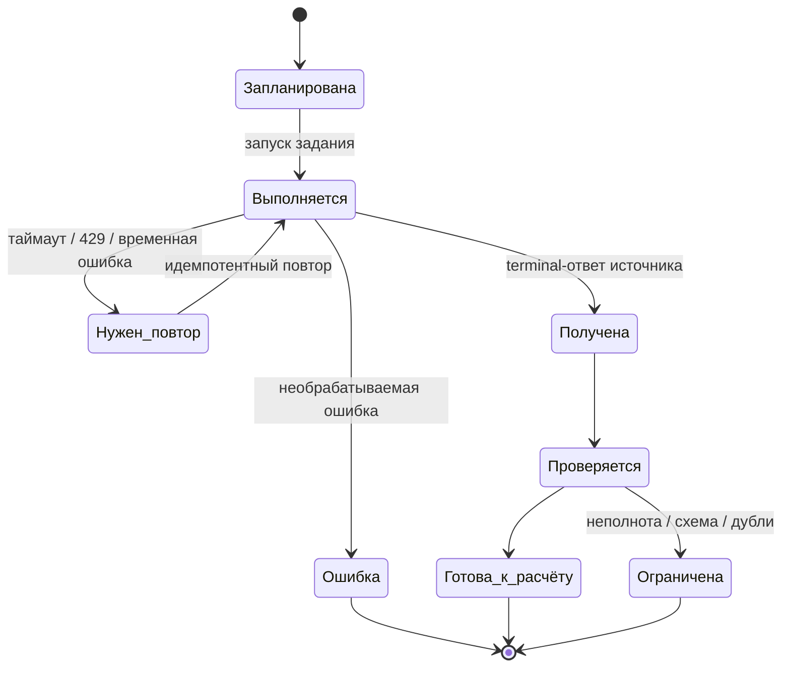
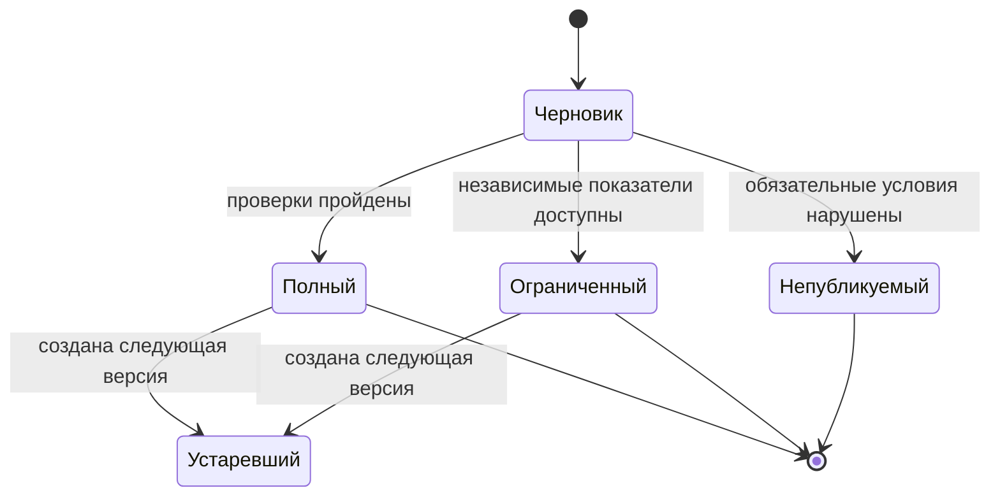
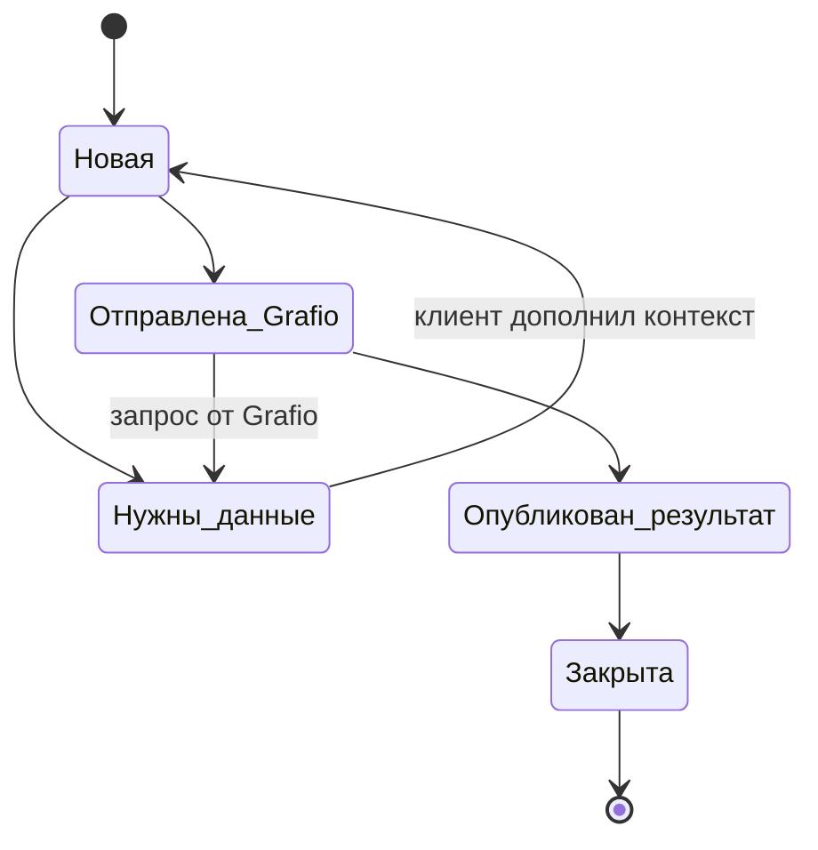
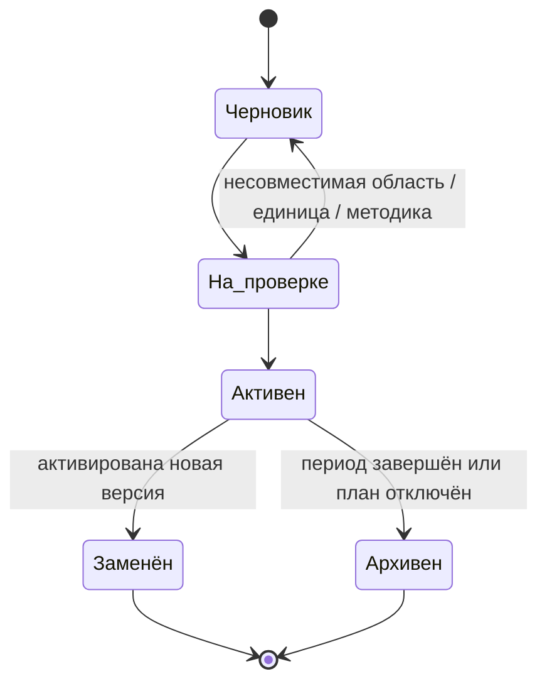

# Статусные модели Grafio

Статус: целевой системный контракт. Документ описывает конечные автоматы доменных объектов: допустимые статусы, переходы, инициаторов и инварианты. Он не заменяет BPMN-процессы: BPMN отвечает на вопрос «кто и в каком порядке выполняет работу», статусная модель — «в каком состоянии находится объект и что с ним допустимо сделать».

## Общие правила

1. Статус хранится вместе с временем изменения, инициатором, причиной и ссылкой на действие или версию.
2. Переход, не указанный в таблице модели, запрещён.
3. Терминальное состояние не меняется скрыто. Для повторной работы создаётся новый объект либо новая версия.
4. Статус качества не смешивается со статусом жизненного цикла: например, опубликованный отчёт может содержать предупреждение о неполноте.

## 1. Загрузка источника

| Из статуса | В статус | Инициатор / условие | Инвариант |
|---|---|---|---|
| Запланирована | Выполняется | Оркестратор запускает `job_id` | Для одной области нет двух активных одинаковых загрузок. |
| Выполняется | Нужен повтор | Временная ошибка WB, лимит или таймаут | Подтверждённые страницы и курсор сохраняются. |
| Выполняется | Получена | Получен terminal-ответ и сохранены документы | Загрузка получает неизменяемый `load_id` и хеш. |
| Выполняется | Ошибка | Ошибка не допускает безопасного продолжения | Ошибка содержит код, этап и `correlation_id`. |
| Получена | Проверяется | Завершено получение | Raw-ответ не изменяется. |
| Проверяется | Готова к расчёту / Ограничена | Пройдены проверки полноты, схемы, валюты, периода и дублей | Ограничение не подменяет результат нулём. |

## 2. Версия отчёта

| Статус | Значение | Допустимое действие |
|---|---|---|
| Черновик | Расчёт завершён, но решение о публикации не принято. | Проверить матрицу качества и опубликовать допустимый результат. |
| Полный | Все обязательные условия результата пройдены. | Читать, сравнивать, детализировать; создать новую версию пересчётом. |
| Ограниченный | Доступны независимые показатели, а зависимые имеют объяснимое состояние. | Читать доступные значения и увидеть ограничение. |
| Непубликуемый | Новый результат нельзя безопасно показать как отчёт. | Видеть состояние загрузки и последнюю опубликованную версию. |
| Устаревший | Существует более новая опубликованная версия того же периода. | Открыть и сравнить; запись остаётся неизменяемой. |

## 3. Клиентский кейс контроля расчётов

| Переход | Кто выполняет | Условие |
|---|---|---|
| Новая → Нужны данные | Клиентская команда | Не хватает периода, суммы, выгрузки или пояснения. |
| Новая → Отправлена Grafio | Владелец или финансист | Контекст и доказательства достаточны для передачи. |
| Отправлена Grafio → Нужны данные | Администратор Grafio | Для решения не хватает исходных данных или пояснения. |
| Отправлена Grafio → Опубликован результат | Admin Console | Есть результат проверки либо опубликована версия методики. |
| Опубликован результат → Закрыта | Клиент | Команда приняла результат. |

Закрытый кейс не переоткрывается редактированием: повторная проблема создаёт новый кейс со ссылкой на предыдущий.

## 4. Запрос и версия методики

| Объект | Статусы | Ключевое правило |
|---|---|---|
| Запрос Admin Console | Новая → Проверяется → Нужны данные от клиента / Готово к публикации → Опубликовано | Только переход в «Готово к публикации» открывает публикацию. |
| Проект правила | Черновик → На контроле → Готов к публикации → Опубликован / Отклонён | Проект не влияет на расчёты до публикации. |
| Версия методики | Опубликована → Замещена | Опубликованная версия неизменяема; замещение создаёт новую версию. |

Переход «Готов к публикации → Опубликован» разрешён, только если определены область и период действия, устранена неоднозначность, исключён двойной учёт, выбраны способ применения и затронутые периоды. Ненулевая сопоставимая сверка блокирует публикацию, если нет зафиксированной причины исключения.

Детальный путь: [BPMN публикации методики](bpmn/03-methodology-publication.bpmn).

## 5. Версия плана

| Статус | Ограничение |
|---|---|
| Черновик | Редактируется, не участвует в сравнении факт–план. |
| На проверке | Проверяются область, состав кабинетов, период, единицы и база метрики. |
| Активен | Единственная применяемая версия для данной области и периода. |
| Заменён | Сохраняется для объяснения прежних решений, но не используется по умолчанию. |
| Архивен | Не редактируется и не активируется повторно; для нового результата создаётся версия. |

## 6. Членство и доступ сотрудника

| Статус | Переходы | Правило |
|---|---|---|
| Приглашён | → Ожидает 2FA / Активен / Отозван | Приглашение имеет срок действия и область будущего доступа. |
| Ожидает 2FA | → Активен / Отозван | Для обязательной 2FA нет доступа к данным до подтверждения. |
| Активен | → Приостановлен / Отозван | Роль и область доступа проверяются на каждом действии. |
| Приостановлен | → Активен / Отозван | Сессии могут быть завершены, новые действия запрещены. |
| Отозван | терминальный | Отзываются доступ, активные сессии и ключи в области роли. |

Детальный путь: [BPMN жизненного цикла доступа](bpmn/06-employee-access-lifecycle.bpmn).

## 7. Кабинет WB

| Статус | Переходы | Значение |
|---|---|---|
| Черновик подключения | → Проверяется / Отключён | Данные кабинета указаны, но доступ ещё не доказан. |
| Проверяется | → Активен / Требует исправления | Проверяются токен, внешний идентификатор и доступ к источнику. |
| Требует исправления | → Проверяется / Отключён | Пользователь видит безопасную причину и может обновить подключение. |
| Активен | → Приостановлен / Отключён | Кабинет доступен в области пользователя и может получать данные. |
| Приостановлен | → Активен / Отключён | Временная остановка не удаляет историю. |
| Отключён | терминальный | Токен отозван, новые загрузки не запускаются. |

Детальный путь: [BPMN подключения](bpmn/05-organization-and-wb-onboarding.bpmn).

## 8. Закрытие клиента и данные

| Статус организации | Переходы | Условие |
|---|---|---|
| Активна | → Закрывается | Подтверждён запрос и полномочия владельца. |
| Закрывается | → Архивирована | Остановлены интеграции, отозваны секреты, зафиксирован состав хранения. |
| Архивирована | → Подлежит удалению | Истёк срок хранения и отсутствуют удерживающие зависимости. |
| Подлежит удалению | → Удалена | Выполнено контролируемое удаление и аудит результата. |
| Удалена | терминальный | Записи для восстановления не остаются вне утверждённой политики. |

Детальный путь: [BPMN закрытия клиента](bpmn/07-client-offboarding-and-deletion.bpmn). Точные сроки и основания хранения остаются допущением до утверждения правовой и коммерческой политикой: [Ограничения и допущения Grafio](../requirements/constraints-and-assumptions.md).

## Связь с приёмкой

Для каждого перехода нужны как минимум проверка разрешённого пути, попытка запрещённого перехода и запись аудита. Сквозные сценарии — в [Приёмочные сценарии](../validation/acceptance-scenarios.md), требования к интерфейсам — в [Требования к интерфейсам Grafio](../requirements/interface-requirements.md), требования к аудиту и восстановлению — в [Нефункциональные требования и атрибуты качества Grafio](../requirements/non-functional-requirements.md).
