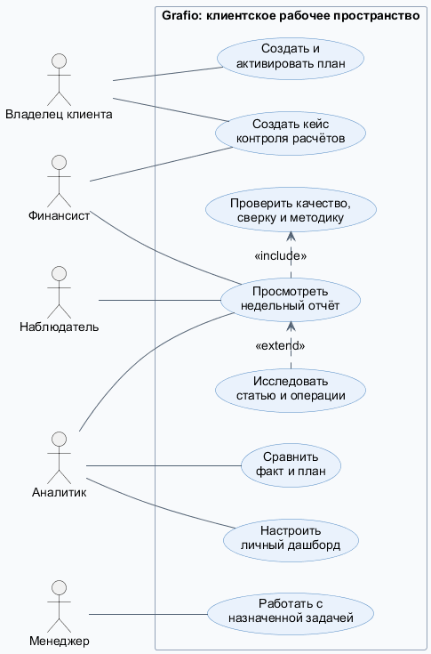
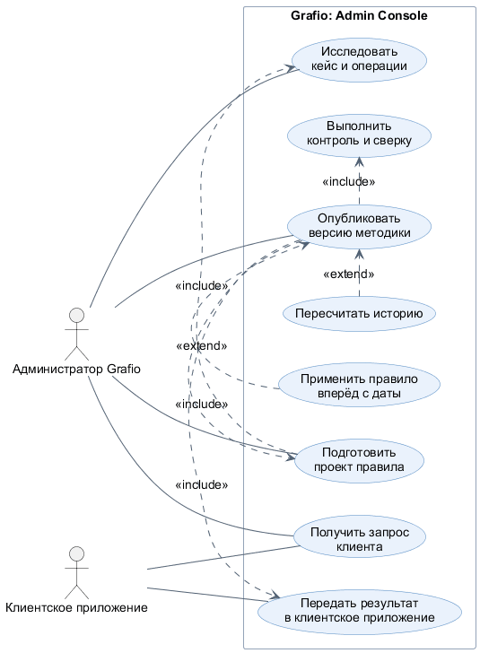
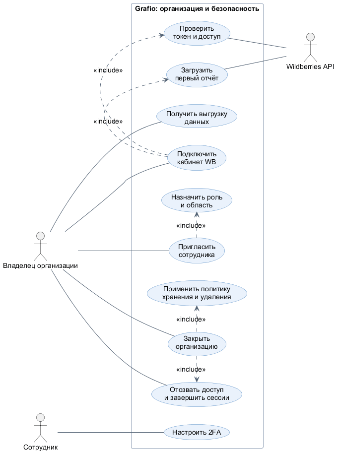

# Каталог вариантов использования Grafio

Каталог показывает цели пользователей и администратора Grafio. Каждый Use Case описывает результат для участника; фоновые процессы, формулы и детали интерфейса раскрыты в профильных документах.

## Состав каталога

| ID | Use Case | Актор | Результат | Детализация |
|---|---|---|---|---|
| UC-01 | Просмотреть недельный финансовый результат | Финансист / аналитик | Отчёт по выбранному контексту с качеством и версией | [Пользовательский сценарий недельного анализа расходов](weekly-expense-use-case.md) |
| UC-02 | Исследовать изменение статьи | Аналитик | Объяснение суммы доступными товарами и операциями | UC-01, шаги 7–10 |
| UC-03 | Передать проблему расчёта в Grafio | Финансист / владелец | Кейс с контекстом, доказательствами и статусом | [Операционные процессы Grafio](../processes/operational-workflows.md) |
| UC-04 | Опубликовать версию методики | Администратор Grafio | Новая методика и результат для клиента | [Операционные процессы Grafio](../processes/operational-workflows.md), BPMN-03 |
| UC-05 | Создать и активировать план | Владелец / аналитик | Совместимая активная версия плана | [Правила и сценарий планов](../product/plans-and-forecasts.md) |
| UC-06 | Настроить личный дашборд | Аналитик | Лист с выбранными KPI и графиками | [Функциональные требования Grafio](functional-requirements.md) |
| UC-07 | Управлять доступом сотрудника | Владелец организации | Роль и область доступа сотрудника | BPMN-06, [Статусные модели Grafio](../processes/status-models.md) |
| UC-08 | Подключить кабинет WB | Владелец организации | Активный кабинет или объяснимое требование исправления | BPMN-05 |
| UC-09 | Закрыть организацию | Владелец организации | Остановленные интеграции, хранение и контролируемое удаление | BPMN-07 |

UC-01 и UC-02 раскрыты шаг за шагом в [сценарии недельного анализа расходов](weekly-expense-use-case.md). Каталог ниже кратко фиксирует остальные цели и результаты, не повторяя подробный поток отчёта.

## UC-03. Передать проблему расчёта в Grafio

| Поле | Описание |
|---|---|
| Актор | Финансист или владелец клиента |
| Предусловия | Обнаружены расхождение, неизвестная операция, неполнота или дубликат. |
| Триггер | Пользователь выбирает действие создания кейса. |
| Основной поток | Проверяет контекст → добавляет доказательства и комментарий → при необходимости назначает задачу → отправляет запрос в Grafio → отслеживает статус. |
| Альтернативы | Grafio запрашивает дополнительные данные; клиент дополняет кейс и отправляет его повторно. |
| Результат | Проблема передана без самостоятельного изменения методики. |
| Связь | US-06—US-07, PFR-11—PFR-12, AC-13—AC-16, AT-04, AT-06 |

## UC-04. Опубликовать версию методики

| Поле | Описание |
|---|---|
| Актор | Администратор Grafio |
| Предусловия | В Admin Console есть автоматически созданный системный сигнал или отдельный клиентский кейс. |
| Триггер | Администратор берёт сигнал или кейс в работу. |
| Основной поток | Подтверждает область → изучает операции и действующие правила → готовит проект → выполняет контроль → выбирает пересчёт или применение вперёд → публикует версию. |
| Альтернативы | При изменении структуры администратор проверяет raw-ответ и правило без обязательного запроса к клиенту; условия публикации не пройдены — версия остаётся проектом. Уточнение у клиента возможно только для клиентского контекста, которого нет в данных источника. |
| Результат | Создана неизменяемая версия методики и клиент получает объяснение результата. |
| Связь | US-08—US-09, PFR-13—PFR-16, AC-17—AC-21, AT-06 |

## UC-05. Создать и активировать план

| Поле | Описание |
|---|---|
| Актор | Владелец или аналитик |
| Предусловия | Доступна область планирования и показатель. |
| Триггер | Пользователь начинает создание плана. |
| Основной поток | Выбирает область и период → добавляет цель, единицу и тип сравнения → проходит проверку → активирует версию → видит сопоставление факт–план. |
| Альтернативы | Несовместимая единица, база или область возвращают версию в черновик. |
| Результат | Активен только совместимый план; прежние версии сохраняются. |
| Связь | US-10—US-11, PFR-17—PFR-18 |

## UC-06. Настроить личный дашборд

| Поле | Описание |
|---|---|
| Актор | Аналитик |
| Предусловия | Открыт раздел «Мой дашборд». |
| Триггер | Пользователь создаёт лист или включает режим редактирования. |
| Основной поток | Выбирает KPI или график → добавляет на лист → настраивает → перемещает и меняет размер → сохраняет представление. |
| Альтернативы | Новый лист пуст и показывает подсказку; вне режима редактирования виджеты не имеют редакторских контролов. |
| Результат | Личное представление доступных метрик без изменения факта и методики. |
| Связь | US-13—US-15, PFR-20—PFR-23 |

## UC-07. Управлять доступом сотрудника

| Поле | Описание |
|---|---|
| Актор | Владелец организации |
| Предусловия | У владельца есть полномочие на управление командой. |
| Триггер | Нужно выдать, изменить, приостановить или отозвать доступ. |
| Основной поток | Приглашает сотрудника → назначает роль и область → при необходимости требует 2FA → система активирует доступ и фиксирует аудит. |
| Альтернативы | При отзыве доступа завершаются сессии и отзываются ключи в области роли. |
| Результат | Сотрудник имеет только назначенный уровень доступа. |
| Связь | US-16—US-17, PFR-24—PFR-27 |

## UC-08. Подключить кабинет WB

| Поле | Описание |
|---|---|
| Актор | Владелец организации |
| Предусловия | Созданы организация и юридическое лицо. |
| Триггер | Пользователь выбирает подключение кабинета. |
| Основной поток | Указывает кабинет и токен → Grafio сохраняет секрет защищённо → проверяет доступ → активирует область → запускает первую загрузку. |
| Альтернативы | Неверный токен или недоступный кабинет возвращают понятную причину и позволяют исправить подключение. |
| Результат | Кабинет готов к получению отчётов либо ожидает исправления. |
| Связь | US-18, [подключение кабинета](../processes/bpmn/05-organization-and-wb-onboarding.bpmn), [статусы кабинета](../processes/status-models.md) |

## UC-09. Закрыть организацию

| Поле | Описание |
|---|---|
| Актор | Владелец организации |
| Предусловия | Есть подтверждённое основание и полномочие закрытия. |
| Триггер | Владелец подтверждает запрос закрытия. |
| Основной поток | При необходимости получает выгрузку → Grafio отзывает токены и останавливает загрузки → фиксирует состав хранения → применяет политику хранения и удаления. |
| Альтернативы | Удерживающие зависимости блокируют удаление до разрешения. |
| Результат | Данные не удаляются скрыто; завершение операции аудируется. |
| Связь | US-19, BPMN-07, NFR-18—NFR-20 |

## Диаграммы вариантов использования

| Область | Диаграмма |
|---|---|
| Клиентское рабочее пространство | [PNG](diagrams/01-client-workspace-use-cases.png) · [SVG](diagrams/01-client-workspace-use-cases.svg) · [PlantUML](diagrams/01-client-workspace-use-cases.puml) |
| Admin Console | [PNG](diagrams/02-admin-console-use-cases.png) · [SVG](diagrams/02-admin-console-use-cases.svg) · [PlantUML](diagrams/02-admin-console-use-cases.puml) |
| Организация и доступ | [PNG](diagrams/03-organization-lifecycle-use-cases.png) · [SVG](diagrams/03-organization-lifecycle-use-cases.svg) · [PlantUML](diagrams/03-organization-lifecycle-use-cases.puml) |

### Клиентское рабочее пространство

### Admin Console

### Организация и доступ

Сплошная линия связывает участника со сценарием. `include` обозначает обязательный вложенный шаг, `extend` — дополнительное поведение при выполнении условия. Получение выгрузки показано отдельно: владелец запрашивает её при необходимости до подтверждения закрытия организации.
