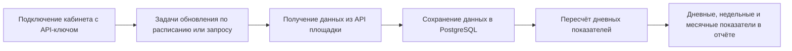

# Что уже реализовано: получение и обновление данных через API

Статус: разбор существующей реализации для подготовки аналитического кейса. Исходный код не входит в этот репозиторий; пути к файлам ниже позволяют найти основания выводов в основном репозитории Grafio. Реализованное поведение не утверждается автоматически как требование к будущему решению.

## Основание и границы проверки

Автор уточнил: Grafio изначально предполагал получение данных через API, и часть этого механизма уже была реализована. При проверке прочитаны обработчики WB/Ozon, подключение кабинетов, планировщик, фоновый обработчик, расчёты дневной сводки, отчёт и статусы интерфейса. Запущены четыре существующих тестовых файла с имитацией API, базы данных и очередей.

Подтверждается наличие и устройство кода. Не проверены реальные ключи, действующие контракты внешних API, работа развёрнутого сервиса, скорость на реальных объёмах и соответствие сумм кабинетам площадок. Актуальность указанных в коде внешних адресов отдельно не проверялась.

## Основной вывод

В Grafio реализован процесс фоновой загрузки данных WB и Ozon через API с сохранением в PostgreSQL и пересчётом аналитики. Данные загружаются по расписанию и по ручному запросу синхронизации. Открытие отчёта читает сохранённые данные и не требует скачивания пользователем Excel.

В модели маркетплейсов предусмотрены только `wb` и `ozon`. Интеграций Яндекс Маркета, Lamoda и Мегамаркета в проверенном серверном процессе нет.

Схема показывает основной путь РНП и KPI. Дополнительно в системе есть агрегированные представления с отдельным почасовым обновлением для других аналитических запросов.

## Подключение кабинетов

- Создание кабинета WB/Ozon и хранение ключей в зашифрованном виде.
- Для Ozon предусмотрен Client-Id и отдельные реквизиты Performance API.
- Проверка подключения и прав на отдельные категории данных.
- Регистрация фоновых задач при подключении, запрос первичной синхронизации.
- Ручная синхронизация всех или отдельных типов данных, возможность полной загрузки.
- Возврат информации о поставленных и пропущенных задачах, в том числе из-за ограничения запросов или уже выполняющейся загрузки.

Основания: подключение кабинетов (`backend/src/services/marketplace-account.service.ts:347`), API запуска синхронизации (`backend/src/routes/marketplace-accounts.ts:198`).

## Какие данные загружаются

| Площадка | Категория | Найденная реализация |
|---|---|---|
| WB | Заказы и продажи | Statistics API, отдельные функции загрузки заказов и продаж; сохранение внешних идентификаторов |
| WB | Финансовые операции | `reportDetailByPeriod`, ежедневная детализация `period=daily`, постраничная загрузка по `rrdid` |
| WB | Товары | Content API: карточки, артикулы, бренды, категории, изображения |
| WB | Реклама | Получение кампаний и статистики: расходы, заказы, суммы заказов, показы, клики, тип кампании |
| WB | Аналитика продавца | Запрос формирования отчёта через API, ожидание готовности, скачивание ZIP и разбор CSV; данные по карточкам, корзинам, заказам, выкупам и отменам |
| Ozon | Заказы и продажи | FBS/FBO postings; создание записей продаж по доставленным отправлениям |
| Ozon | Финансовые операции | Загрузка транзакций по месячным диапазонам через Seller API |
| Ozon | Товары | Получение списка товаров и подробной информации |
| Ozon | Аналитика и реклама | Seller Analytics и отдельный Performance API с получением токена доступа |

WB-финансы сохраняют, среди прочего, суммы к перечислению, комиссии, логистику, эквайринг, хранение, штрафы, приёмку, удержания и дополнительные выплаты. Сохранение поля не означает, что оно уже включено во все показатели интерфейса.

Основания: WB (`backend/src/services/wb-sync.service.ts:59`), финансы WB (`backend/src/services/wb-sync.service.ts:234`), Ozon (`backend/src/services/ozon-sync.service.ts:186`), Performance API (`backend/src/services/ozon-performance.service.ts:123`).

## Периодичность в текущем коде

Это настройки Grafio, а не гарантированная скорость обновления данных у площадки. Время указано по Москве.

| Данные | Обычное расписание | Расписание для WB-токена, классифицированного кодом как restricted |
|---|---|---|
| Заказы и связанные продажи | Каждые 30 минут | Каждые 3 часа |
| Финансы | Каждые 2 часа | Каждые 12 часов |
| Товары | Каждые 4 часа | Каждые 4 часа |
| Реклама | В 06:00 и 18:00 | В 06:00 и 18:00 |
| Аналитика продавца WB | В 06:05 и 18:05 | В 06:05 и 18:05 |

Для части задач предусмотрен немедленный запуск при регистрации; есть восстановление расписаний и загрузка пропущенных данных при запуске обработчика. Ручной запрос также не отменяет ограничения API, блокировки и время выполнения задач.

Основание: планировщик (`backend/src/sync/scheduler.ts:30`).

## Что происходит после загрузки

- После соответствующих задач фоновый обработчик вызывает пересчёт дневной сводки и ожидает его завершения.
- Дневная сводка сохраняется в транзакции, с блокировкой параллельного пересчёта одного кабинета.
- KPI и РНП читают дневную сводку. РНП возвращает также недельные итоги внутри запрошенного месяца и месячный итог. Проверка недели, пересекающей границу месяцев, нужна отдельно для нашего сценария полной отчётной недели.
- Для других агрегированных представлений зарегистрировано почасовое обновление. Нельзя прибавлять час ко всем запросам Grafio: у РНП и KPI другой путь данных.
- Для WB-финансов начальная / полная загрузка использует период около 90 дней; последующая начинается с последней успешной финансовой синхронизации с двухдневным перекрытием. Такой механизм не гарантирует автоматический захват исправлений любой давности.
- Повторная запись финансовых строк WB использует уникальность кабинета и `rrdId`, что предотвращает создание второй строки с тем же ключом. Полнота обновления всех изменяемых полей требует отдельной проверки.

Основания: фоновый пересчёт (`backend/src/worker.ts:150`), дневная сводка (`backend/src/services/daily-summary.service.ts:70`), недельные итоги (`backend/src/services/rnp.service.ts:252`), почасовые агрегаты (`backend/src/worker.ts:300`).

## Устойчивость и статусы

Есть ограничение частоты запросов WB, обработка 429, задержки повторных попыток, защита от одновременного запуска одинаковых задач и восстановление расписаний. В интерфейсе кабинета отображаются последняя синхронизация, частичное выполнение, ошибки доступа и ограничения запросов.

Это технические статусы получения данных. Они не подтверждают финансовую сверку, полноту всех нужных статей или готовность отчёта для управленческого решения.

Основания: защита синхронизации (`backend/src/services/sync-guards.ts:120`), получение WB (`backend/src/services/wb-fetch.ts:34`), статусы кабинета (`frontend/src/pages/settings/components/AccountCard.tsx:30`).

## Ограничения для выбранного аналитического кейса

| Наблюдение по коду | Следствие для аналитической работы |
|---|---|
| В проверенных сервисах не найден процесс получения отдельной сводки отчётов и контрольной сверки, эквивалентной прежней Excel-проверке | Сверку из AS-IS нужно спроектировать отдельно; статус загрузки её не заменяет |
| Не найден отдельный процесс регистрации неизвестных финансовых операций; часть агрегирования опирается на точные названия «Продажа» / «Возврат» | Получение через API не отменяет согласование правил классификации и обработку новых операций |
| Себестоимость вводится отдельно, с историей значений | API маркетплейса не обеспечивает автоматически все данные управленческого отчёта |
| Формула `marginAmt` для KPI / РНП не вычитает себестоимость; также не охватывает весь перечень сохранённых финансовых расходов | Нельзя считать текущую маржу эквивалентом согласованного финансового результата. Требуется паспорт метрики и проверка состава расходов |
| Ozon-финансы сохраняются без `sale_date` и `retail_price`, тогда как дневная агрегация использует их и имена операций WB | Наличие загрузки Ozon не подтверждает полноту сопоставимых финансовых показателей; требуется нормализация модели событий |

Основания: себестоимость (`backend/src/services/product.service.ts:133`), формула маржи (`backend/src/services/metrics-helpers.ts:59`), загрузка финансов Ozon (`backend/src/services/ozon-sync.service.ts:390`), агрегация (`backend/src/services/daily-summary.service.ts:158`).

## Результаты выбранных тестов

Запущены четыре существующих файла: планировщик, синхронизация WB, синхронизация Ozon и дневная сводка. Из 75 тестов прошли 74, один завершился ошибкой.

Не прошёл тест Ozon `syncFinance / paginates and aggregates by month`: при обращении к `res.status` получено `undefined` вместо ответа имитируемого HTTP-вызова. Причина рассогласования теста и реализации в этой проверке не установлена. Этот сбой сам по себе не доказывает отказ настоящего API Ozon.

Тесты выполнялись с подменёнными внешними зависимостями; проверки формирования SQL не равнозначны проверке финансовых сумм на настоящей базе. Первоначально запуск блокировался ограничением среды `spawn EPERM`; повторный разрешённый запуск завершился приведённым результатом. Код и тесты не исправлялись.

## Как корректируем аналитическую работу

- AS-IS остаётся описанием прежней работы в консалтинге с Excel / Google Sheets.
- Подтверждённый замысел Grafio — фоновое получение данных через API. Выбор ручной Excel-загрузки как основного будущего сценария не требуется.
- Существующую реализацию используем для восстановления контекста и выявления пробелов, а целевые правила согласовываем отдельно.
- Для TO-BE различаем первичную загрузку истории, регулярное обновление, пересчёт после исправлений и открытие уже подготовленного отчёта.
- Вместо одного общего срока нужны требования к актуальности данных, времени обработки / пересчёта и времени открытия отчёта. Отдельно задаются полнота и статус финансовой проверки.
- Точные сроки и ограничения внешних API перед утверждением спецификации необходимо сверить с актуальной официальной документацией. Настройки старого кода не заменяют эту проверку.
