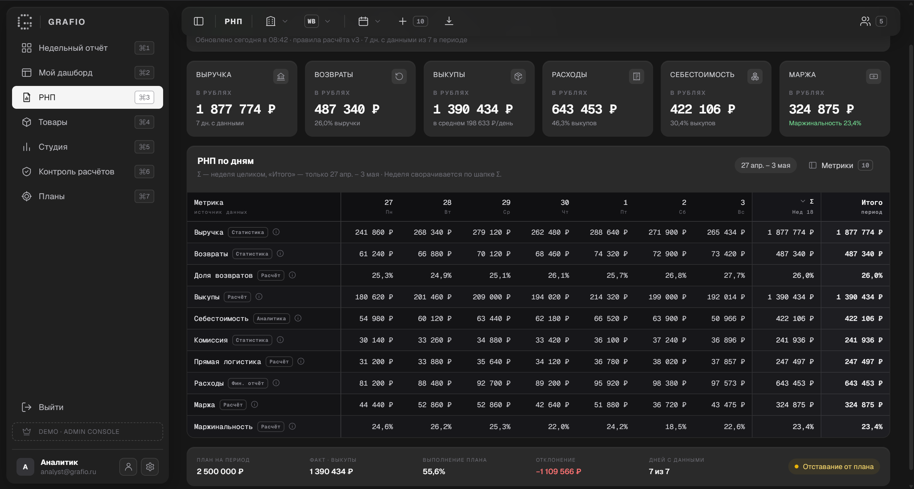
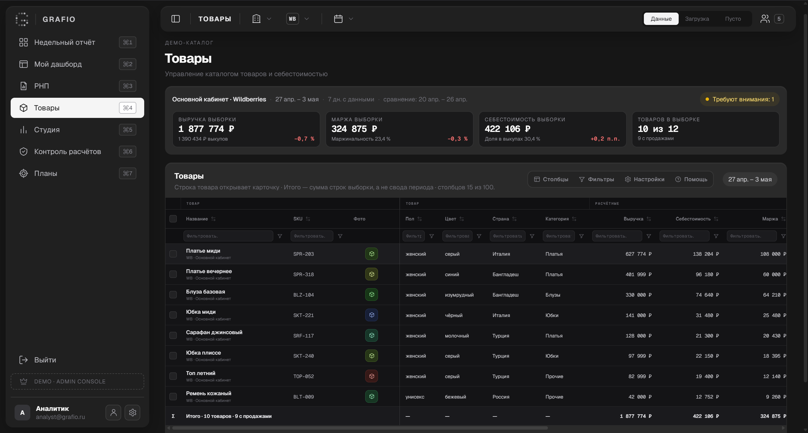
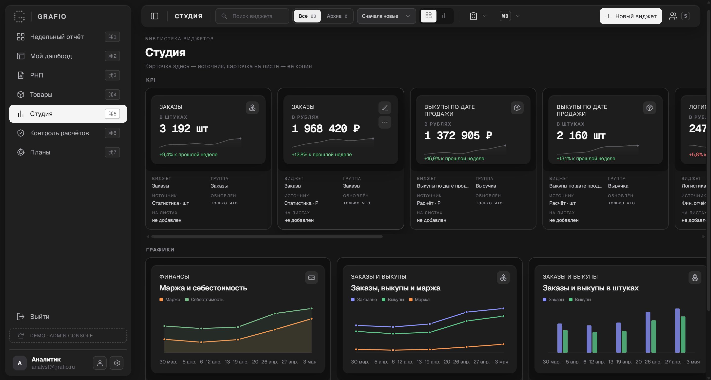
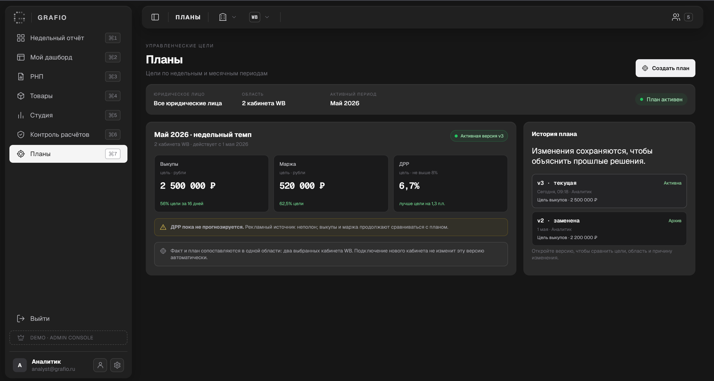
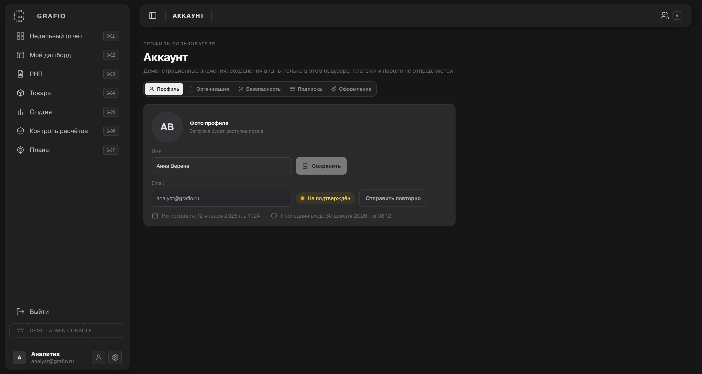

# Экраны демонстрационного прототипа Grafio

Галерея дополняет [кейс Grafio](../README.md). На скриншотах показаны демонстрационные данные: экраны иллюстрируют сценарии, но не подтверждают работу целевого расчётного API или внедрение у клиентов.

## Быстрый обзор

| Аналитика и данные | Рабочее пространство | Контроль и доступ |
|:---:|:---:|:---:|
|  |  |  |
| [Недельный отчёт, РНП, товары](#аналитика-и-детализация) | [Дашборд, Студия, планы](#настройка-рабочего-пространства) | [Кейсы, Admin Console, аккаунт](#контроль-и-доступ) |

Ниже каждый экран показан в полном размере.

## Аналитика и детализация

### Недельный отчёт

Тематическая лента графиков, состояние отчёта, KPI и сравнение недель.

### РНП

Показатели и таблица по дням с недельной суммой и итогом периода.

### Товары

Сводка выборки и таблица товаров с финансовыми показателями.

## Настройка рабочего пространства

### Мой дашборд

Пример листа после добавления KPI-виджетов пользователем: спарклайны, масштаб и панель листов. При первом открытии лист пуст.

### Студия

Библиотека KPI и графиков для добавления на листы.

### Планы

Цели, текущая версия плана и история изменений.

## Контроль и доступ

### Контроль расчётов — клиентский интерфейс

Очередь проблем и карточка кейса с доказательствами и состоянием проверки.

### Правила расчётов — Admin Console

Внутренняя очередь запросов, контрольная сверка и редактор правила.

### Аккаунт

Профиль и разделы настроек пользователя.

